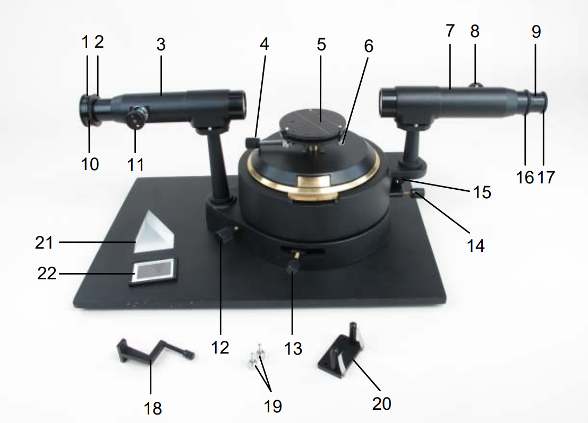
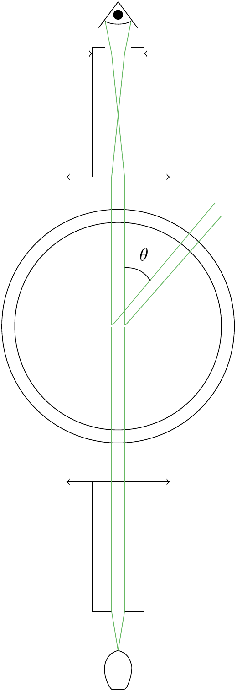
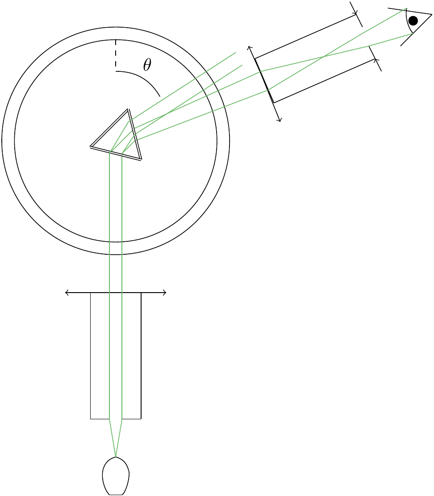
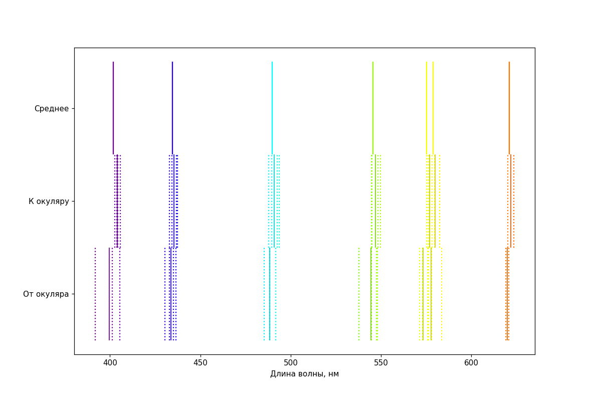
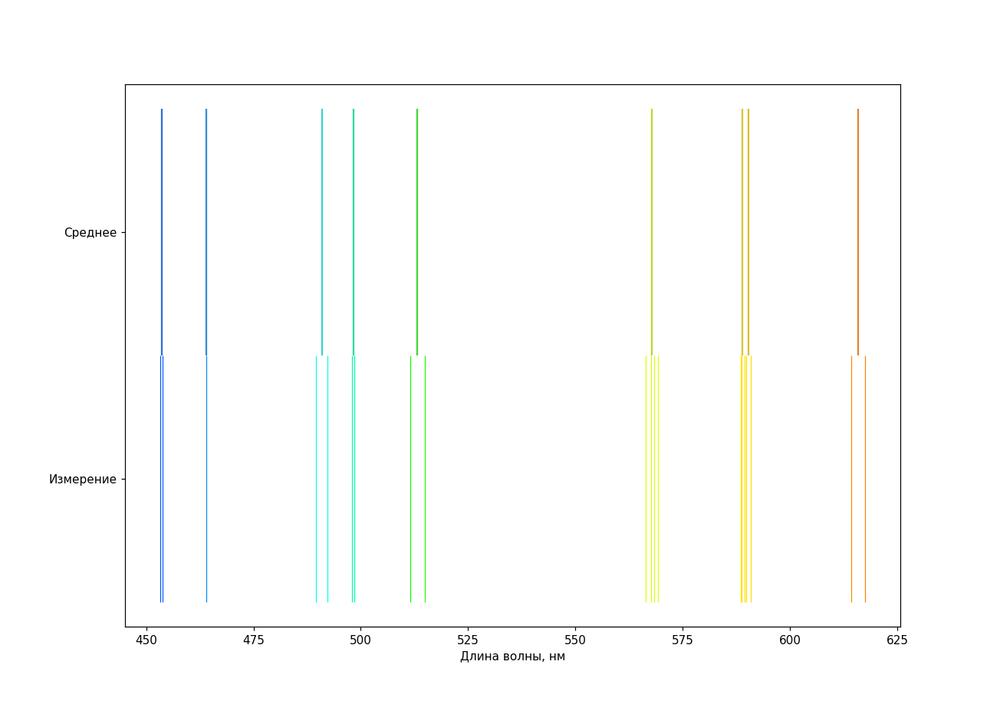
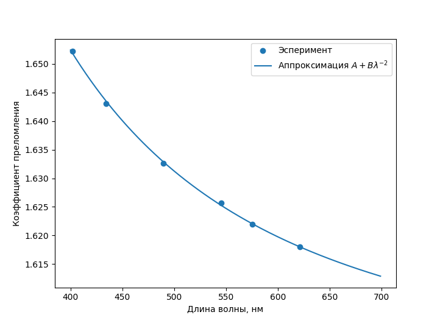
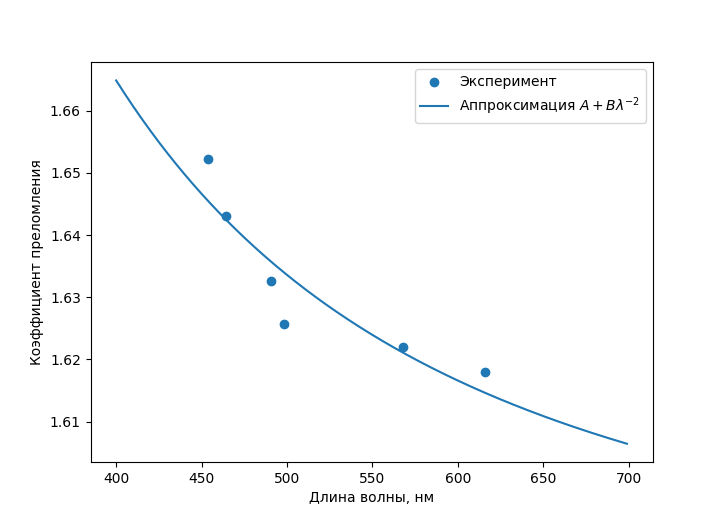

---
title: Исследование спектра газовых ламп
...

## Введение

Одна из основных характеристик источника света — спектр его излучения. С помощью спектра можно определить, какие процессы происходят внутри источника, в случае химических источников — определить их состав. Спектр однозначно задает то, как мы видим свет от источника, это знание может быть полезно при работе с источниками освещения.

В этой работе мы  исследуем спектр, используя гониометр, с помощью которого можно достаточно точно (погрешность не больше десяти угловых минут) узнавать углы поворота различных частей схемы друг относительно друга. 

Мы исследовали две различных химических лампы, спектр которых — отдельные спектральные линии. Установка, которую мы здесь использовали, не позволяет измерять яркость — в случае непрерывного спектра было бы невозможно получить точные значения чего-либо. В качестве рабочих объектов для разделения света по спектру мы использовали дифракционную решётку и призму.

## Оборудование

{width=50%}

Здесь цифрами обозначены:

1. Регулируемая входная щель.
2. Стопорное кольцо, фиксирующее входную щель
3. Коллиматор 
4. Стопорный винт столика
5. Спектрометрический столик с резьбовыми отверстиями для крепления 
6. Подпружиненные винты для регулировки столика
7. Зрительная труба
8. Ручка фокусировки зрительной трубы 
9. Держатель окуляра с крестом
10. Ручка регулировки ширины щели 
11. Ручка фокусировки коллиматора
12. Ручка точной регулировки вращения стола спектрометра 
13. Стопорный винт для вращения столика спектрометра 
14. Стопорный винт для вращения зрительной трубы
15. Ручка точной настройки вращения зрительной трубы
16. Стопорное кольцо, фиксирующее держатель окуляра 
17. Вставной окуляр, 15x
18. Держатель призмы
19. Винты с накатанной головкой для крепления призмы или держателя решетки
20. Держатель для дифракционных решеток или диафрагм
21. Дисперсионная призма
22. Дифракционная решетка

В качестве источников мы использовали *ртутную* ($Hg\ 100$) и *натриевую* лампу.

## Теория

Начнём с дифракционной решётки:

![Принципиальная схема работы дифракционной решетки [^1]](img/difr.jpg)

Дифракционная решётка устроена как "шероховатая" прозрачная поверхность с периодом "неровностей" $d$ по одной из координат в плоскости пластинки (чаще всего в роли "неровностей" выступают специально нанесенные "штрихи"), где d — мало (порядка длины волны — в нашем случае это $\sim 2$ мкм). Из-за того, что лучи падающие на разные "зубцы" ячейки .  Для установки дифракционной решётки перпендикулярно ходу луча мы специально калибровали решетку так, чтобы отражение зрачка наблюдателя совпадало с видимой щелью, поэтому угол падения волны можно считать достаточно близким к нулю. Тогда выражение  упрощается до:
$$
\sin \phi = \frac{m\lambda}{d}
$$
Где $m$ — порядок максимума.

В случае призмы всё немного сложнее.

Обозначим некоторые углы системы: $\alpha$ — угол в вершине призмы, сопряжённой с двумя пересекаемыми сторонами, $\gamma$ и $\beta$ — углы к нормалям после первого и второго преломления соответственно,  $\theta$ — суммарный угол отклонения луча от начального направления движения, и, наконец, $\theta_{red}$ как частный случай — этот угол $θ$ для красного луча.

Мы знаем, что при минимальном угле отклонения угол падения на призму равен углу выхода из призмы [^mindev]. Следовательно:
$$
\sin (\alpha/2 + \theta/2) = n \sin(\alpha/2)
$$

Нам известен угол $\alpha = \frac{\pi}{3}$, а также мы проводили калибровку по минимальному углу отклонения для красного цвета. Значит, получив $\theta_{red}$, можно найти $n$ для красного цвета. А так как углы отличаются не сильно (3.5 градуса), то можно продолжать пользоваться приближением (угла падения и угла отражения):
$$
n = 2 \cos (\frac{\pi}{3}-\theta/2)
$$

 Для более точного ответа нужно брать угол падения света на призму равным $\theta_{red}/2$ и считать все преломления в системе для него. Запишем законы Снелла в такой системе и распишем угол $\theta$ через другие углы системы:
$$
\sin (\alpha/2 + \theta_{red}/2) = n \sin(\gamma) \\
n\sin (\alpha - \gamma) = \sin (\beta) \\
\theta = \beta - \alpha/2 + \theta_{red}/2
$$
Тогда поочерёдно подставим их в последнее уравнение:
$$
\sin(\beta) = n(\sin (\alpha) \cos(\gamma) - \cos (\alpha) \sin(\gamma)) = \sin(\alpha)\sqrt{n^2 - \sin^2(\alpha/2 + \theta_{red}/2)} - \cos(\alpha)\sin (\alpha/2 + \theta_{red}/2) \\
\theta = - \alpha/2 + \theta_{red}/2 + \arcsin(\sin(\alpha)\sqrt{n^2 - \sin^2(\alpha/2 + \theta_{red}/2)} - \cos(\alpha)\sin (\alpha/2 + \theta_{red}/2)) 
$$

Перенесём углы в левую часть и возьмём синус с обеих сторон:
$$
\sin(\theta + \alpha/2 - \theta_{red}/2) + \cos(\alpha)\sin (\alpha/2 + \theta_{red}/2) = \sin(\alpha)\sqrt{n^2 - \sin^2(\alpha/2 + \theta_{red}/2)} \\
n^2 = \left(\frac{\sin(\theta + \alpha/2 - \theta_{red}/2) + \cos(\alpha)\sin (\alpha/2 + \theta_{red}/2)}{\sin(\alpha)}\right)^2 + \sin^2(\alpha/2 + \theta_{red}/2)
$$

То есть:
$$
n(θ) = \sqrt{\left(\frac{\sin(\theta + \alpha/2 - \theta_{red}/2)) + \cos(\alpha)\sin (\alpha/2 + \theta_{red}/2)}{\sin(\alpha)}\right)^2 + \sin^2(\alpha/2 + \theta_{red}/2)}
$$ {#eq:n}

Где $n(\lambda) = A + \frac{B}{\lambda^2}$

Для получения непрерывной зависимости (то есть коэффициентов $A$ и $B$) осталось только аппроксимировать получившиеся результаты с помощью метода наименьших квадратов.

## Методика

Свет от источника проходит через щель коллиматора, и на его собирающей линзе превращается в пучок параллельных лучей. Лучи попадают на решетку или призму, из-за чего частично (или полностью, в случае призмы) отклоняются. С помощью зрительной трубки мы можем собрать лучи в пучок, воспринимаемый глазом, и поворачивать трубу относительно центра гониометра так, чтобы она "смотрела" ровно на нужный пучок. Устройство гониометра позволяет нам удобно и точно считывать угол поворота трубки, и, соответственно, определить угол отклонения лучей.

Настройка зрительной трубы проводилась с помощью дальнего объекта (установка располагалась напротив окна, и мы фокусировали трубку так, чтобы четко видеть далекое здание, находящееся на расстоянии не меньше 500 м). Затем мы настраивали коллиматор так, чтобы через настроенную зрительную трубку была четко видна щель со светом от источника. Перпендикулярность дифракционной решетки, как уже было сказано, мы обеспечивали настройкой с помощью освещенного зрачка наблюдателя с временно убранной зрительной трубкой (изображение зрачка находится на одной прямой с изображением щели).

На схеме приведена примерная схема хода лучей для решетки и призмы (мы не знаем в точности устройства и пропорций зрительной трубки, нам важно только, что она превращает параллельный пучок в удобно воспринимаемый глазом):

{width=30%}

{width=40%}

Для каждого метода измерения мы промеряли отклонение и слева, и справа, затем усредняли (см. графики в "результатах изменений").

Также для ртутной лампы дифракционную решетку мы провели измерения с двух сторон, "лицевой стороной" (надписью с пометкой числа штрихов) к окуляру и к источнику. В процессе измерений оказалось, что если "лицевая сторона" направлена к окуляру, мы получаем больше пиков второго порядка. Мы не можем количественно объяснить этот эффект, кроме как предположить, что из-за разных особенностей поверхности и стекла лучи просто "не могли" отклониться на большое расстояние, или эффективно поглощались.

## Результаты измерений

В процессе обработки данных мы определили, что 600 штрихов/мм, указанные на решетке, не дают длины волн наблюдаемых цветов. Более правдоподобным параметром было 500 штрихов/мм (оценить точность было проблематично, но точно больше, чем ± 100 штрихов/мм) — как оказалось, этот результат соответствовал измерениям лаборатории.

Результаты измерений представлены на графиках ниже (цвета построены по вычисленной длине волны):

| Цвет       | Средняя измеренная длина волны, нм | Субъективное восприятие яркости |
| ---------- | :--------------------------------: | ------------------------------- |
| Красный    |                621                 | Едва заметный                   |
| Оранжевый  |                579                 | Слабый                          |
| Желтый     |                575                 | Слабый                          |
| Зелёный    |                546                 | Яркий                           |
| Голубой    |                490                 | Очень слабый                    |
| Синий      |                435                 | Яркий                           |
| Фиолетовый |                402                 | Не очень яркий                  |

Мы использовали все замеренные значения для каждого цвета, чтобы оценить стандартное отклонение — оно оказалось порядка $2-3$ нм (и в него включается не только непосредственно погрешность считывания показаний — это измерение максимумов разных порядков как слева, так и справа, с двух разных сторон пластинки, снятые разными людьми — в нём "живут" и систематические погрешности).

Сверимся с табличными данными для спектра излучения ртутных ламп[^2]:

| Интенсивность излучения, относительные единицы | Длина волны, нм |
|-----------|--------------|
| 1000      | 184.9499    |
| 1000      | 253.6517    |
| 250       | 296.7280    |
| 600       | 365.0153    |
| 400       | **404.6563** |
| 1000      | **435.8328** |
| 500       | **546.0735** |
| 200       | 1013.976    |

Видно, что мы определили яркие линии *из видимого спектра*, и определили несколько других слабых, не указанных в таблице (возникшие, видимо, из-за примесей). Для линий, которые есть в таблице, мы попали в доверительный интервал наших измерений $2-3$ нм.

В случае натриевой лампы наиболее ярко светилась оранжевая линия, остальные были глубоко вторичны. Некоторые цвета было весьма сложно разглядеть, поэтому сложно ручаться за точность их измерения:

| Цвет             | Средняя длина волны, нм | Субъективное восприятие яркости            |
| :--------------- | :---------------------: | ------------------------------------------ |
| Красно           |           616           | Почти незаметный                           |
| Первый оранжевый |           591           | Очень **яркий**                            |
| Второй оранжевый |           589           | Очень **яркий **(двойная линия с "первым") |
| Желтый           |           568           | Очень слабый                               |
| Салатовый        |           514           | Очень слабый                               |
| Зелёный          |           498           | Очень слабый                               |
| Голубой          |           491           | Очень слабый                               |
| Синий            |           464           | Очень слабый                               |
| Фиолетовый       |           454           | Очень слабый                               |

Табличные данные подтверждают основные линии на  589.0 и 589.6 нм[^3], что достаточно близко к нашим "оранжевым" (опять-таки в пределах погрешности). Остальные линии, скорее всего, вызваны в первую очередь примесями, которые можно попытаться определить по линиям, однако из-за того, что мы не можем количественно оценить их интенсивность, смысла в таком определении будет немного.

По измеренным отклонениям лучей в призме с помощью формулы {@eq:n} и уже измеренных длин волн разных цветов построим графики для коэффициента преломления от длины волны. Мы знаем [^Koshi], что эта зависимость хорошо описывается формулой $A + Bλ^{-2}$, которой и будем аппроксимировать (здесь отклонения влево-вправо уже усреднены для большей точности):

{width=60%}

Здесь $A ≈ 1.594$, $B ≈ 9.4·10^{3}$ нм^2^ (отклонение предсказывает погрешность около единицы в последней значащей цифре, но этой погрешности лучше не доверять из-за эффектов вроде недостаточной минимальности для красного цвета и так далее).

{width=60%}

Здесь $A ≈ 1.58 ± 0.01,\; B≈(14±4)·10^{3}$, погрешность значительно выше (учитывается только случайная погрешность). Скорее всего, такой большой разброс связан со слабостью большинства линий, из-за чего их легко перепутать по цвету с друг другом. Значения лучше брать из измерений для ртутной лампы, но натриевая в целом подтверждает предыдущие результаты.

## Выводы

В процессе работы мы получили набор спектральных линий с субъективными интенсивностями ("на глаз"), которые попали в интервал $±\ 3$ нм от табличных значений. Мы определили, что расположение решетки лицевой стороной к окуляру приводит к более полным результатам. Отличие от перевернутого состояния небольшое, но показывает возможную систематическую погрешность наших измерений (например, из-за неточной калибровки решетки).

Мы выяснили, что совместное использование призмы и решётки даёт неплохой метод измерения зависимости коэффициентов преломления от длины волны. Для этого лучше использовать химическую лампу со спектром, распределенному по всему видимому диапазону.

Мы получили, что для стекла, из которого сделана наша призма, эта зависимость можно приблизиить формулой $n(λ) = 1.594+\frac{9.4·10^{3}\mbox{нм}^2}{λ^2}$.

[^1]: Схема взята с [сайта МИФИ](https://online.mephi.ru/courses/physics/optics/data/course/5/5.5.html)
[^2]: Данные с сайта NIST: [Persistent Lines of Neutral Mercury ( Hg I ) (nist.gov)](https://physics.nist.gov/PhysRefData/Handbook/Tables/mercurytable3.htm)

[^3]: Статья про натриевые лампы в [англоязычной википедии](https://en.wikipedia.org/wiki/Sodium-vapor_lamp)
[^Koshi]: Это хорошее приближение, известное как [уравнение пропускания Коши](https://en.wikipedia.org/wiki/Cauchy%27s_equation)
[^mindev]: Минимальное отклонение луча, [англоязычная википедия](https://en.wikipedia.org/wiki/Minimum_deviation)
