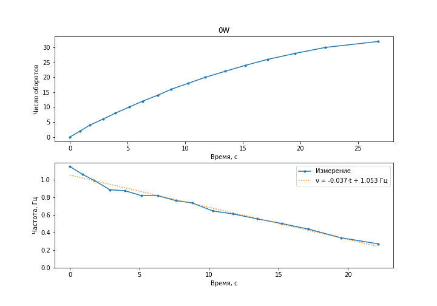
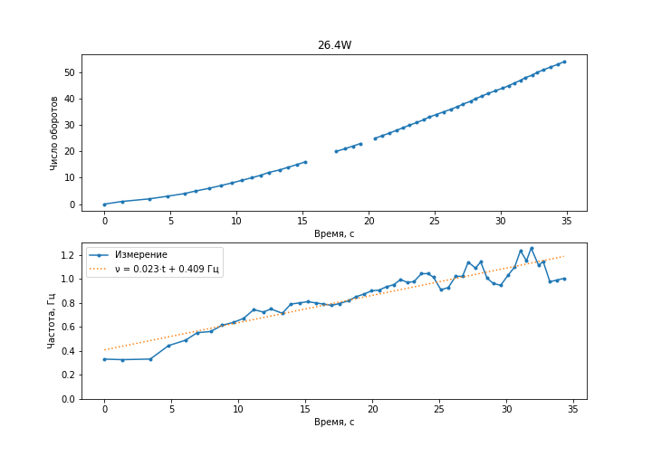
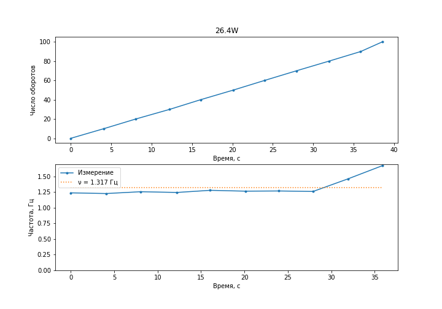
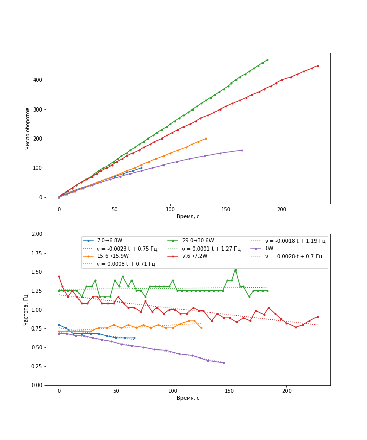
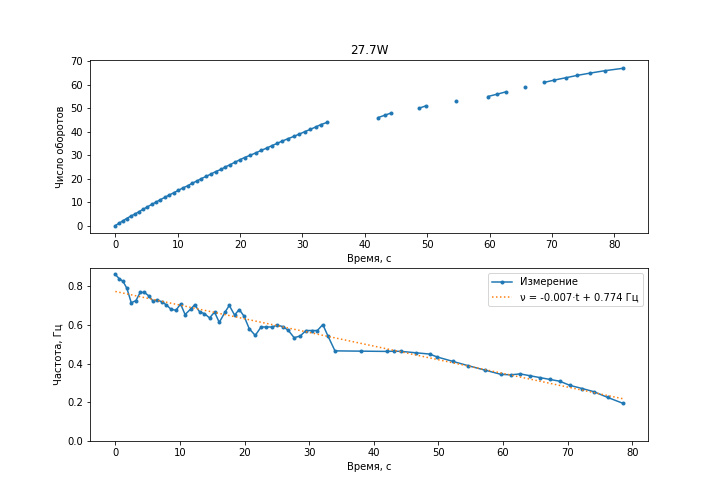
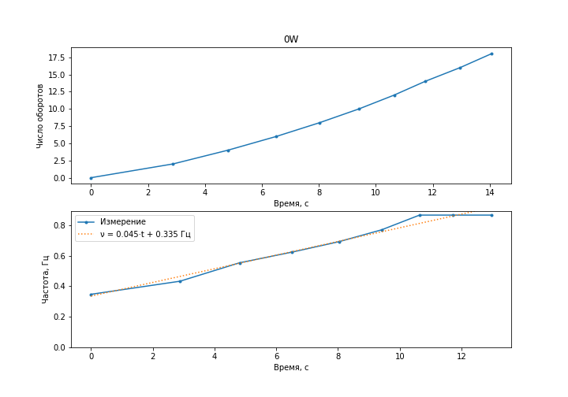

---
title: Двигатель Стирлинга
date: \today
...

## Введение

В этой работе мы изучали двигатель Стирлинга путём измерения различных показателей, связанных с его работой. Это один из первых и самых распространённых двигателей внешнего сгорания, поэтому знакомство с принципами и процессом его работы полезно для понимания работы повседневных механизмов. Так как мы имели достаточно ограниченный инструментарий, то снятие показателей было весьма сложной и нетривиальной задачей. В данной работе мы сфокусировались на измерении КПД двигателя и других параметров, связанных непосредственно с его использованием и строением, а именно силы трения, частоты и максимальной мощности.

Эта работа примечательна тем, что мы не используем никакое оборудование и программное обеспечение, кроме секундомера на телефоне. Оказывается, что даже с настолько простым оборудованием можно провести много содержательных измерений и получить некоторые количественные характеристики.

## Цель работы

Измерить КПД двигателя и другие показатели, характеризующие его термодинамический цикл.

## Установка и визуальное описание работы

{width=80%}

Измерительная установка состоит из сосуда, электронагревателя, поршня, и механической части, обеспечивающей его движение. Электронагреватель нагревает газ у дна сосуда. Горячее дно нагревает газ в сосуде, из-за чего растет давление, которое заставляет поршень подниматься, совершая работу для выравнивания давления с газом снаружи. После чего происходит охлаждение газа, и поршень под своей массой уходит вниз, завершая цикл.
## Общий вид процесса

Попробуем описать этот процесс более подробно. 

В начале происходит нагревание воздуха, при этом основной поршень ($P_1$) поднимается для того, чтобы горячий воздух мог подняться вверх. Но так как объём рабочей части не меняется, то эту часть процесса можно считать изохорной. При всём при этом поршень двигается из крайнего нижнего положения в крайне верхнее:

{width=50%}

В процессе достигается ситуация с минимальным объёмом и максимальным давлением:

{width=50%}

Далее нагретый воздух поднимает вверх рабочий поршень ($P_2$). В следствие этого приводится в движение ротор. В результате подъёма сверху (на расширенной части) происходит теплообмен воздуха:

{width=50%}

В результате движения ротора основной поршень ($P_1$) переводится в нижнее положение позволяя охлаждённому воздуху занять больший объём, тем самым понижая температуру рабочего газа.

{width=50%}

{width=50%}

После чего рабочий поршень приводится в нижнее положение из-за охлаждения газа, и, как следствие, уменьшения давления. Система возвращается в изначальное положение.

{width=50%}

Запишем уравнения для этих процессов (здесь мы делаем очень существенное допущение, что сжатие и расширение — изотермы):
Процесс нагрева:
$$
\begin{aligned}P_1 = P_0 + \frac{Q_1}{V_0} \\
Q_1 = V_0 (P_1 - P_0) = C_V (T_1-T_0)
\end{aligned}
$$
Процесс расширения:
$$
PV = const; \;A_2 = Q_2 = \textbf{ν}RT_1 \ln{ \frac{V_1}{V_0}}
$$
Процесс охлаждения:
$$
P_3 = P_2 - \frac{Q_3}{V_1}
$$
Процесс сжатия
$$
PV = const;\; A_4 = Q_4 = \textbf{ν}RT_0 \ln{ \frac{V_0}{V_1}}
$$

Отсюда видно, что КПД равен:
$$
η = \frac{A_2 + A_4}{Q_1 + Q_2} = \frac{\textbf{ν}R(T_1 - T_0) \ln{ \frac{V_1}{V_0}}}{C_V (T_1-T_0) + \textbf{ν}RT_1 \ln{ \frac{V_1}{V_0}}}
$$
Данная система не учитывает трения и других механических факторов.
$$
\textbf{ν}RT_0 = P·V_0;\\
η = \frac{\textbf{ν}R(T_1 - T_0) \ln{ \frac{V_1}{V_0}}}{{i/2·νR} (T_1-T_0) + \textbf{ν}RT_1 \ln{ \frac{V_1}{V_0}}}=\frac{P_0V_0(T_1/T_0 - 1) \ln{ \frac{V_1}{V_0}}}{i/2·P_0V_0(T_1/T_0 - 1) + P_0V_0·T_1/T_0 \ln{ \frac{V_1}{V_0}}}
$$

Разница температур в нашем опыте не была постоянной. Обе пластины со временем становились горячее, поддерживать температуры постоянными или хотя бы известными у нас не было возможности. Можно оценить характерную температуру нижней пластины как абсолютно черного тела из закона Стефана-Больцмана:
$$
W = σT^4  · S;\; T = \sqrt[4]{\frac{W}{σ·S}}≈\sqrt[4]{\frac{25}{5.67·10^{-8}·π·0.075^2}}\mbox{ Вт}≈400\mbox{ К}
$$

Тогда $ΔT≈100$ К, откуда $η$ мы можем оценить подставив объёмы из справочных данных к аппарату $\frac{V_1}{V_0} = \frac{23}{22} \mbox{ и }  V_0 = 330 \mbox{см}^3$
$$
η = \frac{(T_1/T_0 - 1) \ln{ \frac{V_1}{V_0}}}{i/2·(T_1/T_0 - 1) + T_1/T_0 \ln{ \frac{V_1}{V_0}}} ≈ 0.0175
$$

Здесь важно еще раз отметить, что мы, согласно методике к работе, сделали допущение, что наш процесс — изотерма. Насколько это далеко от правды, несложно оценить, зная, что характерная теплоемкость — $C_V = i/2·R·V/V_m≈2.5·8.31·330·10^{-6}/22.4·10^{-3}≈0.3\mbox{ Дж·К}$. У нас же $C_v·ΔT/UI≈0.3·80/25≈1\mbox{Гц}$. Как раз "на грани разумного". Но если вспомнить, что нам нужно *два* раза за цикл охлаждать-остужать, а нагреватель отдает тепло не только газу, но и окружающей среде. При этом, как будет видно из экспериментов, наша максимальная частота — ~1.5 Гц. Значит, даже в "идеальном" случае не может достигаться равенство температур. Изотермическое сжатие невозможно. Посмотрим, как это сжатие скажется в реальности.  

### Следствия

Как можно заметить система проводит процессы 1, 3 без "вынуждающей силы" (движется только за счет инерции ротора). Это значит, что система не может быть приведена в движение без внешнего взаимодействия из положения равновесия.

## Методика

В работе мы провели несколько серий экспериментов. Начали мы с того, что измерили свободный ход двигателя — мы раскрутили выключенный двигатель (не нагревая нижнюю пластину), а потом измерили зависимость количества оборотов двигателя от времени. Затем мы собрали простую установку, используя грузик массы 25 грамм, блок и нитку, для того, чтобы поднимать грузик при работе двигателя. Мы снова несколько раз измеряли количество оборотов от времени вплоть до момента полного подъёма грузика. Завершили серию экспериментов мы измерением движения поршня после отключения нагревателя.

В дополнение к этим сериям экспериментов мы провели ещё одну, раскрутив поршень в обратную сторону, а затем наблюдали его замедление — тем самым мы хотели изучить нарушение симметрии в нашей системе.

Сами измерения заключались в нажатии кнопки секундомера, после каждых 1 - 5 оборотов (в зависимости эксперимента). Кнопка нажималась в момент, когда одно и то же плечо пересекало луч измерителя. Метод не отличается высокой точностью, но частично компенсируется количеством. К полученным данным применялось программное сглаживание и заполнение "пропущенных" точек кусочно-линейными приближениями. Это делает результаты немного более приятными и воспринимаемыми, но важно понимать, что реальный разброс и ошибка больше, чем отображается на графике. 

## КПД
В *первой* серии экспериментов, где не было разности температур, целью было найти зависимость угловой скорости от времени, чтобы сделать какие-то выводы о "силе трения" в системе. Если бы цикл был бы идеальным, то есть приближение сжатий как изотерм было бы "хорошим", то процесс был бы обратимым, а значит, движение вверх-вниз по изотерме не требовало бы внешней работы. Введя "силу трения", мы хотим приблизить потери от такого приближения и механического трения чем-то, пропорциональным скорости. Это не идеальное приближение, но какую-то поправку при нашей точности измерений оно дать может.

Во *второй* серии мы подтолкнули систему и наблюдали за тем, как она ускорялась при работе двигателя.

В *третьей* серии экспериментов с грузиком мы поднимали его на фиксированную высоту, измеряя время каждого оборота. Это позволяет нам построить зависимость координаты грузика от времени. Из неё мы можем определить "реальную" мощность системы в какой-то момент времени, а так как мощность, поступающая на систему известна и постоянна, то мы можем посчитать КПД системы c учётом момента импульса движущейся части двигателя.  

В первом приближении КПД двигатели оценивается как:

$$
η = \frac{P}{UI} = \frac{mg}{UI} \frac{dh}{dt} = \frac{mg}{UI} v
$$

Мощность в этом приближении равна мощности подъёма грузика

$$
v = ωr
$$

Учтём ускорение системы ($M$ — эффективный момент инерции системы):

$$
\begin{aligned}
η = \frac{P}{UI} = \frac{mg}{UI} \frac{dh}{dt} + \frac{1}{UI} \frac{d(Mω(t)^2/2)}{dt}=\frac{mg}{UI} v(t) + \frac{Mω(t)}{UI} \frac{dω}{dt}= \frac{mgv(t) + Mω(t) \dotω(t)}{UI}\\
v = ω r
\end{aligned}
$$

Во второй серии экспериментов нет грузика, но есть ускорение:

$$
η = \frac{M ω(t) \dotω(t)}{UI}
$$

Ну и наконец, если учитывать трение для подсчёта КПД тепловой части двигателя (без учёта потерь энергии из-за механических причин) получится следующее:

$$
\begin{aligned}
η_1 = \frac{P}{UI} = \frac{mg}{UI} \frac{dh}{dt} + \frac{Mω}{UI} \frac{dω}{dt}+ \frac{P_f(ω)}{UI}= \frac{mgv(t) + Mω(t) \dot ω(t) + P_f(ω(t))}{UI}\\
v = ω r\\
η_2 = \frac{Mω \dot ω(t) + P_f(ω)}{UI}
\end{aligned}
$$

А мощность трения, определяемая угловой скоростью системы, в точке мы получим из первой серии экспериментов

$$
P_f(ω) = Mω \dot ω = 4\pi^2 ν \dot ν
$$

Для удобства подстановки данных перепишем уравнения в частотах (j) и производных частот по времени (u)

$$
\begin{aligned}
ω = 2\pi ν\\
\dot ω = \frac{dω}{dt} = 2\pi \frac{dω}{dt} = 2\pi \dot ν
\end{aligned}
$$
Подставим их в выражения для $η$:
$$
\begin{aligned}
η_1 = \frac{mg ω_3 r + Mω_3 \dot ω_3 + P_f(ω_3)}{UI} = \frac{2\pi mg ν_3 r + 4\pi^2 M ν_3 \dot ν_3 + P_f(ν_3)}{UI}\\
η_2 = \frac{Mω_2 \dot ω_2 + P_f(ω_2)}{UI} = \frac{4\pi^2Mν_2\dot ν_2 + P_f(ν_2)}{UI}\\
\end{aligned}
$$

КПД установок в таком случае должны быть равны при одинаковых угловых скоростях (угловые ускорения - разные).  Тогда возьмём такие моменты серий экспериментов, в которые частоты равны  :

$$
\begin{aligned}
ν_1 = ν_2 = ν_3 \\
\frac{2\pi mg ν_3 r + 4\pi^2 M ν_3 \dot ν_3 + P_f(ν_3)}{UI}= η_2 = \frac{4\pi^2Mν_2\dot ν_2 + P_f(ν_2)}{UI}
\end{aligned}
$$

Значит:
$$
mgr + 2\pi M \dot ν_3= 2\pi M\dot ν_2\\
M = \frac{mgr}{2\pi(\dot ν_2 - \dot ν_3)}
$$

Посчитаем мощность затухания (по модулю):
$$
P_f(ν_1) = -4\pi^2 Mν_1 \dot ν_1 = -2\pi \frac{mgr}{\dot ν_2 - \dot ν_3}ν_1 \dot ν_1
$$
Имея этот момент инерции и мощность затухания нетрудно посчитать КПД тепловой машины от частоты:
$$
η_2(ν_2) = \frac{\frac{2\pi mgr}{\dot ν_2 - \dot ν_3}ν_2\dot ν_2 + 2\pi \frac{mgr}{\dot ν_2 - \dot ν_3}ν_2 \dot ν_1}{UI}= \frac{2\pi mgrν_2 (\dot ν_2 + \dot ν_1)}{(\dot ν_2 - \dot ν_3) UI} = 4\pi^2 M \frac{ν_2(\dot ν_2 + \dot ν_1) }{UI}
$$

И если нам нужно узнать КПД двигателя с учётом его "механического несовершенства", то:
$$
η_{full}(ν_2) = \frac{2\pi mgrν_2 \dot ν_2}{(\dot ν_2 - \dot ν_3) UI} = 4\pi^2 M \frac{ν_2\dot ν_2 }{UI}
$$

## Результаты

Примерно за две минуты нагреватель мощностью 27 Вт нагревает нижнюю пластину от комнатной температуры (~25°C) до температуры человеческого тела (~36°C), проверка "на ощупь" (значит, если пренебречь потерями, теплоемкость пластины порядка 300 Дж · К). Через 13 минут двигатель смог начать самостоятельно вращаться. Можно предположить, что температура пластины на тот момент была около 70-80°C. 

#### Серия 1

{width=80%}

$$
\dot ν_1 ≈ -0.037±0.005  \mbox{с}^{-2}
$$
(погрешность получена из метода наименьших квадратов; в реальности почти наверняка есть серьезная систематическая погрешность, которую мы не можем оценить)

#### Серия 2

{width=80%}

{width=80%}

{width=80%}

$$
\dot ν_2 ≈ 0.025 ± 0.05 \mbox{с}^{-2}
$$

Последнее измерение не получилось "раскручивающимся" — возможно, начальный толчок был слишком сильным, или мы стартовали из положения с высокой "потенциальной энергией".

#### Серия 3

{width=80%}

{width=80%}

{width=80%}

Частота в последнем эксперименте меньше, скорее всего — из-за того, что он проводился одним из первых, пластина не успела полностью прогреться.

В целом видно, что $\dot ν_3$ в нашем случае мала, ею можно пренебречь в расчетах при известной $ν_3$.

Отсюда, считая, что $\dot ν_3 << \dot ν_2$:
$$
M = \frac{mgr}{2\pi(\dot ν_2 - \dot ν_3)}≈\frac{mgr}{2\pi\dot ν_2}≈\frac{0.025·9.8·0.014}{2·3.14·0.025} ≈ 0.0218 (\mbox{кг·м}^2)
$$

$$
P_f(ν) = -4\pi^2 Mν \dot ν_1 = -2\pi \frac{mgr}{\dot ν_2 - \dot ν_3}ν_1 \dot ν_1
$$

$$
\begin{aligned}
η_2(ν_2) ≈ 4\pi^2 M \frac{ν_2(\dot ν_2 + \dot ν_1) }{UI} ≈ \frac{4·9.86·0.0218·(0.025 + 0.037) ·ν_2}{26.7} ≈ 0.0020 ν_2 \\
η_{full}(ν_2) ≈ 4\pi^2 M \frac{ν_2\dot ν_2 }{UI} ≈ \frac{4·9.86·0.0218·0.025·ν_2}{26.7} ≈ 0.00080 ν_2
\end{aligned}
$$

Мы не можем получить "стабильную" частоту из нашей теории, для этого нам нужно больше знать про "внутренности" происходящего. Однако мы получили формулу для КПД, если мы знаем частоту, на которой мы работаем. Ясно, что эти приближения очень быстро перестанут работать — здесь мы, например, считали $\dotν_1, \dot ν_2 \sim const$, что очень быстро станет неправдой, если мы работаем с частотами разных порядков. Однако мы можем применить эту формулу для нашего случая, тогда, если мы возьмем $ν_2≈1\mbox{ Гц}$, получим, что
$$
\begin{aligned}
η_2≈2.0·10^{-3}\\
η_{full} ≈ 8.1·10^{-4}
\end{aligned}
$$

Это крайне низкие показатели КПД, даже с учетом силы трения получается на порядок меньше, чем приближение через изотермы. Оно несложно объясняется — как уже было упомянуто в теории, приближение изотермами даже в идеальном случае не может работать, а значит, в процессе выделяется больше энтропии, КПД обязан заметно уменьшиться. Важна та же упомянутая особенность нагревателя — он не может греть только воздух внутри, пластина, к которой он прикреплен, сильно нагревается (во время эксперимента один из авторов легко обжегся, дотронувшись до нее). 

Ниже представлены графики последовательных измерений, которые мы проводили без груза на разных мощностях. Таким образом мы хотели понять, как зависит частота работы двигателя от мощности подогрева. Стрелками обозначены мощности, изменившиеся во время подогрева (из-за нагрева меняется проводимость нагревательного элемента, из-за чего меняется напряжение/ток).

{width=80%}

Из графика видно, что увеличение мощности в четыре раза приводит к увеличению частоты только в два раза. При слишком маленькой мощности (<5 Вт) двигатель не запускается, а мощность, большую 30 Вт, не рекомендуется подавать из соображений безопасности. Чтобы визуально определить "расстояние" между сериями (нам приходилось делать небольшие паузы, чтобы перебивать данные с секундомера), мы отложили их в хронологическом порядке.

{width=80%}

Между вторым и третьим измерением прошел большой промежуток времени, насос успел "разогнаться". В остальных же частях частота более непрерывна. Из пятого измерения (резко уменьшили мощность с 30 до 7 Вт) видно, что характерное время изменения частоты двигателя — около 200 секунд (за 200 секунд вернулся с уровня 30 Вт до начального, 7 Вт). Из последнего измерения хорошо видно, что частота убывает до нуля практически линейно.

Измерение запуска двигателя в обратную сторону показало, что двигатель тормозится заметно медленнее, чем торможение без разницы температур. В случае торможения частота убывала со скоростью около 3.5%/с, в случае обращения — 1%/с (см. график):

{width=80%}

Это измерение было нужно нам, для того, чтобы показать, что двигатель работает (с положительным ускорением) только в одну сторону.

Мы можем предположить, что двигатель продолжает работать, но гораздо менее эффективно, что приводит к медленному затуханию. Когда достигается ноль, двигатель начинает вращение в обратную сторону.

{width=80%}

Этот эксперимент - аналог первой серии и был проведён одним из первых для проверки двигателя на существенность силы трения. Так как ускорение системы оказалось в два раза выше, чем её замедление в первой серии (с учётом торможения в этом эксперименте), то можно оценить силу трения как mg, где m = 25 г.

Напоследок хочется привести интересный график "раскрутки" двигателя без разницы температур, к которому привешивали груз 50 г и опускали вниз. Скорость раскрутки под грузом 50 г примерно того же порядка, что и обычная раскрутка, а так же затухание. В конце измерения видно, что двигатель переходит в "стабильный" режим, причем достаточно резко, нет аккуратного "подползания" по экспоненте (это может быть вызвано большой погрешностью измерений, которая неспособна уловить настолько тонкий эффект)

{width=80%}

## Выводы

Несмотря на то, что в работе из измерительного оборудования был лишь один секундомер, мы извлекли из нее достаточно много интересных данных (на самом деле мы также используем для теоретических предсказаний некоторые известные параметры системы, такие как $V_1/V_0$ или форму зависимости $PV$ для процесса, но для измерений динамики системы действительно используется только секундомер).

В результате было выяснено, что метод "протыкивания" вращений не слишком точен — человек может буквально не попасть по кнопке. Иногда много раз подряд. Для исправлений последствий этой ошибки полезно записывать суммарное число оборотов за время измерения, чтобы были шансы восстановить пропущенные точки. В целом метод показал себя не слишком надежным, но он в принципе дает что-то разумное, когда под рукой нет более точных и информативных приборов.

Как и следовало ожидать, КПД такого двигателя оказался крайне малым, он не подходит для практического применения. 

Более того, приближение КПД процесса работы двигателя через изотермы дает результат, далекий от наблюдаемого. В реальности в силу разных причин (не только термодинамических), КПД по нашим оценкам снижается примерно ещё в 20 раз.

