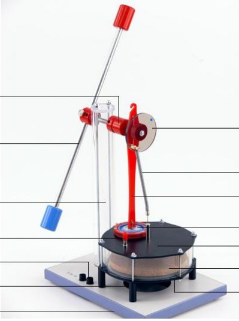

---
title: Двигатель Стирлинга
date: \today
...

## Введение

В этой работе мы изучали двигатель Стирлинга путём измерения различных показателей, связанных с его работой. Это один из первых и самых распространённых двигателей внешнего сгорания, поэтому знакомство с принципами и процессом его работы полезно для понимания работы повседневных механизмов. Так как мы имели достаточно ограниченный инструментарий, то снятие показателей было весьма сложной и нетривиальной задачей. В данной работе мы сфокусировались на измерении КПД двигателя и других параметров, связанных непосредственно с его использованием и строением, а именно силы трения, частоты работы и максимальной мощности.

## Цель работы

Измерить КПД двигателя и другие показатели, характеризующие его термодинамический цикл.

## Установка и визуальное описание работы

{width=70%}

Измерительная установка состоит из сосуда, электронагревателя, поршня, и механической части, обеспечивающей его движение. Электронагреватель нагревает газ у дна сосуда. Горячее дно нагревает газ в сосуде, из-за чего растет давление, которое заставляет поршень подниматься, совершая работу для выравнивания давления с газом с верхней частью сосуда. После чего происходит смешение газов, и поршень под своей массой уходит вниз, завершая цикл.
## Базовая теория 

Попробуем описать этот процесс более подробно. 

В начале происходит нагревание воздуха, при этом основной поршень ($P_1$) поднимается для того, чтобы горячий воздух мог подняться вверх. Но так как объём рабочей части не меняется, то эту часть процесса можно считать изохорной. При всём при этом поршень двигается из крайнего нижнего положения в крайне верхнее:

В процессе достигается ситуация с минимальным объёмом и максимальным давлением:

Далее нагретый воздух поднимает вверх рабочий поршень ($P_2$). В следствие этого приводится в движение ротор. В результате подъёма сверху (на расширенной части) происходит теплообмен воздуха:

В результате движения ротора основной поршень ($P_1$) переводится в нижнее положение позволяя охлаждённому воздуху занять больший объём, тем самым понижая температуру рабочего газа.

После чего рабочий поршень приводится в нижнее положение из-за охлаждения газа, и, как следствие, уменьшения давления. Система возвращается в изначальное положение.

Запишем уравнения для этих процессов (здесь мы делаем существенное допущение, что сжатие и расширение — изотермы):
Процесс нагрева:
$$
P_1 = P_0 + \frac{Q_1}{V_0} \\
Q_1 = V_0 (P_1 - P_0) = C_V (T_1-T_0)
$$
Процесс расширения:
$$
PV = const\\
A_2 = Q_2 = \textbf{ν}RT_1 \ln{ \frac{V_1}{V_0}}
$$
Процесс охлаждения:
$$
P_3 = P_2 - \frac{Q_3}{V_1}
$$
Процесс сжатия
$$
PV = const\\
A_4 = Q_4 = \textbf{ν}RT_0 \ln{ \frac{V_0}{V_1}}
$$

Отсюда видно, что КПД равен:
$$
η = \frac{A_2 + A_4}{Q_1 + Q_2} = \frac{\textbf{ν}R(T_1 - T_0) \ln{ \frac{V_1}{V_0}}}{C_V (T_1-T_0) + \textbf{ν}RT_1 \ln{ \frac{V_1}{V_0}}}
$$
Данная система не учитывает трения и других механических факторов.

## Следствия из теории

Как можно заметить система проводит процессы 1, 3 без "вынуждающей силы" (движется только за счет инерции ротора). Это значит, что система не может быть приведена в движение без внешнего взаимодействия из положения равновесия.

## Методика

В работе мы провели несколько серий экспериментов. Начали мы с того, что измерили свободный ход двигателя — мы раскрутили выключенный двигатель, а потом измерили зависимость количества оборотов двигателя от времени. Затем мы собрали простую установку, используя грузик массы 25 грамм, блок и нитку, для того, чтобы поднимать грузик при работе двигателя. Мы снова несколько раз измеряли количество оборотов от времени вплоть до момента полного подъёма грузика. Завершили серию экспериментов мы измерением движения поршня после отключения нагревателя.

В дополнение к этим сериям экспериментов мы провели ещё одну, раскрутив поршень в обратную сторону, а затем наблюдали его замедление — тем самым мы хотели изучить нарушение симметрии в нашей системе.

Сами измерения заключались в нажатии кнопки секундомера, после каждых 1 - 5 оборотов (в зависимости эксперимента). Кнопка нажималась в момент, когда одно и то же плечо пересекало луч измерителя.

## Пояснения к методике 
В первой серии экспериментов целью было найти зависимость угловой скорости от времени, чтобы сделать какие-то выводы о силе трения в системе.

Во второй серии мы подтолкнули систему и наблюдали за тем, как она ускорялась при работе двигателя.

В третьей серии экспериментов с грузиком мы поднимали его на фиксированную высоту, измеряя время каждого оборота. Это позволяет нам построить зависимость координаты грузика от времени. Из неё мы можем определить "реальную" мощность системы в какой-то момент времени, а так как мощность, поступающая на систему известна и постоянна, то мы можем посчитать КПД системы c учётом момента импульса движущейся части двигателя.  

Простая версия КПД
$$
k = \frac{P}{UI} = \frac{mg}{UI} \frac{dh}{dt} = \frac{mg}{UI} v
$$
Мощность в этом приближении равна мощьности подъёма грузика
$$
v = wr
$$

Усложнённая версия КПД (e_i угловое ускорение в i-том эксперименте)
Здесь мы начинаем учитывать ускорение системы (M - эффективный момент инерции системы)
$$
k = \frac{P}{UI} = \frac{mg}{UI} \frac{dh}{dt} + \frac{Mw_3}{UI} \frac{dw_3}{dt}= \frac{mgv + Mw_3 e_3}{UI}
v = w_3 r
$$
Из второй серии экспериментов
$$
k = \frac{Mw_2 e_2}{UI}
$$

Ну и наконец, если учитывать трение (для подсчёта КПД тепловой части двигателя (без учёта потерь эниергии из-за механических причин)) получиться это:

$$
k_t = \frac{P}{UI} = \frac{mg}{UI} \frac{dh}{dt} + \frac{Mw_3 + P_т}{UI} \frac{dw_3}{dt}= \frac{mgv + Mw_3 e_3 + P_т}{UI}
v = w_3 r
k_t = \frac{Mw_2 e_2 + P_т}{UI}
$$
А мощность трения определяемая угловой скоростью системы в точке мы получим из первой серии экспериментов
$$
P_т = Mw_1 e_1
$$
Для удобства подстановки данных перепишем. Перепишем уравнения в частотах (j) и производных частот по времени (u)
$$
w_i = 2pi * j_i
e_i = \frac{dw_i}{dt} = 2pi \frac{dj_i}{dt} = 2pi u_i
$$
Подставим их в уравнения для $k$ и $k_t$
$$
k_t = \frac{mg w_3 r + Mw_3 e_3 + Mw_1 e_1}{UI} = {2pi mg j_3 r + 4pi^2 M j_3 u_3 + 4pi^2 Mj_1 u_1}{UI}
k_t = \frac{Mw_2 e_2 + Mw_1 e_1}{UI} = 4pi^2 \frac{Mj_2 u_2 + Mj_1 u_1}{UI}
k = \frac{mg w_3 r + Mw_3 e_3}{UI} = {2pi mg j_3 r + 4pi^2 M j_3 u_3}{UI}
$$

## Выводы

