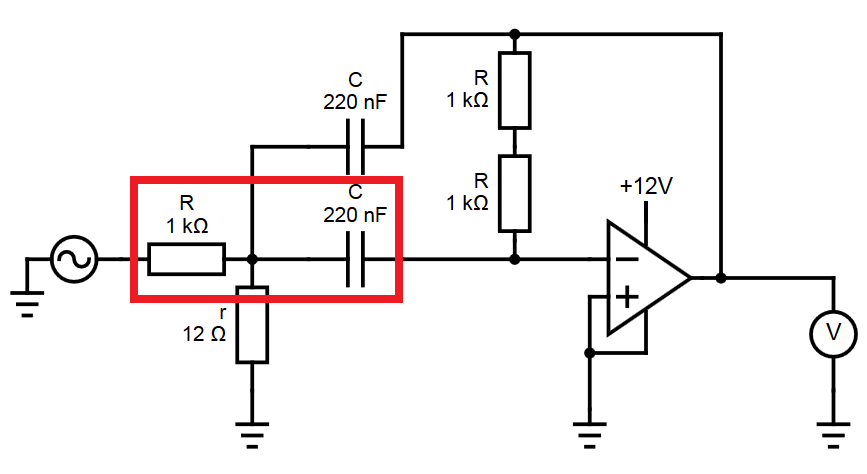

---
title: Активные и пассивные фильтры
...

## Введение

Полосовые фильтры — достаточно востребованная вещь в электронике, если нужно получить некоторый диапазон частот от сигнала. Такое может быть крайне полезно для радиоэлектроники, обработки аналогового звука, фильтрации паразитных частот в научных приборах.

Полосовые фильтры часто делят на пассивные и активные. Пассивные фильтры, как правило, крайне простые устройства, для сборки которых достаточно пары резисторов и конденсаторов. Однако они не позволят получить произвольные параметры фильтрации (вернее, для их получения потребуются фильтры высоких порядков, состоящие из большого количества элементов), также используя только пассивные фильтры первого порядка, мы не можем получить "резкий" скачок в спектре пропускания.

В свою очередь, активные фильтры гораздо более гибкие, но более сложные, требуют дополнительного питания и, как следствие, менее отказоустойчивые. Самые распространенные схемы используют операционный усилитель — небольшую микросхему со сложным подключением транзисторов внутри, многократно (k $\sim$ 10 000-100 000) усиливающую разность напряжений. Если как-либо подключить выход к одному из входов, мы можем получить разные нужные соотношения на напряжения.

В этой работе мы попробовали спаять активный полосовой фильтр, а также создать и замерить АЧХ простейшего пассивного фильтра нижних частот.

## Схема активного полосового фильтра

Мы решили спаять следующую схему (параметры элементов брали из расчета на  центральную частоту $\sim$ 5 000 Гц (среднее арифметическое между нижней и верхней границей пропускания), полосу пропускания около 500 Гц, коэффициент передачи — около 1):

{width=80%}

Параметры фильтра можно получить аналитически, так как он состоит из линейных элементов и операционного усилителя, дающего условие $V_{out} = k(V_+-V_-)$.

Введем следующие параметры системы:

- $R_2$ — в нашем случае это два последовательно подключенных $R$ ($R_2 = 2R$)
- $C_1, C_2$ — верхняя и нижняя ёмкости; в нашем случае они равны, но так бывает не всегда
- $k$ — коэффициент усилиения операционного усилителя, $\sim$ 10 000-100 000
- $U_0$ — напряжение на входе

И следующие неизвестные:

- $I_1$ — ток, текущий через $C_1$
- $I_2$ — ток, текущий через $C_2$ и $R_2$ (вход операционного усилителя практически не требует тока)
- $I_3$ — ток, утекающий по $r$
- $U_1$ — (комплексное) напряжение на точке стыка $C_1, C_2, R$ и $r$
- $U_-$ — (комплексное) напряжение на входе "-" операционного усилителя
- $U_o$ — выходное напряжение

Тогда по закону Ома (по методу импедансов) и условия на усилиение усилителем:

$$
\begin{cases}
  U_0 = R(I_1 + I_2 + I_3) + U_1\\
  U_1 = \frac{I_1}{iwC_1} + U_o\\
  U_1 = \frac{I_2}{iwC_2} + U_-\\
  U_- = I_2 · R_2 + U_o\\
  U_1 = rI_3
  U_o = -kU_-
\end{cases}
$$

Последние два уравнения тривиальные, поэтому избавимся от них подстановкой $U_- = -U_o/k$, $I_3 = U_1/r$, а заодно преобразуем выражения в более удобный вид:

$$
\begin{cases}
  RI_1 + RI_2 + U_1\left(1 + \frac{R}r\right) &= U_0\\
  U_1 - \frac{I_1}{iwC_1} - U_o &= 0\\
  U_1 - \frac{I_2}{iwC_2} + U_o/k &= 0\\
  I_2 · R_2 + U_o - U_o/k &= 0
\end{cases}
$$

Заметим, что слагаемыми, где мы делим на $k$, мы можем с чистой совестью пренебречь — 10 000 достаточно большое число. Тогда:

$$
\begin{aligned}
&0 &+ RI_1 &+ RI_2 &+ \left(1 + \frac{R}r\right)U_1 &= U_0\\
&-U_o &-\frac{1}{iwC_1}I_1 &+ 0  &+U_1 &= 0\\
&0 &+ 0 &-\frac{1}{iwC_2}I_2 &+ U_1 &= 0\\
&U_o &+0 &+ R_2I_2 &+ 0 &= 0
\end{aligned}
$$

Составим матрицу и решим систему методом Гаусса:

$$
\left[\begin{matrix}
0 & R & R & \frac{R}{r} + 1 & U_{0}\\
1 & - \frac{i}{C_{1} w} & 0 & -1 & 0\\
0 & 0 & - \frac{i}{C_{2} w} & -1 & 0\\
1 & 0 & R_{2} & 0 & 0
\end{matrix}\right]
$$

Что дает нам (отн-о $U_o$):

$$
U_{out} = \frac{C_{2} R_{2} U_{0} r w}{(C_{1} C_{2} R R_{2} r w^{2} - R - r)^2 + (C_{1} + C_{2})^2 R^2 r^2 w^2}
$$

Легко видеть, что при $w → 0$ напряжение на выходе $\sim w$, при $w → \infty$ $\sim 1/w$, посередине происходит "что-то интересное". Регулируя эти параметры, можно усиливать получаемое напряжение, менять пиковую частоту и ширину пика. Наши параметры:

$$
\begin{aligned}
R = R_1 = 1\mbox{ кОм}\\
R2 = 2R = 2\mbox{ кОм}\\
C1 = C2 = 220\mbox{ нм}\\
r = 12\mbox{ Ом}
\end{aligned}
$$

Подставляя их в формулу выше, можем получить следующее теоретическое АЧХ:

{width=60%}

Схему мы также "проверили", используя симулятор электрических цепей[^simulator].

Параметры нашей цепи при указанных элементах должны быть следующие:

| Параметр       | Наименование                 | Значение |
| -------------- | -------------------------    | -------- |
| $f_{\mbox{ц}}$ | Центральная частота          | 4 700 Гц |
| $Δf$           | Полоса пропускания           | 700 Гц   |
| $Q$            | Добротность                  | 6.5      |
| $κ$            | Пиковый коэффициент передачи | 1.0      |

 

## Оборудование
Для простоты (фильтр не планировалось использовать для реальных задач) мы решили использовать макетную плату.

Использованные компоненты:

Компонент | Количество
--- | ---
Плата печатная ОПП 50×100 мм | 1
Микросхема TL072CP — малошумящий операционный усилитель (Китай) | 1
Плата печатная ДПП 10×20 мм для SMD компонентов | 1
Резистор 1 кОм МЛТ-0.5 | 3
Резистор 12 Ом МЛТ-0.125 | 1
Конденсатор 0.22 мкФ / 63 В К73-17 10%  | 1

Обычно одна микросхема содержит в себе два операционных усилителя, питание общее. Нам нужен только один усилитель, так что мы будем использовать одну половину.

{width=40%}

К сожалению, оказалось, что расстояние между ножками не соответствует расстоянию на макетной плате, из-за чего мы решили купить плату для SMD компонентов. Увы, ножки оказались еще меньше, и пришлось изобретать "пайку по диагонали" :

{width=40%}

Надежностью такая схема не отличается, но это был единственный доступный вариант в наших условиях (травить плату мы не хотели).

{width=60%}

Для измерения мы использовали источники постоянного и переменного тока (в нашем случае сигнал для измерения был синусоидальным), измерения проводили с помощью осциллографа и вольтметра (в нашем случае вольтметр измеряет "мощность" выходного сигнала, преобразуя её в действующее напряжение, предполагая, что сигнал — синусоида).

{width=60%}

### Результаты измерения параметров полосового фильтра

Амплитуда и мощность практически не зависятм как от частоты, так и от наличия питания на операционном усилителе. Это значит, что где-то в схеме была допущена ошибка — могла "подвести" как "диагональная пайка", так и сам операционный усилитель — способа проверить его работоспособность у нас не было.

Однако график сигнала, получаемого с использованием "бракованной" схемы отличался от обычной синусоиды (на снимках на осциллографе одна кривая отвечает за входной сигнал, вторая — за "отфильтрованный"):

{subfigures:
{width=0.45}
|
|
|

}

Анализировать такие результаты сложно, но можно заметить, что выходной сигнал не был линейным преобразованием входного — из синусоиды наш "фильтр" делал отличную от синусоиды периодичную функцию. Так как одними конденсаторами и резисторами этого добиться нельзя, можно заключить, что наш операционный усилитель работал, пусть и не так, как хотелось бы.

## Пассивный фильтр

Чтобы убедиться, что проблема была в операционном усилителе/его пайке, а не в системе измерения/линейных элементов, мы отделили от схемы резистор и конденсатор, создав из них простейший пассивный фильтр нижних частот. 

{subfigures:
{width=0.45}
|

}

{width=50%}

Теоретическое АЧХ такого простейшего фильтра нижних частот легко найти, используя метод комплексных электрических сопротивлений:

$$
z = R + \frac1{iωC}
$$

$$
U = \frac1{iωC}·\frac{U_0}{z} = \frac1{iωC}·\frac{U_0}{R - \frac{i}{ωC}} = \frac{U_0}{R·iωC - 1}\\
$$

$$
|U| = \frac{U_0}{\left(R^2·ω^2C^2 + 1\right)^2}
$$

### Результаты измерений

Так как вольтметр показывает *действующее* напряжение, то полученный результат нужно умножить на $\sqrt2$. Построим теоретическую зависимость, зная, что $R = 1\ kΩ$, $C = 220\ nF$, нанесем на нее экспериментальные точки (отнормировано по подаваемому напряжению 3.0 В):

{width=80%}

АЧХ хорошо согласуется с теоретическим, однако видна резкая просадка на напряжениях $\sim 10^{-3}$ В. Скорее всего, это вызвано тем, что такие напряжения становятся неотличимы от "шума", и вольтметр просто отфильтровывает их. Возможно, механизм немного другой, но ясно, что на *разумных* напряжениях и частотах фильтр работает полностью корректно. Таким образом, проблема в активном фильтре скорее всего была не в системе измерения, резисторах или конденсаторах, а в операционном усилителе или его способе пайки.

## Выводы

Наша работа помогла осознать сразу два важных вывода: во-первых, для надёжности схемы важно использовать платы и компоненты соответствующих размеров (или травить плату самим, если найти не получается). А во-вторых, в силу простоты и надежности, лучше использовать пассивные фильтры, если это позволяют требования задачи — найти неисправность в операционном усилителе практически нереально, а чтобы найти бракованный резистор/конденсатор в пассивном фильтре, достаточно несколько замеров LCR-метром. Если же требуется активный фильтр, лучше обращаться к профессионалам.

[^simulator]: https://falstad.com/circuit/circuitjs.html
[^formulas]: https://analogiu.ru/6/6-5-2-3.html

