---
title: Отчёт по лабораторному курсу оптической микроскопии
...

# Введение

Оптическая микроскопия — давно зарекомендовавший себя метод изучения малых объектов, который уже более полутора столетий является стандартным инструментом в науке о жизни и материаловедении на масштабах микростурктуры. В свое время микроскопы открыли совершенно новое измерение в науке — с их помощью удалось обнаружить существование микроорганизмов, изучить структуру клеток и увидеть мельчайшие части растений, животных и грибов. Со временем в оптической микроскопии произошло большое количество изменений, которые привели к более высокому разрешению, скорости сбора данных, а также появились методы, позволяющие, например, наблюдать за клетками без использования окрашивания (метод тёмного поля).

Оптическая микроскопия является одним из наиболее важных методов в материаловедении. Она может дать много информации о поверхности материалов, включая их форму, размеры, текстуру и топографию, а также позволяет исследовать структуру материалов на микро- и наномасштабах, а также определять их свойства. Оптический микроскоп позволяет наблюдать объекты на увеличении до 2000–3000 крат, но размер этих объектов не может быть меньше 200–400 нм. Эти ограничения накладывают физические законы – преодолеть эти границы можно лишь с применением электронных систем. Она также позволяет отслеживать процессы образования и роста кристаллов.

Для эффективного применения оптической микроскопии может быть очень важно осознавать основы оптики, и наоборот — оптическая микроскопия может быть очень наглядным примером для лучшего понимания геометрической и волновой оптики. Базовые оптические микроскопы могут быть очень простыми, но существует множество сложных конструкций, направленных на улучшение разрешения и контрастности образца. Именно это мы и будем изучать в этой серии лабораторных работ.

Таким образом, понимание основ оптической микроскопии может быть полезным для всех учёных, поскольку это давно зарекомендовавший себя метод определения характеристик, который уже более полутора столетий является стандартным инструментом в науке. Понимание основ оптики помогает  эффективно использовать этот инструмент. 

В отчете весьма *кратко* будут приводиться отдельные факты из теории оптической микроскопии, важные для понимания результатов работы. Подробнее познакомиться с курсом можно в методических пособиях [1].

# Ход работы

## Лабораторная №1

**Задачи**: изучить основное используемое оборудование: камеры, монохроматическую и цветную, спектрометр.

### Монохроматические и цветные камеры

Монохроматические камеры более чувствительны, потому что они используют только один цветовой канал, в то время как цветные камеры используют три. Обычно это реализуется с помощью фильтров на длину волны (RGB в случае обычных цветных камер) на каждом светочувствительном элементе камеры:

Это означает, что, во-первых, монохроматические камеры могут собирать больше света на каждый пиксель. Более того, чтобы получить цветное изображение из цветной камеры, нужно усреднить значения по пикселям одного цвета, что даёт дополнительное размытие — а значит, монохроматические камеры могут получать хорошие данные и лучшее соотношение сигнал/шум за меньшее время экспозиции.

Монохроматические камеры лучше для физических измерений, потому что они гораздо более чувствительны, чем цветные камеры. Это означает, что вы можете получить хорошие данные и лучшее соотношение сигнал/шум за гораздо меньшее время экспозиции. Монохроматические камеры также имеют более высокое пространственное разрешение, чем цветные камеры. Кроме того, монохроматические камеры могут использоваться для получения мультиспектральных изображений. Очевидный недостаток использования монохроматических камер — нельзя считывать информацию о цветовой текстуре объекта исследования.

### Цвет

В оптических микроскопах выдержка относится к времени, в течение которого датчик камеры находится под воздействием света. **Gain** — мера того, насколько усиливается сигнал камерой. **Black level** относится к минимальному уровню сигнала, который считается выше шума. Предпочтительные значения для этих параметров зависят от конкретного применения и условий съемки. Например, при флуоресцентной микроскопии важно использовать время экспозиции, достаточное для захвата достаточного количества фотонов, но не настолько долгое, чтобы произошло насыщение пикселей. Усиление должно быть достаточно высоким для усиления сигнала, но не настолько высоким, чтобы шум стал проблемой. Уровень черного цвета должен быть достаточно низким для захвата всего сигнала, но не настолько низким, чтобы шум стал проблемой.

В зависимости от условий съемки, то есть от того, как много света доступно и как быстро движется объект, может быть лучше увеличить выдержку или **Gain**. Если объект движется быстро, то увеличение выдержки может привести к размытию изображения. Если света мало, то увеличение **Gain** может привести к большему шуму на изображении. В общем случае лучше использовать наименьшую выдержку и наименьший **Gain**, которые позволяют получить достаточно яркое изображение с низким уровнем шума.

### Спектрометр

Как уже было сказано выше: монохроматические камеры лучше для физических измерений, но через них нельзя считывать информацию о цветовой текстуре объекта исследования.
Поэтому для получения данных спектра в условии однородного источника, лучше использовать спектрометр вместо цветовой камеры. Он способен выдать более точную картину распределения интенсивности свечения от длины волны, но не способен дать информацию о пространственном расположении источников. 

### Используемое программное обеспечение

**ThorCam** — приложение для захвата и просмотра изображения с помощью камер *ThorLabs*.

**ThorSpectra** — программный пакет, который обеспечивает возможности спектрального анализа для спектрометров *Thorlabs*. Он позволяет получать спектры, анализировать данные и выгружать данные в популярных форматах. В него встроены функции, такие как поиск пиков, коррекция базовой линии и сглаживание данных.

### Ход работы

Работу мы начали с проверки работоспособности камеры и ознакомления с возможностями **ThorCam**.

Для начала мы направили камеру на лампу. Камера сама по себе не имеет никаких средств фокусировки, а изображение на выходе — просто массив "количества света" на каждом светочувствительном элемкенте на поверхности. Это значит, что бессмысленно ожидать какое-то разумное изображение. Всё, что мы можем таким получить — экран одного цвета (серый в случае монохромной камеры), или, если камера находится очень близко к объекту — какое-то крайне размытое изображение.

{width=60%}

Но если очень аккуратно частично заслонить падающий сверху свет от лампы бумажкой, так, чтобы граница тени проходила ровно  по светочувствительной матрице камеры  — мы получим очень размытое, но тем не менее различимое изображение:

!SUBFIGURES:
|
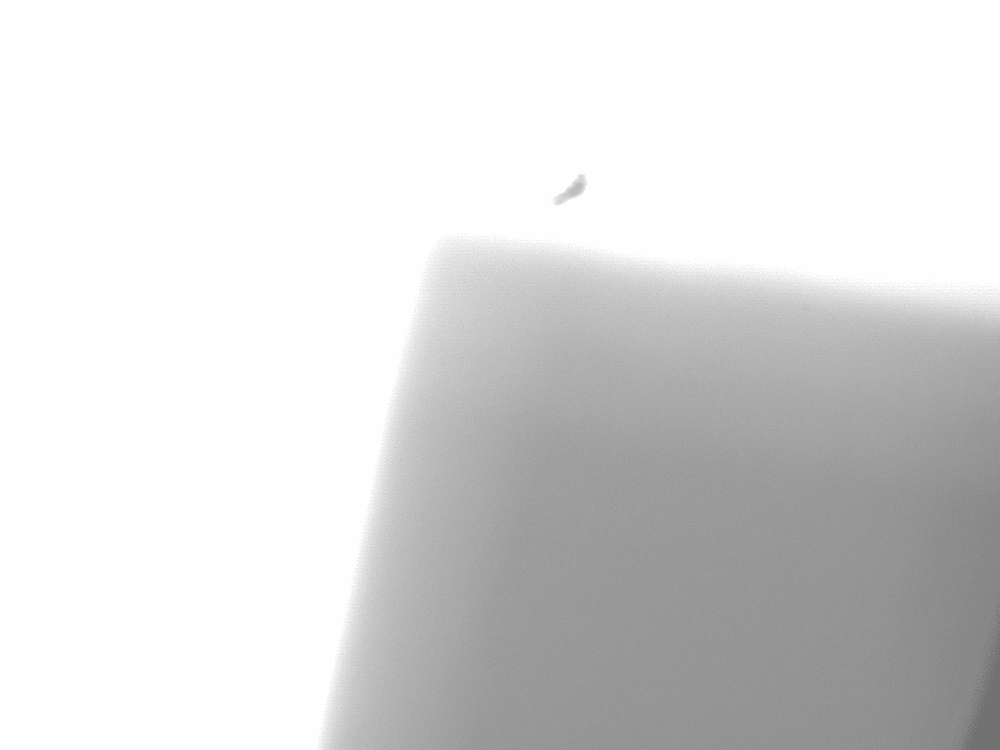|
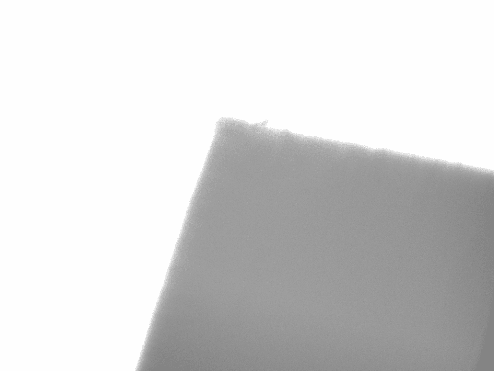

Чтобы получить различимое изображение, нам требуется его сфокусировать на поверхность камеры. Для этого нужно использовать линзу с большой оптической силой, чтобы размер изображения источника был сравним с размером источника. 

Линза, которую мы выбрали, имела фокусное расстояние $25.4\ mm$ — достаточно малое, чтобы изображение лампы занимало порядка нескольких миллиметров. 

Наконец, мы, аккуратно расположив линзу на примерно фокусном расстоянии (чуть дальше, так как лампы на потолке не бесконечно далеко, но тем не менее расположены на расстоянии, значительно больше фокусного) получили изображение на поверхности камеры. В зависимости от выдержки камеры можно получить изображения разной детализованности:

После этого мы занялись настройкой камеры, прикрутив объектив с линзой, и взяв за ориентир расположенное вдалеке здание, мы постарались получить наиболее чёткое изображение верхних окон, изменяя расстояние от камеры до линзы.

Завершили всё это мы установкой камеры на подготовленный рельс и получением фотографий образца, при освещении его лампой с диффузором.

Картинки лампы:

!SUBFIGURES:
|
|
|
|
|

Наконец, мы подключили цветную камеру и засняли "свет от монитора компьютера" (самый простой способ получить произвольное цветное изображение):

{width=50%}

При этом для получения схожего по яркости изображения нам пришлось ставить в 10 раз большую выдержку.

С помощью камер мы провели ещё несколько наблюдений согласно указаниям: например, посветили инфракрасным светодиодом (как мы потом увидим на спектрах, работающем на длине волны около $900$ нм) в монохроматическую и цветную камеру. Как и следовало ожидать, монохроматическая камера "увидела" его, освещенность была не хуже, чем от остальных светодиодов, а цветная не отреагировала (было бы странно, если бы да — иначе камера ловила бы свет, который мы не видим).

К сожалению, оставшееся время лабораторной мы потратили на попытки заставить программное обеспечение "увидеть" спектрометр. Как оказалось, проблема возникла в том, что одна и та же по сути программа имелась в нескольких "вариантах" для спектрометров разной модели. 

## Лабораторная №2

К следующему занятию мы подобрали актуальную программу для спектрометра, и мы начали с измерения спектров светодиодов и лампы в комплекте лабораторной.

!SUBFIGURES:
{width=0.47}

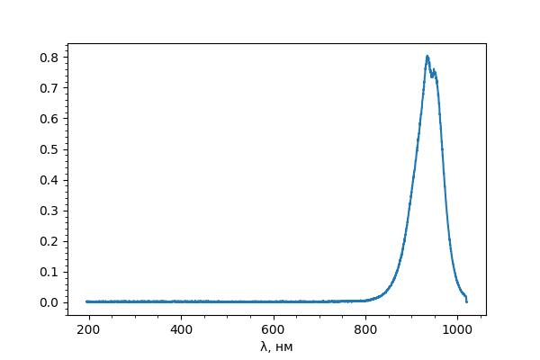

Для лампы:

!SUBFIGURES:
{width=0.47}
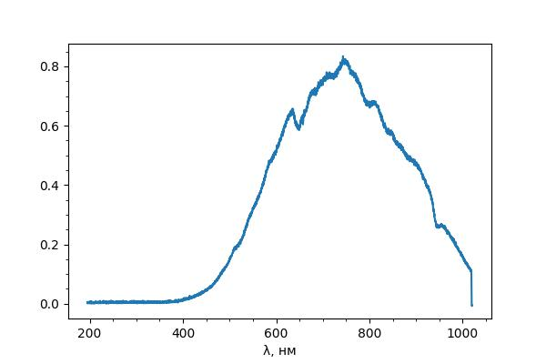|
|
|

}

Видно, что фильтр "обрубает" весь красный и инфракрасный спектр ($>∼700$ нм), оставляя только малую длину волны. Так как длина волны напрямую влияет на максимальное разрешение, использование такого фильтра весьма полезно для измерений.  

{width=70%}

По результатам последнего спектра понятно, что для подсветки мониторов ноутбука используются светодиоды — отдельные пики узкие.

Для измерения мы не использовали никакого дополнительного оборудования, просто "подносили оптоволокно" к источнику освещения и страрались расположить так, чтобы отношение сигнал/шум было максимальным. Разумеется, при такой методике невозможно количественное сравнение мощности тех или иных источнков, поэтому мы калибровали время измерения автоматически и не записывали её результаты. Однако примерную мощность можно оценить из того же отношения сигнал/шум.

Получив спектры, мы приступили к следующей лабораторной согласно руководству.

В следующей части требовалось собрать "простейший микроскоп". Здесь справа-налево:

- Лампа с (опциональным) фильтром инфракрасных частот.

- Диффузор — по сути просто "рассеющивая бумажка", превращающая направленный свет от лампы в "рассеянный"

- "Образец" с нанесёнными специальными отметками для измерения разрешающей способности системы в специальном держателе, допускающего тонкую настройку положения по всем трём осям. Образец в этой системе — практически самая хрупкая и дорогая компонента системы, поэтому нужно быть предельно осторожным при его установке.

  В первую очередь мы будем работать с тестом **USAF 1951**, расположенным примерно по центру образца:

  

- Линза достаточно большой оптической силы ($f = 25\ mm$), "превращающая" точечное изображение на образце в параллельный пучок.

- Камера с линзой с фокусным расстоянием $f = 150\ mm$, и комбинацией двух трубок с примерно той же суммарной длиной, настроенная на бесконечность — если направить трубку с линзой на далёкий объект, на камере должно быть чёткое изображение.

Завершили всё это мы установкой камеры на подготовленный рельс и получением фотографий образца, при освещении его с помощью линзы, и лампы с диффузором. Получив изображения для линзы при обоих её положениях (направления выпуклой стороны). Мы выбрали то, которое дало наиболее чёткую картинку (?)

### Настройка камеры

Мы начали с настройки камеры, прикрутив объектив с линзой, и взяв за ориентир расположенное достаточно далеко (не менее нескольких сотен метров) здание. Мы постарались получить наиболее чёткое изображение верхних окон, изменяя расстояние от камеры до линзы.

 

Можно убедиться, что камера (вместе с трубкой с линзой) "сама по себе" даёт весьма качественное изображение, с минимумом дефектов и весьма низким размытием. Вся "плохость" будет заключаться именно в устройстве остальной системы.

Зафиксировав линзу на этом расстоянии, мы установили её на краю рельса.

### Установка линз

Из курса, прилагающегося к лабораторной, мы знаем, что для качественных изображений несимметричным линзам важно, какой стороной они направлены к более сходящимся/расходящимся пучкам. Более "точный" ход лучей получается, если лучи преломляются (падают не под нормальным углом) на обоих сторонах, тогда искажения на краях линзы "компенсируются". Это наглядно видно на следующих схемах (это можно аккуратно доказать, используя разложения в ряды Тейлора, но для практического значения важен только результат):

В нашем случае линза должна быть установлена так, чтобы "смотреть" выпуклой стороной на камеру (где идут параллельные лучи), плоской стороной — на образец. Расположим её примерно на фокусном расстоянии ($f = 25\ mm$), дальше будем настраивать образец с помощью ручек тонкой калибровки.

### Образец и лампа

Сцена для образца устанавливается так, чтобы её можно было удобно двигать с той стороны, с которой мы с ней работаем. 

Лампа может открываться с двух сторон: на одной из них свет может выходить в трубку, на которую можно установить фильтр. Со второй стороны лампа открывается "полностью". Нас в большинстве случаев будет интересовать первая конфигурация.

Мы успели сделать несколько снимков других тестов:

!SUBFIGURES:
|
|
|
|

Здесь достаточно малозаметна разница между положением линз, но это, скорее всего, вызвано тем, что у нас сейчас не слишком высокое разрешение само по себе, разница может быть малозаметна.

На последних двух кадрах другой тест, **NBS1963A standard** (подписано число пар линий на миллиметр):

{width=30%}

## Лабораторная №3

Начали лабораторную мы с того, что замерили **USAF 1951** на той же конфигурации: этот тест более удобный для нашей задачи, так как нам достаточно оценивать разрешение на одном и том же расположении образца — из-за спирального расположения "больше влезает".

Начнём с "неправильно" поставленной линзы:

{width=50%}

Видно, что разрешение далеко от идеального. Попробуем его улучшить:

{width=50%}

Небольшое изменение заметно, но сильно качество не возросло.

Попробуем понять, насколько ухудшится наше изображение, если убрать диффузор:

{width=50%}

Изображение стало светлее (здесь выдержка камеры перенастроена).

Можем попробовать калибровкой немного улучшить изображение, но сильно улучшить его не выйдет:

{width=50%}

На самом деле мы здесь наблюдаем дифракцию — когда мы убираем диффузер, свет от источника становится "частично когерентным". Так как это лампа, о полной когерентности говорить невозможно, но нам достаточно любых её проявлений, чтобы возникли нежелательные полосы. Когда мы возвращаем диффузор обратно, свет рассеивается и тем самым "перемешивается", когерентность уменьшается, полосы становятся менее заметными.

Теперь попробуем заменить лампу светодиодом.

Важный момент — качество может заметно "просесть", если используется источник с широким спектром. Из-за того, что для разных длин волн отличается коэффициент преломления линз, будет отличаться и фокусное расстояние. Это приводит к тому, что там, где для одной длины волны будет располагаться фокус, для остальных будет "пятно":

Итак, попробуем просто заменить лампу на светодиод, диффузор оставим по-прежнему на месте.

!SUBFIGURES:
|
|
|

Здесь мы обнаружили, что забыли подстроить "систему" под каждый из светодиодов. Мы вернулись к синему и зелёному, и убедились, что оба дают очень качественное изображение. 

!SUBFIGURES:
|

Теперь заменим линзу на ахроматический объектив:

{width=70%}

Идея в том, что такое устройство должно частично устранить аберрации за счёт использования нескольких линз, которые "поправляют" хроматические и сферические аберрации друг друга. Наш объектив устроен так, что мы можем менять апертуру (*Numerical Apperture*, $NA$). Чем меньше апертура, тем с меньшего угла объектив может собрать свет, изображение будет получаться более размытым. Проверим, как оно ведёт себя на разных апертурах:

!SUBFIGURES:
|
|
|
|
|
|
|

Видно, что малая апертура приводит к изображениям меньшего качества.

Можем убедиться, что нам по-прежнему для хорошего изображения нужен диффузор:

{width=50%}

Чтобы считать показания разрешения, нам понадобится таблица разрешения (все значения указаны в $lp/mm$, пар линий на миллиметр):

Элемент/Группа | -2 | -1| 0 | 1 | 2 | 3| 4| 5| 6| 7
--|----|---|---|---|---|--|--|--|--|--
1| 0.250| 0.500| 1.00| 2.00| 4.00| 8.00 |16.00 |32.00| 64.00 |128.00 
2| 0.280| 0.561| 1.12| 2.24| 4.49| 8.98 |17.95 |36.0 |71.8 |144.0 
3| 0.315| 0.630| 1.26| 2.52| 5.04| 10.10| 20.16| 40.3| 80.6 |161.0 
4| 0.353| 0.707| 1.41| 2.83| 5.66| 11.30| 22.62| 45.3| 90.5 |181.0 
5| 0.397| 0.793| 1.59| 3.17| 6.35| 12.70| 25.39| 50.8| 102.0 |203.0 
6| 0.445| 0.891| 1.78| 3.56| 7.13| 14.30| 28.50| 57.0| 114.0 |228.0

### Увеличение

Воспользуемся отдельным тестом с $30$ парами линий на миллиметр для того, чтобы вычислить увеличение (нанесены пометки для удобства расчета): 

{width=50%}

### Вычисления&результаты

Следующим пунктом нашей работы стало наблюдение за изменением качества картинки при удалении диффузора и развороте линзы. Было выяснено, что при развороте линзы картинка получается чуть менее светлой и чуть более размытой  скорее всего это связано с тем что после прохождения через диффузор свет рассеивается, а потому создаются проблемы с формулой тонкой линзы, учитывая что сама линза весьма не тонкая, то отклонение источника от главной оси вызывает ещё большие проблемы. А при удалении диффузора ухудшились края изображений, это было вызвано тем, что свет оказался слишком сильно сфокусированным, а потому разница освещённости на краях тёмных частей была заметно выше. . После чего мы получили картинки образца при применении различных светодиодов в качестве источников света.

| Цвет светодиода | Пиковая длина волны, нм | Смещение настройки микрометра для лучшего фокуса |
| --------------- | ----------------------- | ------------------------------------------------ |
| Синий           | 400                     | 0                                                |
| Зелёный         | 530                     | $40 ⋅ 10\ μm$                                    |
| Красный         | 640                     | $53⋅ 10\ μm$                                     |
| Инфракрасный    | 930                     | $88⋅ 10\ μm$                                     |

Для расчета ожидаемого разрешения воспользуемся формулой Рэлея:

$$
δ = \frac{0.61λ}{NA}
$$

Оценим $NA$ для 

Сравним ожидаемое и наблюдаемое разрешение для радиуса апертуры $2.5\ mm$. $NA$ для неё можно оценить по формуле $NA ≈ \frac {r}f$, где $r$ — радиус апертуры, $f$ — фокусное расстояние (оно же расстояние от линзы до образца, в нашем случае $f = 25\ mm$), откуда $NA ≈ 0.1$

| Длина волны, нм | Наблюдаемые группа-элемент | Наблюдаемое разрешение, $lp/mm$ | Наблюдаемое разрешение, $μm$ | Разрешение по формуле Рэлея |      |      |
| --------------- | -------------------------- | ------------------------------- | ---------------------------- | --------------------------- | ---- | ---- |
| 400             | 7-3                        | 160 (161)                       | 6.2                          | 2.4                         |      |      |
| 530             | 7-2                        | 140 (144)                       | 6.9                          | 3.2                         |      |      |
| 640             | 6-5                        | 100 (102)                       | 9.8                          | 3.8                         |      |      |
| 930             | 6-2                        | 70 (72)                         | 13.9                         | 5.7                         |      |      |
|                 | <!--Почему?-->             |                                 |                              |                             |      |      |

Для линзы с лампой можно сделать похожее вычисление:

| Средняя длина волны лампы, нм | $NA$      | Разрешение, группа-элемент | Разрешение, $μm$ | Разрешение Релея, $μm$ |
| ----------------------------- | --------- | -------------------------- | ---------------- | ---------------------- |
| 750                           | $25/25≈1$ | 7-2                        | 7                | 4.6                    |

Оценим смещение показателя преломления из смещения образца (т.е. изменения фокусного расстояния плоско-выпуклой линзы) для разных длин волн:
$$
∆f ≈ 90\ μm\\
∆f = Δ\frac R{n-1} ≈ -Δn\frac{R}{(n-1)^2}≈-Δn⋅\frac{f}{n-1}\\
Δn=\frac{n-1}{f}Δf
$$
Для этого стекла методика утверждает, что показатель преломления $n≈1.5153$, поэтому при $Δf≈900\ μm$ $Δn≈-0.018$. Можем воспользоваться [сервисом с сайта производителя](https://refractiveindex.info/?shelf=glass&book=BK7&page=SCHOTT) для определения показателя преломления этого стекла, он выдаст $1.5085 - 1.5308 ≈-0.022$ (очень близкие значения).

Для фокусного расстояния линзы/объектива $25\ mm$ и фокусного расстояния трубки с камерой $150\ mm$ логично ожидать увеличение $Γ≈150\ mm/25\ mm≈6$.

Наконец, рассчитаем *увеличение* из последнего изображения с $30 lp/mm$ и, зная из документации к камере, что разрешение её пикселей — $3.45\ μm$. На изображении $10$ пар линий соответствуют $580px$, а значит, наблюдаемое увеличение
$$
Γ≈\frac{580⋅3.45\ μm}{10/30\ mm}≈6.003
$$

## Лабораторная №4

В этой лабораторной мы собирали и настраивали установку по более сложной схеме. Начнём со схемы, затем покажем, чем она принципиально отличается от схемы, которую мы собирали ранее. 

{width=50%}

Где:
1) Камера
2) Перпендикулярный рельс (будет нужен впоследствии, сейчас для системы не важен)
3) Объектив
4) Образец
5) Конденсор
6) Набор фильтров яркости
7) Набор цветовых фильтров
8) Диафрагма
9) Линза
10) Лампа

### Фильтры

В этой установке "на постоянной основе" появляются наборы фильтров. Мы здесь используем фильтры яркости — вращающееся "колесо" фильтров, каждый из которых не влияет на форму спектра сигнала, лишь равномерно снижая его интенсивность. Фильтров здесь четыре с резко отличающимися коэффициентами пропускания, и ещё одно пустое место для пропускания света без снижения яркости. Основная задача этих фильтров — грубо регулировать мощность светового потока, (например, для того, чтобы не нужно было настраивать выдержку камеры заново каждый раз, когда освещенность камеры увеличивается/уменьшается).

В предыдущей части мы обнаружили, что монохромный свет от светодиодов позволяет получить лучшие изображения, чем чистый свет от лампы (в частности, для разных длин волн различаются показатели преломления). Тем не менее, светодиоды не слишком удобно использовать для освещения — монохромность приводит к "паразитной" интерференции (чтобы избавить от которой, нам приходилось использовать рассеиватель), а низкая мощность не позволяет легко "отбрасывать" световой поток для улучшения качества изображения (далее будет описано, за счет чего это работает).

Для того, чтобы использовать одновременно преимущества низкого разброса длины волны и мощности "обычных" ламп, можно использовать цветные фильтры — зелёный и синий (как мы видели выше, меньшая длина волны позволяет получить меньшие искажения). Эти фильтры пропускают достаточно узкую полосу спектра, чтобы коэффициент преломления менялся не сильно (спектры для фильтров и характерные показатели ), однако достаточно велико, чтобы пропускать большую мощность, у которой не возникает "лишней" интерференции.  

### Принцип работы освещения Кёлера (Köhler Illumination)

Если образец достаточно прозрачный или маленький, то он будет рассеивать очень мало света, и если лампа будет далеко от образца, то из-за низкой яркости может быть очень сложно его различать на камере. Напрашивающееся решение — собрать свет на образце с помощью линзы (линзы-коллектора). Ход лучей в линзе будет выглядеть примерно так:

{width=50%}

Изображение нити накаливания будет как на образце, так и на камере. С одной стороны, это значит, что мы можем осветить весь образец, если правильно подберем увеличение собирающей линзы, но с другой — освещенность образца будет не совсем однородной.

На самом деле нам не нужно освещать весь образец — его освещенность не нужна для изображения на камере, наоборот, она создает лишний световой шум, от которого было бы неплохо избавиться. К сожалению, очень тяжело добиться достаточного уменьшения изображения с помощью коллектора. Поэтому, чтобы уменьшить размер "лишней" освещенности, используется так называемый "field stop", который просто "заслоняет" все, кроме центра нити накаливания.

{width=50%}

Можно было бы, конечно, заслонить свет и в другие части схемы, но тогда бы лишний световой шум все равно бы так или иначе появлялся. Ставя заслонку в начале, мы тем самым избавляемся от него по максимуму.

Следующая проблема — **однородность** освещенности образца. Любая неоднородность в источнике (в нашем случае — витки нити накаливания) приведут к тому, что на изображении будут лишние элементы. Ясно, что в текущей рассматриваемой системе чем дальше источник, тем меньше будет его неоднородность. Если источник находился бы на бесконечности, неоднородностей бы не было. Отсюда возникает следующее решение — поставить линзу прямо перед источником и поставить источник в её фокус. Тогда его изображение перенесется на бесконечность, каждая точка источника будет равномерно освещать весь образец:

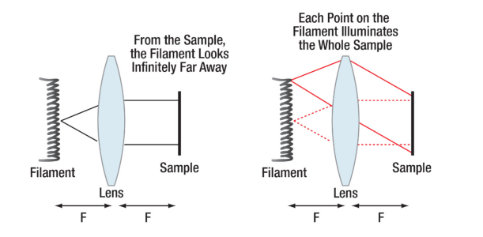{width=50%}

Наконец, последнее, чем мы хотим манипулировать — угол освещения. В этой части мы будем пытаться получить "непрямое освещение" — освещение под углом к образцу. Лучи сквозь прозрачную (или темную) часть легко проходят, не попадая в камеру. Однако на переходах между прозрачным и темным из-за дифракции лучи будут расходится, и мы будем видеть резкие переходы как освещенные. Но для этого нам нужно получить освещение под углом, а для этого нужно научиться как-то им манипулировать.

Несложно заметить, что фокальные плоскости линзы в каком-то смысле "преобразуют" углы в смещение и наоборот (точки находятся в фокусах):

{width=50%}

Этот факт можно использовать для того, чтобы добавить к линзе-конденсору апертуру, которая позволит регулировать угловой разброс света, попадающего на образец.

{width=50%}

Итак, стандартная оптическая схема, собирающая в себе все эти особенности, выглядит примерно так:

{width=50%}

Ключевой проблемой при сборке было вертикальное отклонение различных компонентов, смещённое положение источника в горизонтали, его вертикальная асимметричность, и тот факт, что некоторые из частей установки для корректной работы требовали *очень* точной настройки. Мы потратили на эту работу больше, чем планировали.

### Ход работы

После сборки системы установим ирис объектива на 3 мм (больший размер, как мы дальше увидим, даст лучшее изображение, однако из-за того, что фитиль лампы по одному измерению сильно больше, чем в другом, одна из осей будет хуже различима, чем другая), апертуру конденсера — примерно до размера изображения нити накаливания, апертуру у лампы — так, чтобы края подступали к изображению на камере, чтобы не было лишней световой засветки.

{width=40%}
{width=40%}

Видно, что после добавления зеленого фильтра изображение улучшилось — можно различить полосы на группе 7-3, на предыдущем — только на 7-2.

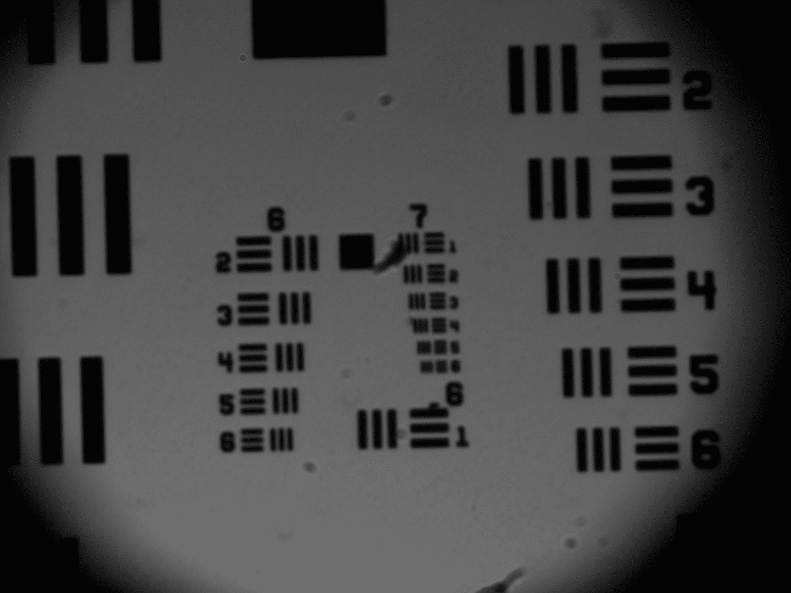{width=40%}

Первая серия исследует зависимость от диаметра апертуры объектива.

!SUBFIGURES:
{width:0.45}
|
|
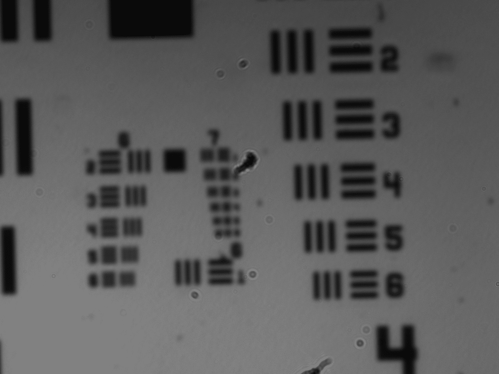|
|
|

## Выводы I

По прошествии 4 лаб мы смогли поработать с установкой, и подготовится к предстоящей, белее интересной, части работы. В процессе мы смогли разобраться с устройством части выданных приборов и получить количественные данные, которые можно будет использовать для сверки в предстоящих экспериментах.

## Лабораторная №5

Микроскопия в темном поле — это специализированный метод освещения, в котором используется наклонное освещение для повышения контраста в образцах, которые плохо визуализируются при нормальном освещении в светлом поле. Микроскопия в темном поле — это метод, в котором используется наклонное освещение для повышения контраста в образцах, которые плохо визуализируются при нормальных условиях освещения. Когда прозрачный образец помещают на предметный столик стеклянного микроскопа и наблюдают в темном поле, косые световые лучи пересекают образец и преломляются, отражаются и/или преломляются оптическими разрывами (такими как клеточная мембрана, ядро ​​и внутренние органеллы). позволяя этим слабым лучам попасть в объектив.

Темное поле микроскопии исторически очень важно: до 1950-х годов это был единственный способ наблюдения прозрачных объектов, и даже сейчас это самый дешевый способ. Его полезность не может быть переоценена: клетки обычно прозрачны, и окрашивание их для того, чтобы сделать их видимыми, зачастую убивает их. Таким образом, тёмное поле и подобные техники (например, фазовый контраст и дифференциальный интерференционный контраст, DIC) предлагают способ наблюдать за клетками в то время как они живы и ведут себя нормально, что очевидно имеет научное значение. С точки зрения этого класса темное поле также представляет собой хороший способ изучения использования конъюгированных плоскостей для манипулирования контрастом изображения, рассмотрения разрешения более подробно и начала развития интуиции о том, как информация об изображении распределена в задней фокальной плоскости объектива. 

!SUBFIGURES:
{width:0.5}
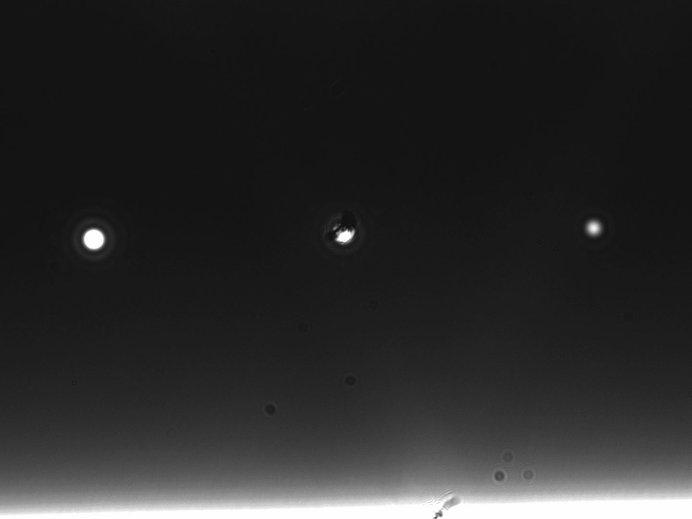

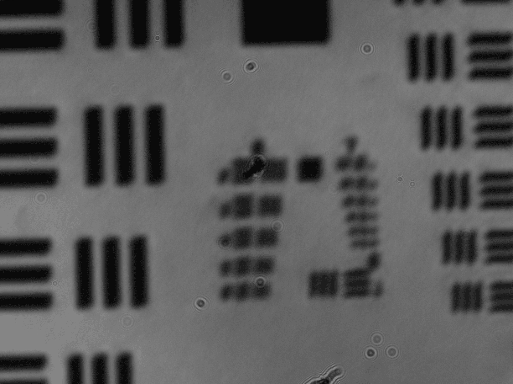

{width=50%}

!SUBFIGURES:

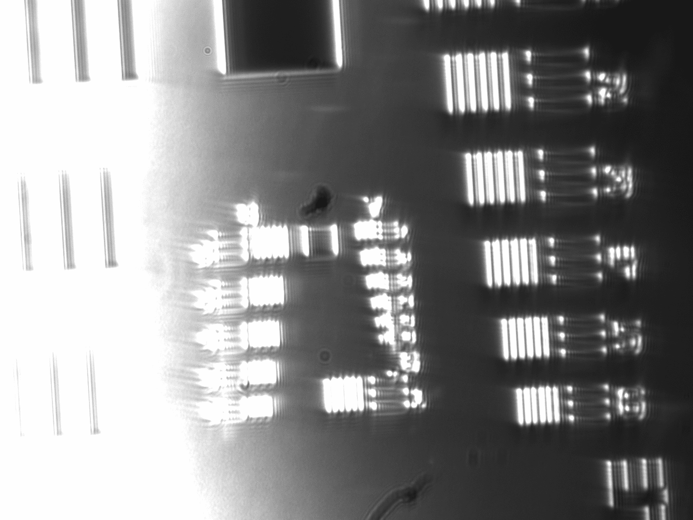

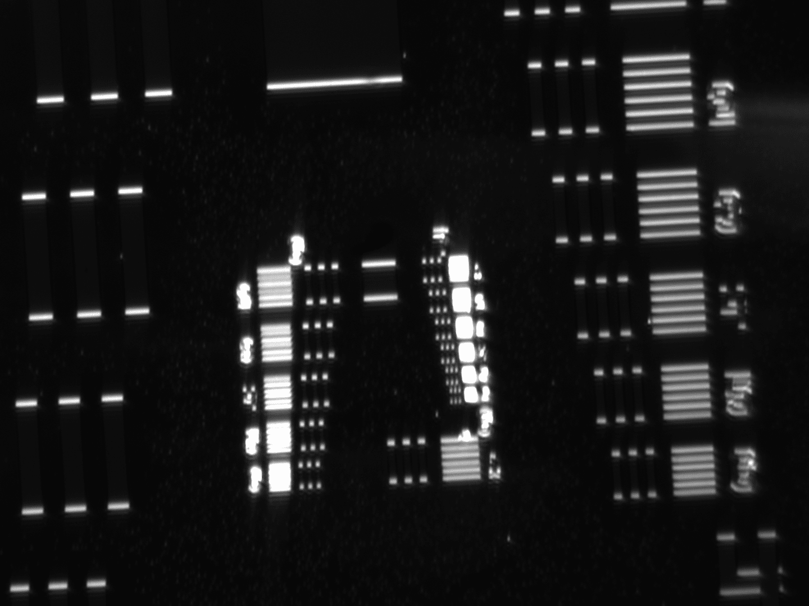

## Лабораторная №6

Здесь мы начали изучать **теорию Аббе** образования изображений.

{width=50%}

{width=50%}

{width=50%}

{width=50%}

Мы хотим получить изображение задней фокальной плоскости (back focal plane) на камере. Чтобы по-прежнему уметь ориентироваться по предыдущему изображению, мы используем разделитель луча:

{width=50%}

 

К большому сожалению, на эту лабораторную нам потребовалось гораздо больше времени, чем было указано — к сожалению, эта установка требует очень тонкой неочевидной настройки. Нужно было получить чёткое изображение задней фокальной плоскости. Мы несколько раз полностью переставляли рельс, на который крепится камера, пытались по-другому настраивать объектив. В лучшем случае мы получали что-то вроде: 

{width=50%}

## Лабораторная №7

Следующие две лабораторных мы продолжили настраивать установку, ниже несколько фотографий, полученных в процессе. 

{width=50%}

Один из методов проверки корректности настройки — помещения в фокальную плоскость изображения. То, насколько его отчетливо видно, показывает качество настройки.

{width=50%}

{width=50%}

К сожалению, такой метод удобно использовать для проверки, но для непосредственной настройки — неудобно держать, сложно держать точно в фокальной плоскости. 

.png){width=50%}

{width=50%}

Закрывая апертуры, мы должны были бы получить преобразование Фурье от изображения, то есть просто несколько точек, однако мы получали "толстые" пятна, накладывающиеся друг на друга, похожие на то, что было выше. 

Этот этап работы закончился после того, как мы позвали на помощь заведующего лабораторией, Никиту Александровича, с которым мы провели около часа, пытаясь заставить настроить оборудование, но с помощью дополнительных видео-материалов и разъяснений по методике настройки к концу этой лабораторной мы смогли добиться четкого изображения фокальной плоскости.

## Лабораторная №8

Изображение, которое мы стремились получить всю предыдущую работу, при всех закрытых апертурах выглядит так:

{width=50%}

При открытых апертурах оно превращается в изображение нити накаливания: 

{width=50%}

Если мы поместим образец-изображение напрямую в фокальную плоскость (перед объективом), это изображение будет отчетливо видно на камере. Это подтверждение того, что настройка корректна.

{width=50%}

Следующий результат — если мы наведёмся на те самые линии и закроем апертуры, мы должны получить отдельные точки. Действительно, когда на "основной" камере есть такое изображение,

{width=50%}

И со стандартным зелёным фильтром мы получаем то, что нужно:

{width=50%}

Если убрать зелёный фильтр, то есть пропускать все длины волн лампы (см. спектр выше), мы получаем:

{width=50%}

Дополнительное "размытие" обусловлено тем, что преобразование Фурье зависит от длины волны.

Попробуем поставить фильтры на разную длину волны:

!SUBFIGURES:
{width=0.45}

Сами фильтры с спектрами пропускания и измеренными спектрами света от лампы, пропущенного через фильтры (мы заменили синий, указанный в методичке на близкий по спектру, так как не смогли найти необходимый):

!SUBFIGURES:
{width=0.45}

!SUBFIGURES:
{width=0.5}
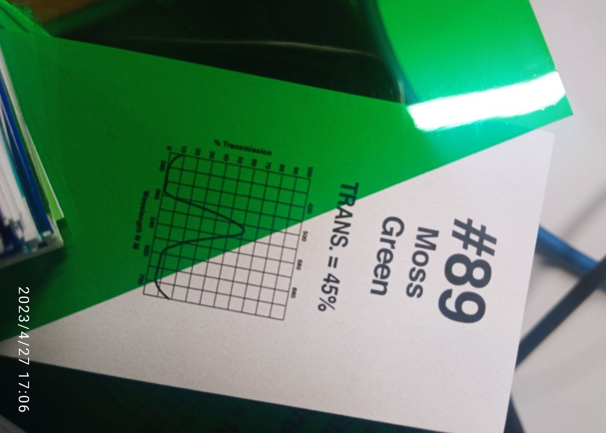

Можно убедиться, что указанные спектры фильтров близки к тем, которые мы наблюдаем.

## Лабораторная №9

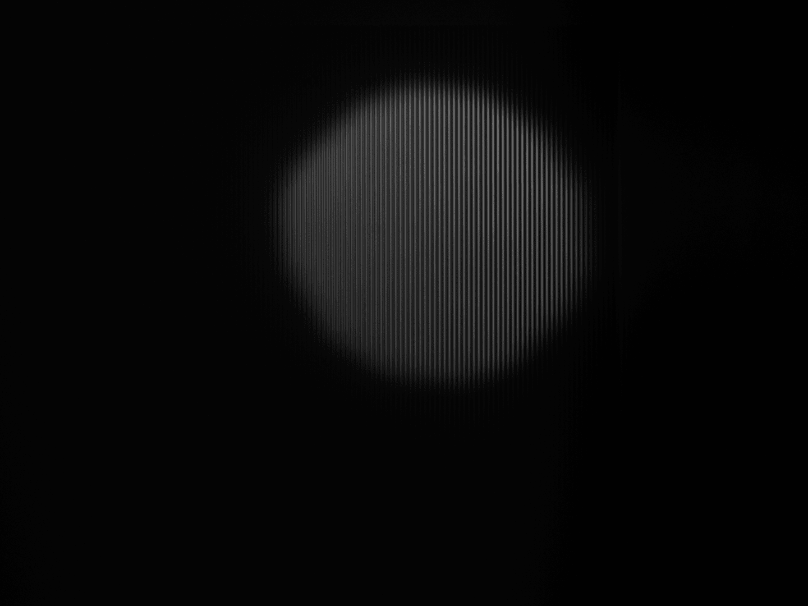

## Лабораторная №10

### Darkfield

Здесь пришлось тщательно докалибровывать систему (которая, к сожалению, может незначительно сбиваться между работами), чтобы можно было поместить пластинку с *zero-order mask* (маска нулевого порядка) — прозрачная пластинка с небольшой точкой посередине, которая устанавливается на заднюю фокальную плоскостью и блокирует свет, который по преобразованию Фурье соответствует постоянной засветке. Соответственно, если правильно откалибровать установку, чтобы  "нулевые лучи" точно попадали на эту точку, то мы получим непрямое освещение (обсуждалось в лабораторной №4).

Крупные объекты:

В задней плоскости оно выглядит как:

На более мелком образце USAF лучше видны "паразитные" элементы такого освещения: 

### Продолжение теории формирования формирования изображений Аббе

Если подать на обычный образец с вертикальными линиями свет с маленькой апертурой конденсора, его изображение на задней фокальной плоскости будет выглядеть как большое количество горизонтальных точек. Из-за ограниченности апертуры объектива часть этих точек, отвечающих за высокие частоты, неминуемо обрежется, из-за чего мы будем наблюдать ограниченное разрешение.

Если ограничить заднюю плоскость по краям так, чтобы закрылись все порядки, мы будем наблюдать только равномерную засветку (нулевой порядок):

{width=50%}

Если использовать более сложные паттерны

{width=50%}

{width=50%}

Как только ширина полос станет слишком малой, мы будем наблюдать только размытый фон.

{width=50%}

График разрешения от частоты будет выглядеть примерно так:

{width=50%}

Для непрямого освещения, с заблокированным нулевым порядком, также будет сдвинуто начало этого графика (шириной блокирования): 

{width=50%}

Предположим, что через конденсер проходит более одной точки. Если обозначить их разными цветами, схема будет выглядеть примерно так:

{width=50%}

Но так как точки на конденсере не когерентные, каждая точка конденсера вносит свой вклад, изображения складываются.

Если  выбирать точки с каждой высоты отдельно, получим только нулевую компоненту в сумме:

{width=50%}

При блокировке в BFP по горизонтали картинка получается эквивалентной одной точке конденсера:

{width=50%}

Если точка с конденсера будет смещена относительно центра, в задней фокальной плоскости изображение тоже сместится, и мы можем получить частично "размытое" изображение, но полосы будет видно (точка, не попадающая в объектив, приведет к равномерному фону).

{width=50%}

{width=50%}

В реальных установках, как правило, используется другая схема непрямого освещения. Пластина на конденсере закрывает всё центральное освещение, а край объектива "обрубает" все лучи по бокам:

{width=50%}

Если воспользоваться рассуждением выше для увеличения максимального разрешения 

{width=50%}

Общая зависимость (объяснить)

Для реальных систем с учетом аберраций графики будут выглядеть примерно так:

На самом деле оценивать по полосам чёткость изображения не очень хорошо, так как частоты изображения *могут совпасть* с частотами, которые хорошо сохраняются при изображении. Например, спектр от трёх полос выглядит примерно так:

Лучше для этого использовать какие-то "реальные" изображения, где представлены все виды частот. Мы, как правило, фокусируемся с использованием USAF, где представлены многие полосы разной толщины, поэтому пики не так выражены.

### Измерения

Здесь мы замеряли интенсивности засветки и сигнала, чтобы проверить рассуждения выше о МФТ.

Из-за того, что "идеальный" фокус не может попадать на весь образец, будет возникать осцилляция:

!SUBFIGURES:
{width: 0.3}
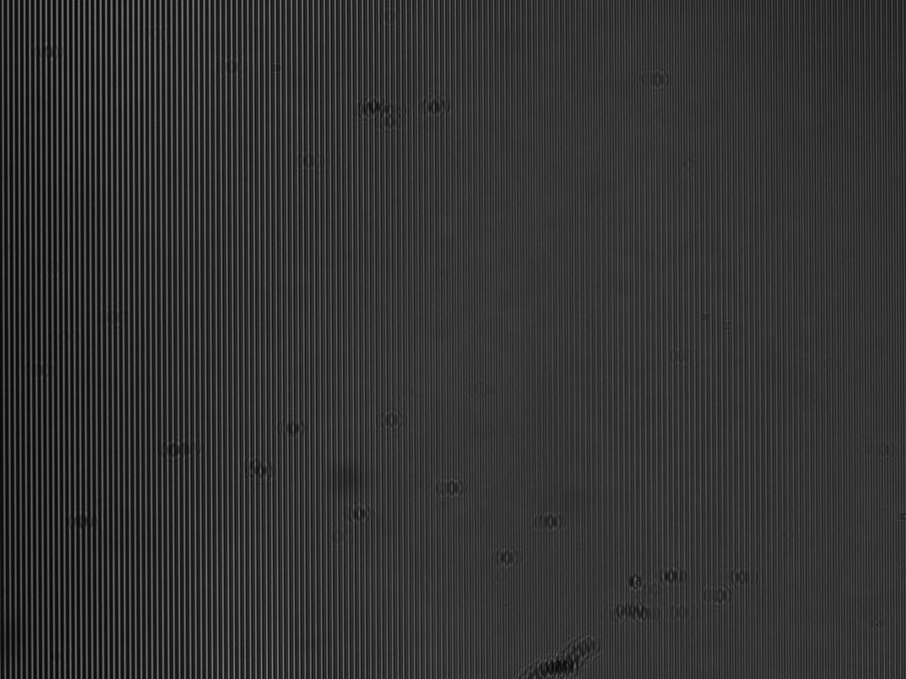

Освещенность черной части ($1/256$ от максимально воспринимаемой камерой освещенности на этой выдержке): $1$, белой — $~190$, контраст — ($\frac{I_{max} - I_{min}}{I_{max} + I_{min}}≈0.99$)

Наблюдения проводились в две серии: в обоих сериях BFP объектива устанавливалось на $d=3 mm$. Однако в первой серии конденсер был открыт  на тот же диаметр $d$, во второй — закрыт практически до упора. 

!SUBFIGURES:
{width: 0.3}

!SUBFIGURES:
{width: 0.3}

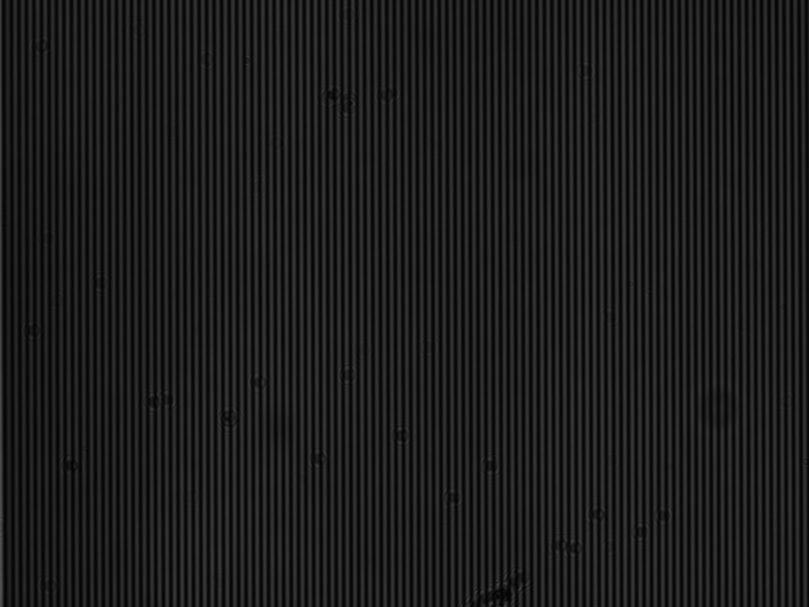

<!---->

Для того, чтобы извлечь освещенность максимумов и минимумов, использовались гистограммы вида

{width=50%}

Результаты обработки первой серии:

| Образец | Минимум | Максимум |
| ------- | ------- | -------- |
| 7 lp    | 1.98    | 192      |
| 10 lp   | 3.3     | 189      |
| 30 lp   | 5.7     | 183.9    |
| 70 lp   | 11.5    | 151.3    |
| 130 lp  | 15.8    | 91.2     |
| 160 lp  | 26.9    | 64.4     |
| 190 lp  | 34.0    | 44.0     |

Вторая серия:

| Образец | Минимум | Максимум                                       |
| ------- | ------- | ---------------------------------------------- |
| 10 lp   | 3.7     | 87.8                                           |
| 40 lp   | 5.4     | 110.6 (протяженный участок гистограммы, конец) |
| 70 lp   | 7.9     | 71.7                                           |
| 100 lp  | 5.8     | 50.9                                           |
| 130 lp  | 5.7     | 52.9                                           |
| 160 lp  | 17.0    | 24.9                                           |
| 190 lp  | 19.1    | 19.1                                           |
|         |         |                                                |

Как и следовало ожидать, во втором случае контраст в целом меньше и имеет более резкий "скачок".

Следующая серия — перемещение образца из фокуса на примере "края чёрного края". Апертурная остановка здесь была закрыта.

!SUBFIGURES:

<!---->

Зная, что образец на самом деле — близкий к идеальному черный край, можно изучить побочные возникающие гармоники, чтобы получить график MFT для всех частот. Для этого мы используем плагин "SE MTF 2xNyquist" для программы обработки изображений ImageJ.

{width=50%}

Можно сравнить с MFT, полученного для расфокусированных образов:

!SUBFIGURES:
{width:0.3}

Видно, что наклон становится более крутым, площадь становится меньше. Соответственно, передается меньше важных частот, больше засветки, изображение размывается.

Можно сравнить с графиком выше, если вспомнить, что 1px на камере соответствует $3.45μm/6≈0.56μm$, т.е. частота 0.1 циклов/px (характерная точка "зануления" графиков выше) соответствует $0.1 lp/0.56μm = 1000 lp/5.6mm = 179 lp/mm$ — что вполне соответсвует MFT, полученным "вручную".

Дополнительно можно посмотреть на ширину полосы перехода (при идеальном разрешении она была бы нулевой). Посмотрим на производную интенсивности по координате:

!SUBFIGURES:
{width:0.3}

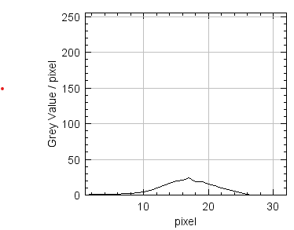

Здесь очень наглядно наблюдается "размытие" перехода.

# Лабораторная №11

Расположение поглощающей пластинки по центру апертуры приводит к повышению контраста, который может быть критичен для образцов, которые рассеивают мало света:

В идеале, если $α → 0$, пластина непрозрачная, контраст стремится к бесконечности — внешняя засветка исчезает.

### Наблюдение

Здесь мы переключились на другой образец с шестью разными участками, на которых должны были быть микросферы радиусом в $4\ μm$, $1\ μm$, $0.5μm$, $0.2μm$, $0.1μm$ (первые пять участка), и последний, шестой, должен был совмещать все предыдущие — на нем должны были быть расположены микросферы всех радиусов. Несложно подсчитать, что при шестикратном увеличении (см. лабораторную №3) и размере пикселя $3.75μ$, что размер сферы радиусом $4\ μm$ на экране будет порядка $6px$. Меньшие сферы уже будут вне оптического предела, в лучшем случае мы сможем наблюдать только размытые пятна. Однако у нас возникли сложности с наблюдением этих микросфер — на образце было очень много других структур совершенно разных размеров, выделить среди них нужного размера микросферы оказалось практически невозможно. На первом образце можно увидеть капли, похожее на искомые и с примерно одинаковым размером, но они имеют разную яркость, поэтому вполне могут иметь разный размер на самом деле.

Например, на первом образце наблюдалась такая структура, значительно превышающая размеры капель:

В целом образец выглядит примерно так:

В тёмном поле капли должны быть лучше за счет повышенного контраста. Если приблизить изображение, можно увидеть, что фиксированного размера нет.

### Фазовый контраст

# Литература

Для работы использовались методические пособия *ThorLabs* на основе курса *UC Berkeley*, а именно:

[1] Optical Microscopy Course, Course Notes — Neil A. Switz, Daniel A. Fletcher — 2020

[2] Optical Microscopy Course, Lab Notes — Neil A. Switz, Daniel A. Fletcher — 2020

[3] Optical Microscopy Course, Manual — Neil A. Switz, Daniel A. Fletcher — 2020

# Благодарности

Мы хотим поблагодарить заведующего лабораторий, Никиту Александровича Богословского, за помощь в настройке оборудования и Федора Борисовича Свинарёва за то, что разрешал нам оставаться на дополнительное время в лаборатории.
