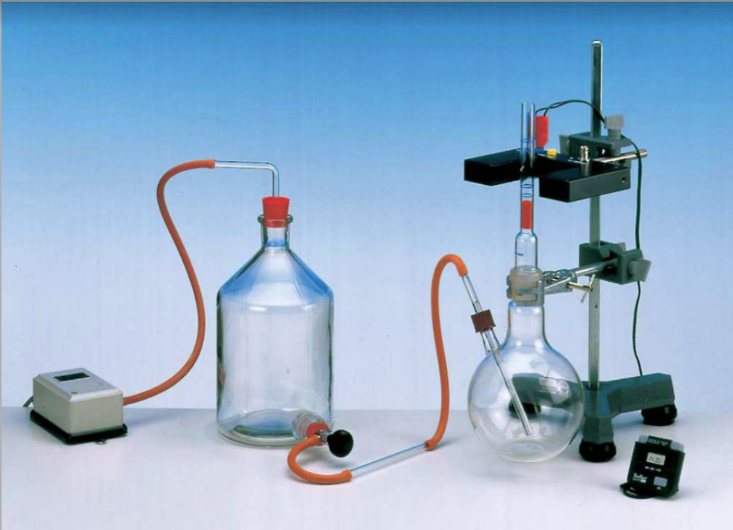
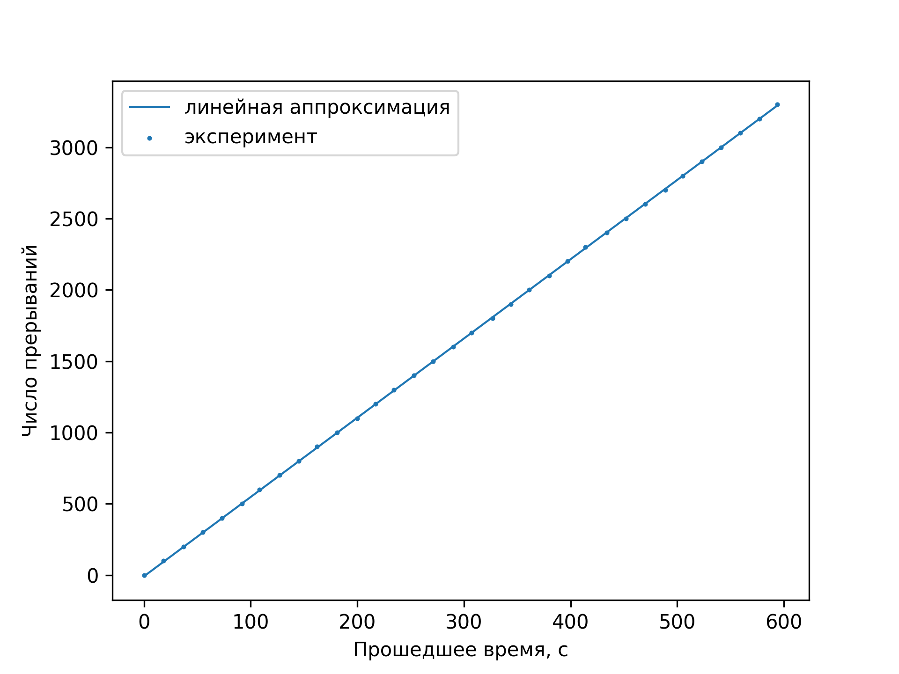

---
title: Показатель адиабаты
date: \today
...

## Введение

В школьной термодинамике, как правило, учат работать с однородным идеальным газом. Однако в реальной жизни даже самый распространенный и широко используемый газ — воздух — имеет состав, далекий от одной компоненты. Тем не менее, для ряда практических задач можно использовать приближение воздуха идеальным газом с усредненными параметрами. Одна из основных характеристик, отвечающих за поведение газа в термодинамических циклах — число его степеней свободы, которое однозначно задает молярную теплоёмкость газа. Число степеней свободы может быть выражено через более "измеримую" характеристику — показатель адиабаты. В этой работе мы исследуем показатели и степени свободы для двух как бы двухатомных газов — углекислого газа и воздуха. В первом случае молекулы трехатомного газа выстраиваются на прямой, из-за чего он теряет степень свободы по вращению вдоль этой прямой, во втором — газ является смесью многих, хотя около 99% составляющих по-прежнему являются "чистыми" двухатомными ($N_2$, $O_2$). 

## Цель работы

Измерить и сравнить показатели адиабаты и степени свободы для воздуха и углекислого газа, используя осциллятор, работающий на адиабатическом расширении газа.

## Установка

{width=70%}

Измерительная установка состоит из двух колб, насоса, баллона с углекислым газом и счетчиком прерываний луча. Газ (из баллона или насоса) подается в объемную первую колбу, которая служит "буфером" для поступающего газа, выравнивающего давление, подающееся во вторую колбу. Разница давлений поднимает пробку, "затыкающую" выход воздуха. Над пробкой в сосуде есть небольшая щель. Как только пробка поднимается достаточно высоко,   воздух начинает выходить через эту щель 

## Теория

Запишем второй закон Ньютона для пробки, и условие адиабатического расширения газа в сосуде:				
$$
m \frac{d^2 x}{dt^2} = \pi r^2 \Delta P
$$

$$
(P - P_{atm}) · \pi r^2 = mg
$$

$$
PV^\chi = const
$$

Продифференцируем уравнение (3):
$$
d P = \frac{-\chi ·const ·  d V}{V^{\chi+1}} = -\chi\frac{const}{V^\chi} · \frac{ dV}{V} = -\chi\frac{P d V}{V}
$$

$$
\ln P/P_0=-χ\ln V/V_0
$$

В нашем случае изменение $P/P_0$ очень близко к единице, поэтому можем приближенно считать, что:
$$
ΔP ≈-χ\frac{PΔV}{V}
$$
Выразим изменение объёма через характеристики сосуда:
$$
\Delta V = \pi r^2 x
$$
При подстановке в уравнение закона Ньютона получим:
$$
\frac{d^2 x}{dt^2} + \frac{P\pi^2 r^4\chi}{mV}x = 0
$$
Отсюда можно легко выразить угловую частоту колебаний :
$$
\omega = \sqrt\frac{P\pi^2 r^4\chi}{mV}
$$
Тогда выражение для показателя адиабаты примет вид:	
$$
\chi = \frac{mV\omega^2}{P\pi^2 r^4} = \frac{4mV}{Pr^4 T^2}
$$
Характеристики нашей системы:

| Обозначение | Величина             | Значение           | Метод измерения           |
| ----------- | -------------------- | ------------------ | ------------------------- |
| $m$         | Масса пробки         | 4.787 ± 0.001 г    | Высокоточные весы         |
| $V$         | Объем сосуда         | 1.14 ± 0.01 л      | Данные из методики        |
| $P_a$       | Атмосферное давление | 100 950 Па ± 10 Па | Барометр                  |
| $r$         | Радиус пробки        | 5.95 мм ± 0.01     | Штангенциркуль & методика |

Нетрудно заметить, что $P - P_{atm}$ будет порядка $500 \mbox{Па}$. Что много меньше $P_{atm}$. Значит, в показателе адиабаты множитель $P$ можно заменить на $P_{atm}$. Тогда показатель адиабаты равен:
$$
\chi = \frac{4mV}{P_{atm}r^4 T^2}
$$

## Методика

Нашей задачей было проведение двух серий экспериментов с различными газами. В первой серии экспериментов мы использовали насос для закачки воздуха. Во втором типе экспериментов мы работали с углекислым газом. Работа происходила почти также, за тем лишь исключением, что вместо насоса у нас был баллон со сжатым газом. 

Сама серия при этом состояла из нескольких замеров количества колебаний пробки и времени затраченного на них. Как оказалось, от 2 до 10 минут на одно измерение нам вполне достаточно для того, чтобы отследить большое количество скачков пробки, для того чтобы значительно уменьшить погрешность. Но при этом не делать измерения настолько длинными, чтобы влияние других систематические факторов было критическим. Например измерения показали, что длительное движение пробки или долгая работа насоса приводит к тому, что через некоторое время с начала эксперимента можно наблюдать значительное затухание колебаний, вплоть до полной остановки. Что сильно влияет на результат из-за принципа работы датчика.

Таблицы измерений (так как за период прерывания считываются два раза, то полный период можно вычислить по формуле $T = \frac{2t}{N}$:

Для воздуха:

| Число прерываний | Время измерения, с | Период колебания, с |
| ---------------- | ------------------ | ------------------- |
| 700              | 126                | 0.360               |
| 3290             | 604                | 0.367               |
| 2450             | 444                | 0.362               |

Таким образом, $T = 0.363 ± 0.003$

Для углекислого газа:

| Число прерываний | Время измерения, с | Период колебания, с |
| ---------------- | ------------------ | ------------------- |
| 1300             | 270                | 0.42                |
| 3430             | 631                | 0.37                |

Видно, что результаты получились слишком сильно разбросанными, чтобы можно было сделать определенный вывод. Практически наверняка это вызвано тем, что измерение времени имеет большую погрешность, вызванную медленной человеской реакцией. Поэтому мы решили провести повторное измерение, в котором фиксировали время каждые 100 прерываний — это позволяет как увидеть "плохие" точки, так и скомпенсировать погрешность количеством.

{width=60%}

> Так как эксперимент проводился в другой день, атмосферное давление немного отличалось — $1 014$ кПа вместо $1 009$ 

Аппроксимация проводилась по вторым 2/3 графика, на случай если углекислый газ на момент начала не до конца успел наполнить сосуд, и частота будет зависеть от времени. Как видно, разница практически незаметна. 

Коэффициент наклона аппроксимирующей прямой $5.56±0.01$ (стандартное отклонение от аппроксимации), отсюда период колебания — $T = 1/ν=2/(2N/T)=2/((5.56­±0.01))=0.360±0.001$.

Отсюда показатели адиабаты:

Для воздуха: 
$$
χ=\frac{4mV}{P_{atm}r^4 T^2}=\frac
{4(4.787\mbox{ г} ± 0.001\mbox{ г})(1.14\mbox{ л} ± 0.01 \mbox{ л})}
{(100 950 \mbox{ Па} ± 10 \mbox{ Па})(5.95 \mbox{мм} ± 0.01\mbox{мм})^4 (0.363\mbox{ с} ± 0.003\mbox{ с})^2}=1.31±0.03
$$
Для $CO2$:
$$
χ=\frac{4mV}{P_{atm}r^4 T^2}=\frac
{4(4.787\mbox{ г} ± 0.001\mbox{ г})(1.14\mbox{ л} ± 0.01 \mbox{ л})}
{(101\ 400 \mbox{ Па} ± 10 \mbox{ Па})(5.95 \mbox{мм} ± 0.01\mbox{мм})^4 (0.360\mbox{ с} ± 0.001\mbox{ с})^2}=1.33±0.02
$$

## Выводы

Как и следовало ожидать, показатель адиабаты для обоих газов, ведущих себя как двухатомные
