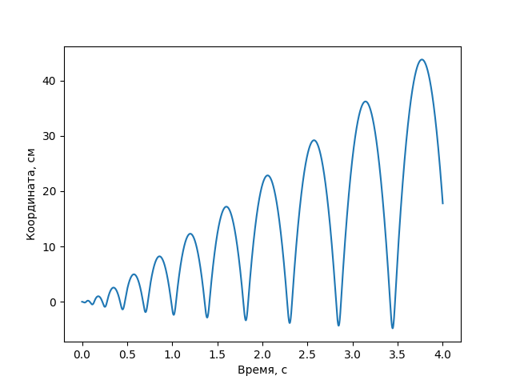

---
title: Показатель адиабаты
date: \today
...

## Введение

В школьной термодинамике, как правило, учат работать с однородным идеальным газом. Однако в реальной жизни даже самый распространенный и широко используемый газ — воздух — имеет состав, далекий от одной компоненты. Тем не менее, для ряда практических задач можно использовать приближение воздуха идеальным газом с усредненными параметрами. Одна из основных характеристик, отвечающих за поведение газа в термодинамических циклах — число его степеней свободы, которое однозначно задает молярную теплоёмкость газа. Число степеней свободы может быть выражено через более "измеримую" характеристику — показатель адиабаты. В этой работе мы исследуем показатели и степени свободы для двух, как бы, двухатомных газов: углекислого газа и воздуха. В первом случае молекулы трехатомного газа выстраиваются на прямой, из-за чего он теряет степень свободы по вращению вдоль этой прямой, во втором — газ является смесью многих, хотя около 99% составляющих по-прежнему являются "чистыми" двухатомными ($N_2$, $O_2$). 

## Цель работы

Измерить и сравнить показатели адиабаты и степени свободы для воздуха и углекислого газа, используя осциллятор, работающий на адиабатическом расширении газа.

## Установка

{width=70%}

Измерительная установка состоит из двух колб, насоса, баллона с углекислым газом и счетчиком прерываний луча. Газ (из баллона или насоса) подается в объемную первую колбу, которая служит "буфером" для поступающего газа, выравнивающего давление, подающееся во вторую колбу. Разница давлений поднимает пробку, "затыкающую" выход воздуха. Над пробкой в сосуде есть небольшая щель. Как только пробка поднимается достаточно высоко,   воздух начинает выходить через эту щель, давление слегка опускаются — таким образом инициируются вынужденные колебания. Пробка приобретает ненулевую скорость, и начинается колебаться практически с частотой свободных колебаний (поток слабый, он нужен только для того, чтобы не допускать равновесное состояние). 

## Теория

Запишем второй закон Ньютона для пробки, и условие адиабатического расширения газа в сосуде:				
$$
m \frac{d^2 x}{dt^2} = \pi r^2 \Delta P
$$

$$
(P - P_{atm}) · \pi r^2 = mg
$$

$$
PV^\chi = const
$$

Продифференцируем уравнение (3):
$$
d P = \frac{-\chi ·const ·  d V}{V^{\chi+1}} = -\chi\frac{const}{V^\chi} · \frac{ dV}{V} = -\chi\frac{P d V}{V}
$$

$$
\ln P/P_0=-χ\ln V/V_0
$$

В нашем случае изменение $P/P_0$ очень близко к единице, поэтому можем приближенно считать, что:
$$
ΔP ≈-χ\frac{PΔV}{V}
$$
Выразим изменение объёма через характеристики сосуда:
$$
\Delta V = \pi r^2 x
$$
При подстановке в уравнение закона Ньютона получим:
$$
\frac{d^2 x}{dt^2} + \frac{P\pi^2 r^4\chi}{mV}x = 0
$$
Отсюда можно легко выразить угловую частоту колебаний :
$$
\omega = \sqrt\frac{P\pi^2 r^4\chi}{mV}
$$
Тогда выражение для показателя адиабаты примет вид:	
$$
\chi = \frac{mV\omega^2}{P\pi^2 r^4} = \frac{4mV}{Pr^4 T^2}
$$
Характеристики нашей системы:

| Обозначение | Величина             | Значение           | Метод измерения           |
| ----------- | -------------------- | ------------------ | ------------------------- |
| $m$         | Масса пробки         | 4.787 ± 0.001 г    | Высокоточные весы         |
| $V$         | Объем сосуда         | 1.14 ± 0.01 л      | Данные из методики        |
| $P_a$       | Атмосферное давление | 100 950 Па ± 10 Па | Барометр                  |
| $r$         | Радиус пробки        | 5.95 мм ± 0.01     | Штангенциркуль & методика |

Нетрудно заметить, что $P - P_{atm}$ будет порядка $500 \mbox{Па}$. Что много меньше $P_{atm}$. Значит, в показателе адиабаты множитель $P$ можно заменить на $P_{atm}$. Тогда показатель адиабаты равен:
$$
\chi = \frac{4mV}{P_{atm}r^4 T^2}
$$

## Методика

Нашей задачей было проведение двух серий экспериментов с различными газами. В первой серии экспериментов мы использовали насос для закачки воздуха. Во втором типе экспериментов мы работали с углекислым газом. Работа происходила почти также, за тем лишь исключением, что вместо насоса у нас был баллон со сжатым газом. 

Сама серия при этом состояла из нескольких замеров количества колебаний пробки и времени затраченного на них. Как оказалось, от 2 до 10 минут на одно измерение нам вполне достаточно для того, чтобы отследить большое количество скачков пробки, для того чтобы значительно уменьшить погрешность. Но при этом не делать измерения настолько длинными, чтобы влияние других систематические факторов было критическим. Например измерения показали, что длительное движение пробки или долгая работа насоса приводит к тому, что через некоторое время с начала эксперимента можно наблюдать значительное затухание колебаний, вплоть до полной остановки. Что сильно влияет на результат из-за принципа работы датчика.

Таблицы измерений (так как за период прерывания считываются два раза, то полный период можно вычислить по формуле $T = \frac{2t}{N}$:

Для воздуха:

| Число прерываний | Время измерения, с | Частота колебания, Гц | Период, с |
| ---------------- | ------------------ | --------------------- | --------- |
| 700              | 126                | 2.78                  | 0.360     |
| 3290             | 604                | 2.72                  | 0.367     |
| 2450             | 444                | 2.76                  | 0.362     |

Таким образом, $T = 0.363 ± 0.003$

Для углекислого газа:

| Число прерываний | Время измерения, с |Частота колебания, Гц| Период колебания, с |
| ---------------- | ------------------ | ---- | ------------------- |
| 1300             | 270                | 2.38 | 0.42                |
| 3430             | 631                | 2.70 | 0.37                |

Видно, что результаты получились слишком сильно разбросанными, чтобы можно было сделать определенный вывод. Практически наверняка это вызвано тем, что измерение времени имеет большую погрешность, вызванную медленной человеской реакцией. Поэтому мы решили провести повторное измерение, в котором фиксировали время каждые 100 прерываний — это позволяет как увидеть "плохие" точки, так и скомпенсировать погрешность количеством.

{width=60%}

> Так как эксперимент проводился в другой день, атмосферное давление немного отличалось — $1 014$ кПа вместо $1 009$ 

Аппроксимация проводилась по вторым 2/3 графика, на случай если углекислый газ на момент начала не до конца успел наполнить сосуд, и частота будет зависеть от времени. Как видно, разница практически незаметна. 

Коэффициент наклона аппроксимирующей прямой $5.56±0.01$ (стандартное отклонение от аппроксимации), отсюда период колебания — $T = 1/ν=2/(2N/T)=2/((5.56­±0.01))=0.360±0.001$.

Отсюда показатели адиабаты:

Для воздуха: 
$$
χ=\frac{4mV}{P_{atm}r^4 T^2}=\frac
{4(4.787\mbox{ г} ± 0.001\mbox{ г})(1.14\mbox{ л} ± 0.01 \mbox{ л})}
{(100 950 \mbox{ Па} ± 10 \mbox{ Па})(5.95 \mbox{мм} ± 0.01\mbox{мм})^4 (0.363\mbox{ с} ± 0.003\mbox{ с})^2}=1.31±0.03
$$
Для $CO2$:
$$
χ=\frac{4mV}{P_{atm}r^4 T^2}=\frac
{4(4.787\mbox{ г} ± 0.001\mbox{ г})(1.14\mbox{ л} ± 0.01 \mbox{ л})}
{(101\ 400 \mbox{ Па} ± 10 \mbox{ Па})(5.95 \mbox{мм} ± 0.01\mbox{мм})^4 (0.360\mbox{ с} ± 0.001\mbox{ с})^2}=1.33±0.02
$$

Вычислим степень свободы:
$$
i = \frac{2}{γ-1}=\frac{2}{1.32 - 1} = 6.25
$$
Должно было получиться примерно 5 (степень свободы двухатомного газа), но, видимо, в установке есть какой-то неучтенный фактор.

Мы наблюдали, что на малых амплитудах колебания визуально далеки от гармонических ("вверх" пробка ползет сильно медленнее, чем падает "вниз"), поэтому предположили, что методика эксперимента и подведенная теория не до конца корректна. Мы решили провести дополнительные измерения, которые показали бы, что колебания не являются свободными и могут зависеть от напора подаваемого газа.

## Дополнительные измерения

Как показали измерения выше, результаты для углекислого газа и обычного воздуха практически совпадают с точностью до погрешности измерения. Мы использовали насос для воздуха и регулировали мощность подачи воздуха по трубке.

{width=50%}

Колебания трубки для большей точности и оценки амплитуды мы засняли на видео, для каждого из которых сделали раскадровку. Из раскадровки выделили изменяющийся "передний план" с помощью библиотеки `bgslibrary`. Наконец, изображения-маски для переднего плана обработали с помощью небольшого скрипта на питоне, отбрасывающего шум, и определяющего координату границ движущейся пробки на каждом кадре.

Результаты обработки представлены ниже:

{subfigures:
{width=0.45}

|

|

}

К сожалению, из-за технических ограничений (отсутствие штатива, плохое качество камеры, малый fps, наличие "полос" на трубке, закрывающих ее перемещение) графики не настолько качественные, чтобы можно было анализировать траекторию, но достаточно — чтобы можно было построить зависимость частоты от амплитуды:

{width=70%}

Конечно, наши данные сложно назвать полными, мы уткнулись в ограниченность мощности насоса (подключать углекислый газ третий раз мы не решились), но явно прослеживается увеличение частоты на больших амплитудах.

## Теоретическая модель для описания расхождения

Упрощенное представление, предлагаемое методикой выше, натыкается на заметное количество проблем. Оно хорошо описывает систему с *неизменным* количеством газа *без дырки*. При этом наша дырка "бинарна", в хорошем приближении она умеет работать только в двух режимах —  пропускать количество воздуха, пропорциональное разности давлений, или же не пропускать вовсе.

В нашей модели будем считать, что по трубке подводится постоянное количество нового газа $Φ$ (что, конечно, будет не совсем правдой, но гораздо лучше приближения "подаваемое давление постоянное" — в таком случае у нас пропадают сами колебания). Тогда *количество газа* $ν$ в колбе описывается дифференциальным уравнением ($x$ — отклонение пробки от дырки):
$$
\dot ν = Φ - 
\begin{cases}
α(p - p_a)&x≥0\\0&x<0
\end{cases}
$$
 Будем считать, что в колбе по-прежнему происходит адиабатическое сжатие, но "для каждого моля отдельно", то есть, считая давление "каждого моля" парциальным (объем — общий), получаем, что $ν·p_ν·V^γ = p·V^γ=ν·const=ν·p_aV_0/ν_0$ (здесь мы делаем предположение о том, что газ поступает ровно в таком же состоянии, что сейчас находится в сосуде).

Таким образом, давление в любой момент можно приближенно рассчитать как
$$
p = k\frac{ν}{V^γ}=k\frac{ν}{(V_0+S·x)^γ},\qquad k=\frac{p_aV_0}{ν_0}=const
$$
Движение пробки описывается по-прежнему тем же
$$
\ddot x = -g+\frac{(p-p_a)·S}{m}
$$
Такую кусочно-заданную систему нелинейных дифференциальных уравнений руками решать не очень приятно, но несложно написать скрипт, который будет симулировать эту систему, задав все постоянные параметры системы, и подбирая подходящие неизвестные постоянные ($Φ$, $α$).

В первую очередь, оказывается, что без трения такая система неограниченно расходится:

{width=60%}

Но здесь зато хорошо видно, что период колебания меняется — правда, он дает противоположный наблюдаемому эффект — увеличивается *период*, а не обратная частота.

Если добавить вязкое трение:
$$
\ddot x =-g+\frac{(p-p_a)·S}{m} - β\ \dot x
$$
Колебания стабилизируются, эффект остается, но не меняет знак:

{subfigures:
{width=0.45}

}

Однако, если на малых колебаниях действует не вязкое трение, а сухое, т.е. $\ddot x$ уменьшается на $β \operatorname{sign}(\dot x)$, модель начинает *уменьшать* период с увеличением амплитуды, и давать более близкие к наблюдаемым значений частот (~ 5 Гц по сравнению):

{subfigures:
{width=0.45}
  

}

Таким образом, вполне может быть, что на наблюдаемых малых колебаниях трение работает примерно как сухое, и уже на больших амплитудах и, соответственно, скоростях, начинают играть важную роль и вязкое трение. В таком случае зависимость частоты от амплитуды будет похожа на "колокол" (увеличивается в начале, уменьшается после какого-то пикового значения), но его "вторую часть" мы не можем наблюдать из-за ограниченной длины трубки.

Важно отметить, что для описания по-настоящему малых колебаний щелку нельзя считать точкой, в реальности она немного "вытянута", из-за чего на малых колебаниях вблизи этой точки эффекты не будут описываться таким рассуждением. Не менее важно, что здесь мы не могли измерить параметры $Φ, α$ и $β$, а без них что-то прогнозировать с помощью этой модели невозможно ("прогнозируемые" частоты так и не совпали с наблюдаемыми). 

## Выводы

Как и следовало ожидать, показатель адиабаты для обоих газов, ведущих себя как двухатомные, практически совпало ($χ≈1.32$). Оно не совпало с показателем адиабаты идеального двухатомного газа.

В процессе работы было испробовано три различных метода измерения частоты пробки:

- Подсчет числа прерываний счетчика за большой промежуток времени (~ 10 минут) — метод оказался относительно неточным, так как за такой большой промежуток времени возможны моменты некорректной работы, которые невозможно "отловить". Разброс результатов измерений составил порядка 2%.
- Ручное измерения времени достижения пиков за тот же большой промежуток времени. Каждые n колебаний (в нашем случае n = 10) в секундомере делаются отметки, которые потом аппроксимируются прямой. Этот метод позволяет уменьшить *случайную* погрешность до ~ 0.3%.
- Автоматическое снятие периода с видео. Если бы не использование специального программного обеспечения и самописных скриптов, этот способ был бы просто предыдущим, перенесенным на снятие времени с видео. Однако нам удалось автоматизировать эту работу, получив адекватные графики колебаний. Понятно, что этот метод не должен уступать в точности предыдущему (хотя полноценная оценка точности не проводилась), однако он на порядок проще и быстрее предыдущего при условии, что все программные компоненты уже имеются.

Однако погоня за точностью в этом эксперименте оказалась скорее избыточной, так как результаты заметно расходились с предсказываемыми теорией, несмотря на последовательное повышение точности измерений. 

Мы предположили, что расхождение происходит из-за того, что систему некорректно рассматривать как систему со свободными гармоническими колебаниями. И действительно, измерения показали, что частота колебаний существенно завит от амплитуды (наблюдалась разница около 40%).

Наконец, мы построили более "подробную" модель для описания изменений частоты. Тем не менее, правильных количественных предсказаний от модели добиться не удалось из-за неизвестных параметров системы, неучтенных эффектов малых колебаний и, возможно, грубых предположений о подаваемом по трубке газе.
