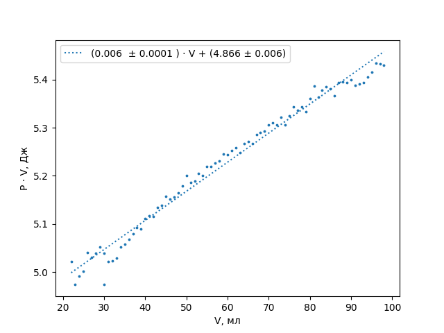

---
title: Контрольная проверка
date: \today
...

## Введение

В этой работе мы работали с базовыми законами для идеального газа — законы, которые получаются как частные случаи закона Менделеева-Клайперона. Это работа в каком-то смысле — "основа" для прочих работ, выполненных в этом году, так как проверяет основные принципы, которыми мы пользовались на протяжении всего полугодия.

## Цель работы

Доказать на практике законы Шарля, Бойля-Мариотта и Гей-Люссака (здесь мы используем классическую "русскую" терминологию, и точно **не** подразумеваем под законом Гей-Люссака закон объемных отношений).

## Установка 

В этой работе мы пользовались собранной за нас системой:

{width=70%}

Состоящей непосредственно из: термопары, манометра, нагревательного элемента, двух сосудов (мерного сосуда с воздухом внутри обычного сосуда с водой), поршнем (для изменения объёма занимаемого воздухом во внутреннем сосуде). Также в установке находился магнит, который позволял перемешивать воду внутри с помощью магнитной палочки снаружи. Дополнительно мы использовали небольшое количество снега для охлаждения установки.

## Методика

В первом эксперименте мы медленно увеличивали и уменьшали объём воздуха в замкнутом сосуде с делениями с шагом 1 мл в пределах 30–70 мл, измеряя давление в сосуде в каждой точке.

Во второй серии экспериментов мы медленно поднимали температуру, измеряя температуру заключенного в сосуде воздуха при каждом сдвиге объёма на 1 мл. Параллельно с этим мы вдавливали плунжер в газовый шприц до тех пор, пока объем газа не был сжат до исходного объема V = 50 мл. Все эти измерения мы проводили вплоть до температуры 372 К (около 98–99°C). Вторая серия разбилась на два разных дня, из-за чего атмосферное давление слегка различалось.

## Теория (которую нужно проверить)

Закон идеального газа описывается уравнением, содержащим: давление, температуру, объем, количество вещества, количество частиц и массу. И согласно ему

$$
PV = νRT
$$

Мы будем рассматривать замкнутую систему, в которой $ν = const$. Тогда отсюда как частные случаи легко получаются следующие законы:

Закон Бойля-Мариотта ($T = const$):
$$
PV = const = νRT = P_0V_0
$$

Закон Гей-Люссака ($P = const$):

$$
\frac{V}{T} = const = \frac{νR}{P}=\frac{V_0}{T_0} = 0.1745 \mbox{ мл/к}
$$

Закон Шарля ($V = const$):

$$
\frac{P}{T} = const = \frac{νR}{V} =\frac{P_0}{T_0} =  349 \mbox{ Па/к}
$$

Для проверки закона Бойля-Мариотта рассмотрим график давления в системе от обратного объёма. Если он будет линейным — закон выполняется.

Закон Гей-Люссака и закон Шарля утверждают аналогичную линейность зависимости объёма и давления от температуры.

## Результаты
Для доказательства описанных выше законов достаточно проверить, является ли линейной зависимость величин в "правильных" координатах.
Построим график полученных данных из различных экспериментов, начнём с графика $P = f(\frac{1}{V})$.

{width=70%}

Как нетрудно заметить, наклон на графике хорошо приближается функцией $P = α(\frac{1}{V})$.

Из "теории" $1/P = V/PV$, $1/PV=1/P_0V_0=\frac1{(104.1±0.1)·(50±1)}\mbox{ кПа}^{-1}·{мл}^{-1}≈(1.92±0.04)·10^{-4}\mbox{ кПа}^{-1}·{мл}^{-1}$. Попали в погрешность

Построим графики давления и объёма от температуры:

​	{width=70%}

​	{width=70%}

Зависимости также описываются выражением $Y = βT$. Видна небольшая разность между измерениями на втором графике, обусловленная разницами атмосферного давления, до которого мы "доводили" объем. Во втором измерении разница практически не заметна, так как количество вещества не поменялось.

Сравним с теорией (1,2 здесь обозначают номера измерений):
$$
(1)\;\; \frac{V}{T} = \frac{V_0}{T_0} = \frac{50±1}{25.2+273.2±0.1}\mbox{ мл·К}^{-1}=0.168±0.003\mbox{ мл·К}^{-1}
$$

$$
(2)\;\;\frac{V}{T} = \frac{V_0}{T_0} = \frac{52±1}{23.7	+273.2±0.1}\mbox{ мл·К}^{-1}=0.174±0.003\mbox{ мл·К}^{-1}
$$

$$
(1)\;\;\frac{P}{T}=\frac{P_0}{T_0}=\frac{104.1±0.1}{25.2 + 273.2±0.1}=0.3489±0.0004 \mbox{ кПа·К}^{-1}
$$

$$
(2)\;\;\frac{P}{T}=\frac{P_0}{T_0}=\frac{101.3±0.1}{23.7 + 273.2±0.1}=0.3412 ± 0.0004 \mbox{ кПа·К}^{-1}
$$

Относительно большое расхождение в последних двух вычислениях объясняется тем, что давление снималось через небольшой промежуток времени, за который система успевала заметно нагреться. Поэтому реальная погрешность будет гораздо больше приборной — если учесть эту особенность,  

Вернёмся к первому графику. Видно, что существует заметный наклон измерений относительно прямой, проходящей через ноль, который сложно объяснить случайной погрешностью. Для того, чтобы определить, из-за чего он возникает, надо вспомнить, что во время всех измерений мы получали давление, сжимая $V_0$ до нужного объема. Ясно, что при этом мы совершаем работу, которая незначительно влияет на внутреннюю температуру газа, а стенки сосуда не успевают до конца сравнять температуру газа с температурой воды. Построим график внутренней энергии на момент измерения от объема (то есть $P·V$ с точностью до константы $i/2$, то есть 2.5 для воздуха):

{width=70%}

Если бы у нас была бы настоящая изотерма, это была постоянная функция. Если бы процесс был бы адиабатическим: при малом изменении объема совершаемая работа $A ≈ P_0 ·ΔV$,  — $A = ΔU=i/2·Δ(PV)$, то есть $Δ(PV)=P_0/(i/2)ΔV$. Наклон был бы $2/i·P_0≈0.4·10^5$ Па · мл $≈ 0.04$ Дж / м³. У нас же получилась величина в **7** раз меньше, поэтому, если не принимать во внимание поведение функции на краях (на которых мы уже достаточно быстро сжимали газ, так как из-за высоких разниц давлений поршень было очень сложно удерживать). Значит, теплообмен происходит достаточно быстро, и, несмотря на регулярное сжатие газа, в этой работе *корректно* использовать изотермическое приближение. 

## Выводы

Мы убедились, что для воздуха при температуре, близкой к комнатной,  законы Гей-Люссака (давления — 0.5 – 2.5 атмосферы, на краях наблюдаются отклонения), Бойля-Мариотта и Шарля (температуры 20°C – 90°C) с константами, взятыми из закона Менделеева-Клайперона хорошо работают (с точностью до нескольких десятых процента). 

Как можно заметить, наблюдаемое отклонение констант, полученных из наклонов аппроксимирующих графики прямых, от констант, полученных в теории, лежит в пределах погрешности измерения (правда, важно, что при нагреве в эту погрешность нужно включать отклонение из-за роста температуры между измерениями — мы не умеем снимать данные мгновенно). 

