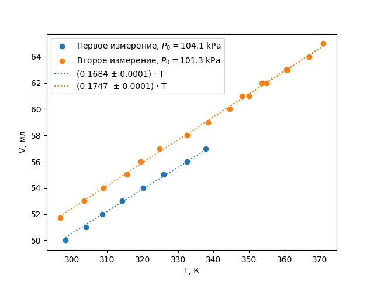

---
title: Контрольная проверка
date: \today
...

## Введение

В данной работе мы работали с базовыми законами для идеального газа. Это работа является базой для остальных наших работ выполненных в этом году, так как доказывает принципы которыми мы пользовались на протяжении всего полугодия.

## Цель работы

Доказать на практике законы Шарля, Бойля-Мариотта и Гей-Люсака.

## Установка 

В этой работе мы пользовались собранной за нас системой:

Состоящей непосредственно из: термопары, манометра, нагревательного элемента, двух сосудов (мерного сосуда с воздухом внутри обычного сосуда с водой), поршнем (для изменения объёма занимаемого воздухом во внутреннем сосуде). Также в установке находился магнит, который позволял перемешивать воду внутри с помощью магнитной палочки снаружи. Дополнительно мы использовали небольшое количество снега для охлаждения установки.

## Методика

В первом эксперименте мы медленно (без колебаний температуры) увеличивали и уменьшали объём заключенного воздуха с шагом 1 мл в пределах 30-70 мл. Записывая давление в сосуде в каждой точке.

Во второй серии экспериментов мы медленно поднимали температуру увеличивая и измеряя температуру заключенного в сосуде воздуха при каждом сдвиге объёма на 1 мл. Параллельно с этим быстро вдавливали плунжер в газовый шприц до тех пор, пока объем газа не был сжат до исходного объема V = 50 мл. Все эти измерения мы проводили вплоть до температуры 372 К.

## Теория (которую нужно проверить)

Закон идеального газа описывается уравнением, содержащим: давление, температуру, объем, количество вещества, количество частиц и массу. И согласно ему

$$
PV = νRT
$$

Мы будем рассматривать замкнутую систему, в которой $ν = const$. Тогда отсюда как частные случаи легко получаются следующие законы:

Закон Бойля-Мариотта ($T = const$):
$$
PV = const = νRT = 5.565 \mbox{ Дж}
$$

Закон Гей-Люссака ($P = const$):

$$
\frac{V}{T} = const = \frac{νR}{P} = 0.1855 \mbox{ мл/к}
$$

Закон Шарля ($V = const$):

$$
\frac{P}{T} = const = \frac{νR}{V} = \frac{8.31}{0.0224} = 371 \mbox{ Па/к}
$$

Для проверки закона Бойля-Мариотта рассмотрим график давления в системе от обратного объёма. Если он будет линейным — закон выполняется.

Закон Гей-Люссака и закон Шарля утверждают аналогичную линейность зависимости объёма и давления от температуры.

## Результаты
Для доказательства описанных выше законов достаточно проверить, является ли линейной зависимость величин в "правильных" координатах.
Построим график полученных данных из различных экспериментов, начнём с графика $P = f(\frac{1}{V})$.

Как нетрудно заметить наклон на графике примерно постоянный и хорошо приближается функцией $P = α(\frac{1}{V})$

Построим графики давления и объёма от температуры:
	

​	

Зависимости также описываются выражением $Y = βT$. Видна небольшая разность между измерениями на втором графике, обусловленная разницами атмосферного давления, до которого мы "доводили" объем. Во втором измерении разница практически не заметна, так как количество вещества не поменялось.

Вернёмся к первому графику. Видно, что существует заметный наклон измерений относительно прямой, проходящей через ноль, который сложно объяснить случайной погрешностью. Для того, чтобы определить, из-за чего он возникает, надо вспомнить, что во время всех измерений мы получали давление, сжимая $V_0$ до нужного объема. Ясно, что при этом мы совершаем работу, которая незначительно влияет на внутреннюю температуру газа, а стенки сосуда не успевают до конца сравнять температуру газа с температурой воды. Построим график внутренней энергии на момент измерения от объема (то есть $P·V$ с точностью до константы $c_V$, то есть 2.5 для воздуха):

При малом изменении объема совершаемая работа $A ≈ P_0 ·ΔV$, если бы процесс был бы адиабатическим — $A = ΔU$, то есть 

## Выводы

