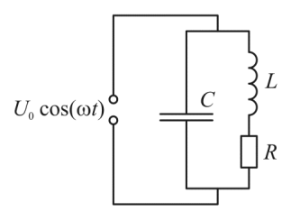
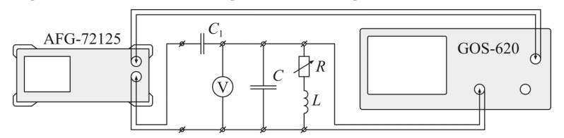
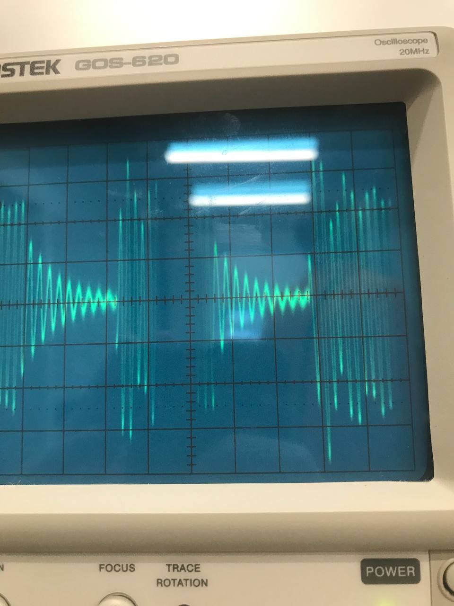
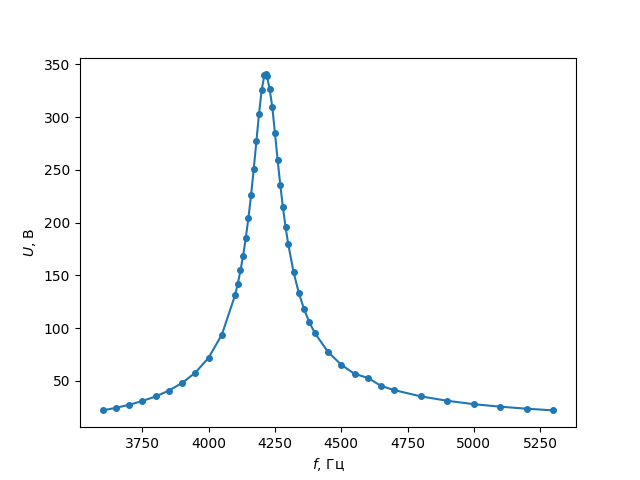
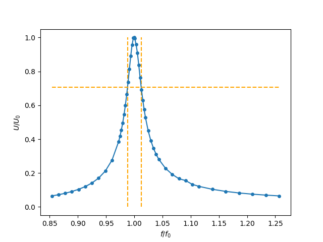
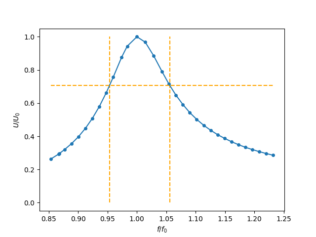
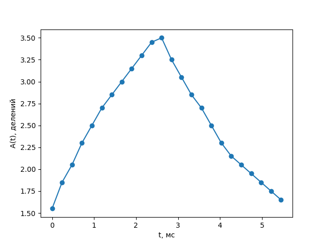
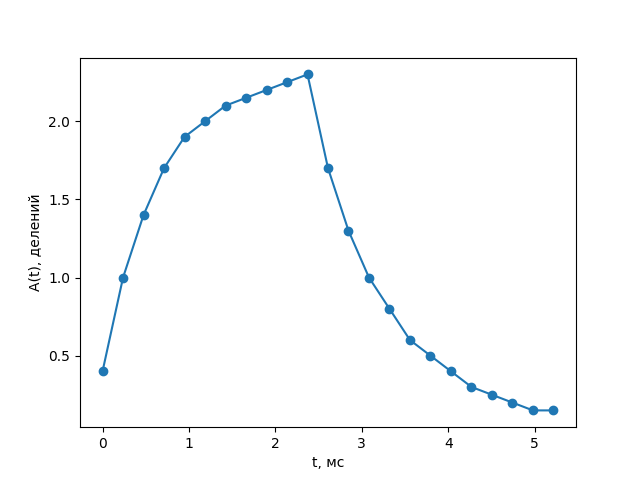
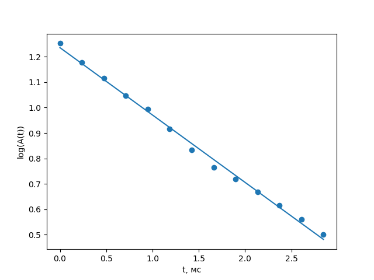
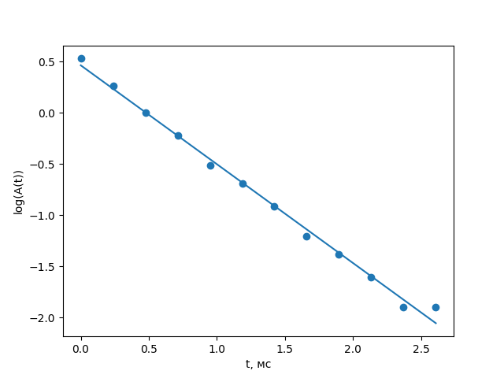

---
title: Вынужденнные колебания в электрическом контуре
date: \today
...

## Цель работы
Исследование резонансных кривых, с целью определения добротности и логарифмического декремента затухания при нарастании и затухании колебаний

## Теория

Рассмотрим цепь с таким параллельным контуром:

{width=30%}

Запишем импедансы параллельных проводов, и посчитаем полный импеданс контура

$$
\frac{1}{Z}=\frac{1}{Z_{L}}+\frac{1}{Z_{C}}=\frac{1}{R+i \omega L}+i \omega C=\frac{1-\left(\omega / \omega_{0}\right)^{2}+i \omega R C}{R+i \omega L}
$$

При этом, если частота генератора совпадает с частотой колебательного контура, то импеданс упрощается до:

$$
Z_{\text {рез }}=\frac{R+i \omega_{0} L}{i \omega_{0} R C}=\frac{L}{R C}-i \frac{1}{\omega_{0} C}
$$
Что при малом сопротивлении (R<<w_0\*L) превращается в:

$$
Z_{\text {pез}}=\frac{L}{R C}
$$
что также можно переписать через добротность $Q=\frac{\omega_{0} L}{R}$ 

$$
Z_{\text {рез }}=\frac{L}{R C}=\frac{Q}{\omega_{0} C}
$$
А если рассматривать импеданс для всех частот генератора, то формула будет такой:

$$
|Z|=\frac{\omega L}{\sqrt{\left(1-\left(\omega / \omega_{0}\right)^{2}\right)^{2}+(\omega R C)^{2}}}
$$

## Методика
При исследовании резонансной кривой тока в колебательном контуре обычно снимают зависимость амплитуды напряжения на резисторе R от частоты генератора. Однако при резком увеличении тока вблизи резонанса выходное напряжение генератора заметно просаживается, что вносит существенные искажения в форму резонансной кривой.

В работе для устранения влияния генератора используется такая схема:

{width=70%}

Синусоидальный сигнал с генератора подаётся на параллельный колебательный контур через небольшую разделительную ёмкость $C_1$. При этом ток в цепи определяется ёмкостью $C_1$ и вблизи резонанса остается практически постоянным. Напряжение с ёмкости контура $C$ поступает на вертикальный вход осциллографа. Зависимость амплитуды этого напряжения от частоты генератора согласно формуле:

$$
U_{0}=I_{0}|Z|=\frac{I_{0} \omega L}{\sqrt{\left(1-\left(\omega / \omega_{0}\right)^{2}\right)^{2}+(\omega R C)^{2}}}
$$

Разделительная ёмкость $C_1$ выбирается настолько малой, что в рабочем диапазоне частот её импеданс $Z_{C_1} = 1/(ωC1)$ много больше импеданса контура, в цепи генератора течёт ток с постоянной амплитудой, а колебательный контур выполняет роль нагрузочного сопротивления, которое, в свою очередь, зависит от частоты. Поскольку в резонансе сопротивление $Z_{\mbox{рез}}$ параллельного контура максимально, то и напряжение на ёмкости C (неизменный ток, умноженный на максимальное сопротивление) тоже максимально. Входное сопротивление осциллографа в измеряющей цепи достаточно велико: $R_{\mbox{ЭО}} = 1\ \mbox{МОм}$. Таким образом, при выполнении условий

$$
\begin{gathered}
Z_{C_{1}}=\frac{1}{\omega C_{1}} \gg Z_{\text {рез }}=\frac{Q}{\omega C} \\
R_{\mbox{ЭО}} \gg \frac{Q}{\omega C}
\end{gathered}
$$

и при условии, что действительная часть импеданса катушки много меньше её мнимой части, резонансная кривая в нашем контуре будет выглядеть так же, как в последовательном: максимум амплитуды при резонансе. Ширина резонансной кривой определяет важную характеристику контура — добротность.

Рассмотрим процесс установления колебаний в контуре вблизи резонанса. Несложно
показать, что возникающие в контуре колебания будут представлять собой суперпозицию
двух синусоид: первая – с частотой собственных колебаний контура $ω_0$ и амплитудой,
экспоненциально убывающей со временем; вторая – с частотой внешнего источника $ω$ и
постоянной амплитудой. Зависимость напряжения на контуре (при напряжении и его производной равным 0 при t = 0) от времени имеет вид:
$$
U(t)=U_{0}\left(\cos (\omega t-\varphi)-e^{-\gamma t} \cos \left(\omega_{0} t-\varphi\right)\right)
$$
Здесь $U_0$ – амплитуда установившихся колебаний, $γ$ – коэффициент затухания.
При частотах ω, отличающихся от собственной частоты контура $ω_0$, уравнение
описывает биения. При очень близких частотах биения не возникают, так как колебания с
собственной частотой контура затухают быстрее, чем накапливается разность фаз между
колебаниями с частотами $ω$ и $ω_0$. В этом случае уравнение сводится к простому виду
$$
U(t)=U_{0}\left(1-e^{-\gamma t}\right) \cos \left(\omega_{0} t-\varphi\right)
$$

Заметим, что добротность колебательного контура можно выразить через коэффициент
затухания

$$
Q=\frac{\omega_{0}}{2 \gamma}
$$

Это соотношение позволяет определить добротность контура по скорости нарастания амплитуды вынужденных колебаний при резонансе или по скорости затухания свободных колебаний. Нарастание и затухание колебаний можно наблюдать на экране осциллографа, если на контур подаются цуги – отрезки синусоиды, разделённые
интервалами, в течение которых сигнал отсутствует. Чем выше добротность, тем медленнее нарастают и медленнее затухают колебания в контуре. Количественные оценки можно сделать, если определить логарифмический декремент затухания по скорости нарастания или затухания колебаний. В условиях резонанса огибающая затухающих колебаний – это перевёрнутая огибающая нарастающего участка, поэтому при расчёте логарифмического декремента по затухающему участку нет необходимости использовать амплитуду установившихся колебаний U0, которая в контуре с высокой добротностью иногда не успевает установиться за время продолжительности цуга.

При частоте генератора близкой (но не равной) к резонансной, происходят биения

{width=60%}

Которые появляются из-за наложения двух колебаний, различных по частоте:  вынужденных и свободных. В итоге, из-за  изменения сдвига по фазе от времени — со временем меняется и амплитуда.

## Результаты

{table: Om_table.csv}

Как оказалось, сопротивление моста имеет постоянную добавку 0.07Ω, но мы здесь и далее будем писать 0 и 30Ω, имея в виду номинальное сопротивление — тем более, что добавка мала.

#### R = 0
Резонансная частота контура (теоретически):
			    (на практике) :

График показаний вольтметра от частоты генератора:

{width=80%}

#### R = 30 ом

Резонансная частота контура (теоретически):

$$
ν = frac{ω_0}{2π} = \frac1{2π}\sqrt{\frac1{LC}} ≈ 4 220 \mbox{Гц}
$$

(на практике) :

График показаний вольтметра от частоты генератора:

{width=80%}

Фото графика затухающих и растущих колебаний
для обоих значений R

Фото биений

## Обработка данных

График резонансных кривых в относительных координатах

{width=80%}

{width=80%}

Ширина полосы при $R=0$: $0.242$, откуда добротность — $Q = \frac {f}{Δf}=\frac 1{0.24}≈41.4$

Ширина полосы при $R=30$: $0.102$, откуда добротность — $Q = \frac {f}{Δf}=\frac 1{0.24}≈9.8$

Добротность из формулы
Сравнение теоритической и экспериментальной резонансных частот

график амплитуды зат. колеб. от времени
из него достать добротность и коэф. затухания

{width=70%}

{width=70%}

Рассмотрим в логарифмическом масштабе правые части графиков:

{width=70%}

Коэффициент наклона: $- 0.27$ 1/мс

{width=70%}

Коэффициент наклона: $- 0.27$ 1/мс.
$$
Q = \frac1R \sqrt{\frac LC} = \frac 1{2γ}\sqrt{\frac1{LC}} = \frac {ω_0}{2γ} = \frac π{γ T}
$$
Подставляя, получаем $Q_0 ≈ 50$, $Q_{30}≈13.7$.

добротность из параметров

<сравнение результатов добротностей и их погрешностей>

​	