---
title: Откачка воздуха в замкнутом объёме
date: \today
...

## Введение

В этой работе мы следили за поведением воздуха в системе при его откачке с помощью насоса. Как и в прошлой работе, мы имели минимум оборудования для отслеживания параметров системы. Для этого мы использовали цифровой измеритель давления без возможности подключения к компьютеру и телефонную камеру. В результате мы собрали несколько принципиально различных схем и провели несколько измерений с различным положением барометра. В процессе работы был создан скрипт, распознающий показания датчика с видео.

## Цель работы

Узнать больше о поведении воздуха и работе насоса при откачке и низком давлении.

## Установка

{width=80%}

В этой работе мы пользовались системой собранной из вакуумного насоса, измерителя давления, труб, клапанов, и шланга (длина — 10.2 метра, радиус — 1.22 см). В процессе измерения мы записывали видео, на котором были видны показания датчика. Обработка измерений производилась с помощью специальной программы, определявшей показания прибора с видео в каждый момент времени.

## Методика

В работе мы провели несколько серий экспериментов.

В самом начале мы использовали пластмассовые "крышки" для того, чтобы закрывать отверстия в клапанах. Однако в первые несколько измерений оказалось, что давление понижается максимум до $1$ mbar, и очень быстро происходит разгерметизация.

Мы пересобрали систему, перезакрутили все соединители, давление стало падать до заметно меньших значений, но по-прежнему достаточно быстро. 

Наконец, мы подключили измеритель давления напрямую к насосу, максимально уменьшив количество возможных протечек и объём системы. Давление упало вплоть до $10^{-3}$ mbar. Тем самым мы выяснили примерную цель, на которую мы должны выходить по давлению после большого промежутка времени.

После этого эксперимента мы пересобрали систему так, чтобы не использовать пластиковые крышки для закрытия отверстий. Это действительно помогло, давление стало падать до $10^{-1}-10^{-2}$, протечки сильно замедлились.

Картинка 1

Затем мы провели эксперимент с увеличенным давлением, подключив секцию трубы и клапан в систему, для более простого впуска воздуха назад в систему, после завершения измерения.

Картинка 2

После проведения этих базовых экспериментов мы отдались воображению, и начали придумывать более интересные схемы. Следующим шагом было подключение в систему длинного шланга:

Картинка 3

Для такой системы мы измерили давление в 2 точках у насоса (поз. 1) и на конце шланга (поз. 2)

Затем мы решили модифицировать нашу систему, и создали последнюю схему

Картинка 4

{width=70%}

Весь смысл этой системы в том, что мы можем открывать и закрывать клапан (2) меняя расстояние от барометра до насоса. Это в свою очередь позволит нам наглядно уведеть то каким образом изменяется давление в зависимости от состояния системы.

## Программная обработка

Для обработки цифр с изображений использовался скрипт на языке `Python` с помощью технологии `OpenCV`. Сначала планировалось использовать нейронные сети, но из-за низкой скорости работы и отсутствия простых решений их интеграции в распознавание цифр с *видео* мы решили использовать более простой метод. Мы использовали несколько сверток для выделения контуров, среди которых позже искали что-то, похоже по размеру на цифры. Далее, через линейные преобразовывания преобразовывали каждую цифру к "правильному" расположению, а затем смотрели на распределение "закрашенных" пикселей, сопоставляя их распределение конкретной цифре. 

Дебаговый кадр для отладки распознавания:

{width=40%}

К сожалению, у такого подхода есть несколько неприятных моментов. В первую очередь, мы не можем уловить позицию точки (слишком маленький объект), то есть у нас будут проблемы с распознаваниям порядков $10^3 - 1$ mbar. Меньшие мы сможем распознать, так как сможем распознать множитель справа.

Во-вторых, распознаватель основан на точном пространственном распределении пикселей, а не "образах", в отличие от нейронных сетей, поэтому он легко может выдать мусор из-за небольших изменений освещения, изменения ракурса и размытия. Нам удалось сделать такие ошибки незначительными по своему количеству, но они по-прежнему остаются. Работать с такими данными на порядок сложнее, чем с "нормальными" из-за большого количества выбросов.  

## Результаты

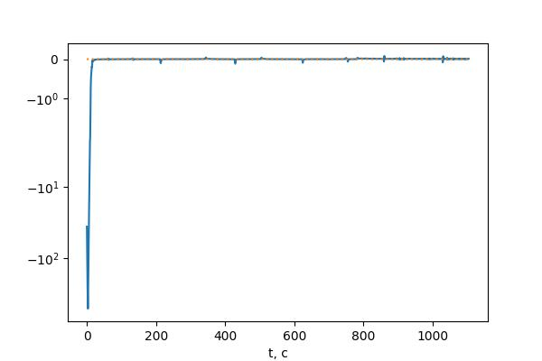

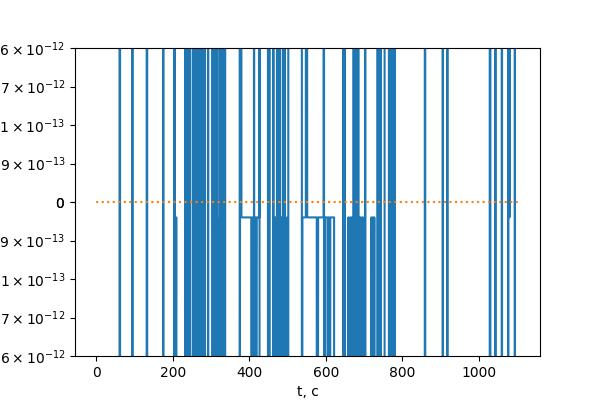

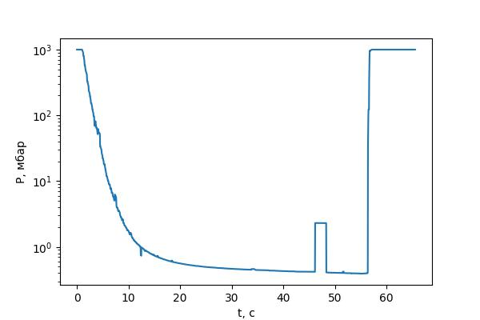

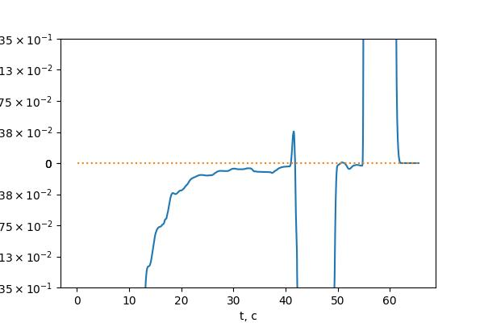

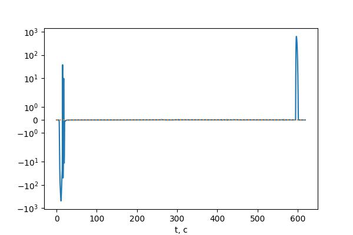

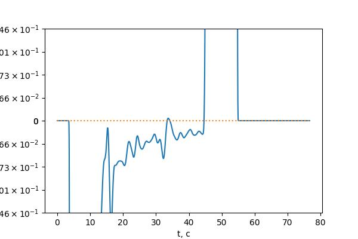

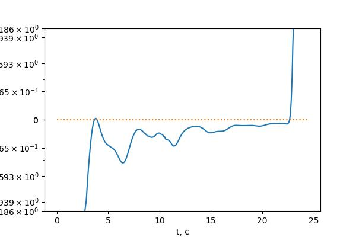

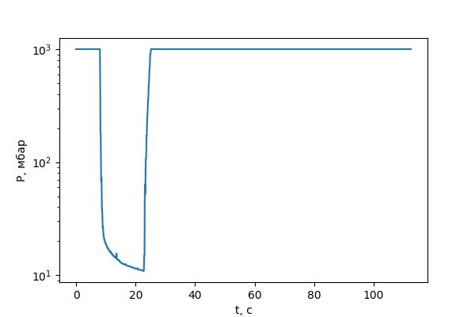

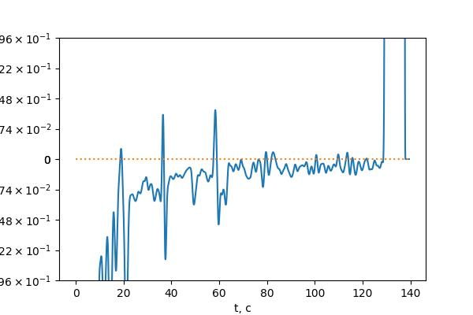

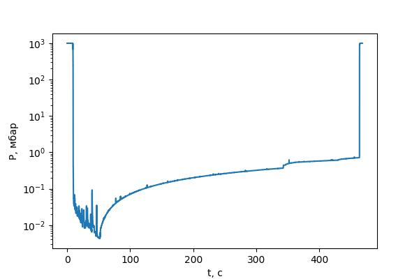

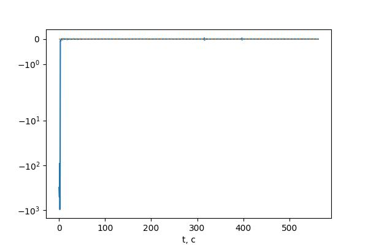

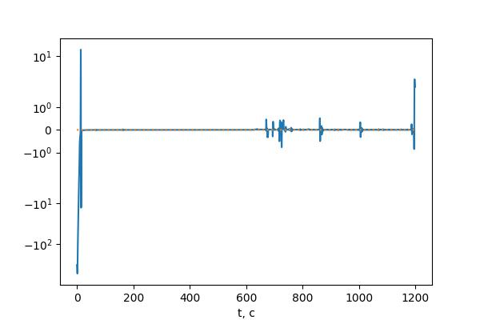

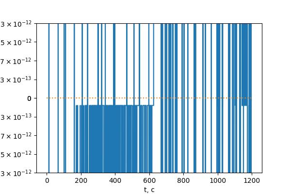

.png)

.png)

.png)

.png)

.png)

## Теория (возможно, но больше похоже на танцы со скрипкой)

Исходя из данных первого измерения, можно сделать несколько выводов: 

## Выводы

Мы рассмотрели большое количество конфигурации одной, достаточно простой установки с одним измерительным прибором.

В результате было выяснено, что метод "протыкивания" вращений не слишком точен — человек может буквально не попасть по кнопке. Иногда много раз подряд. Для исправлений последствий этой ошибки полезно записывать суммарное число оборотов за время измерения, чтобы были шансы восстановить пропущенные точки. В целом метод показал себя не слишком надежным, но он в принципе дает что-то разумное, когда под рукой нет более точных и информативных приборов.

Как и следовало ожидать, КПД такого двигателя оказался крайне малым, он не подходит для практического применения. 

Более того, приближение КПД процесса работы двигателя через изотермы дает результат, далекий от наблюдаемого. В реальности в силу разных причин (не только термодинамических), КПД по нашим оценкам снижается примерно ещё в 20 раз.

