---
title: Откачка воздуха в замкнутом объёме
date: \today
...

## Введение

В этой работе мы следили за поведением воздуха в системе при его откачке с помощью насоса. К	ак и в прошлой работе, мы имели минимум оборудования для отслеживания параметров системы. Для этого мы использовали цифровой измеритель давления без возможности подключения к компьютеру и телефонную камеру. В результате мы собрали несколько принципиально различных схем и провели несколько измерений с различным положением барометра. В процессе работы был создан скрипт, распознающий показания датчика с видео.

## Цель работы

Узнать больше о поведении воздуха и работе насоса при откачке и низком давлении.

## Установка

{width=80%}

В этой работе мы пользовались системой собранной из вакуумного насоса, измерителя давления, труб, клапанов, и шланга (длина — 10.2 метра, радиус — 1.22 см). В процессе измерения мы записывали видео, на котором были видны показания датчика. Обработка измерений производилась с помощью специальной программы, определявшей показания прибора с видео в каждый момент времени.

## Обозначения

На этой схеме введём общеупотребительные обозначения, которые будем использовать на дальнейших схемах:

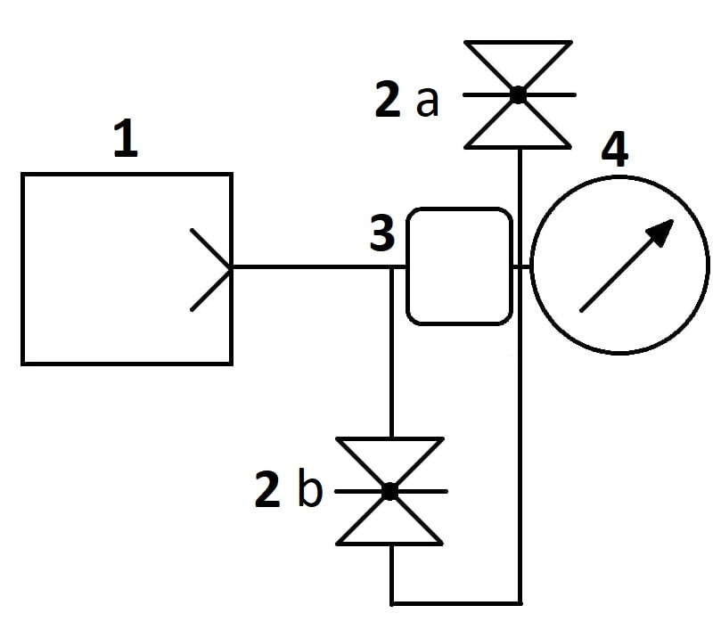{width=50%}

1) Вакуумный насос
2) Задвижка — верхняя соединена с внешней средой (воздухом), нижняя соединяет элементы системы
3) Шланг (обозначаем как изолированный резервуар)
4) Вакуумметр (измеритель давления)

Черные соединительные линии обозначают наличие плотного соединения между объектами.

## Методика

В работе мы провели несколько серий экспериментов.

В самом начале мы использовали пластмассовые "крышки" для того, чтобы закрывать отверстия в соединительных элементах. Однако в первые несколько измерений оказалось, что давление понижается максимум до $1$ mbar, и очень быстро происходит разгерметизация.

Мы пересобрали систему, перезакрутили все соединители, давление стало падать до немного меньших значений, но по-прежнему достаточно быстро. 

Наконец, мы подключили измеритель давления напрямую к насосу, максимально уменьшив количество возможных протечек и объём системы. Давление упало вплоть до $10^{-3}$ mbar. Тем самым мы выяснили примерную цель, на которую мы должны выходить по давлению после большого промежутка времени.

После этого эксперимента мы пересобрали систему так, чтобы не использовать пластиковые крышки для закрытия отверстий. Это действительно помогло, давление стало падать до $10^{-1}-10^{-2}$ mbar, протечки сильно замедлились.

{width=50%}

Затем мы провели эксперимент с увеличенным давлением, подключив секцию трубы и клапан в систему, для более простого впуска воздуха назад в систему, после завершения измерения.

{width=50%}

После проведения этих базовых экспериментов мы отдались воображению, и начали придумывать более интересные схемы. Следующим шагом было подключение в систему длинного шланга:

{width=50%}

{width=50%}

Для такой системы мы измерили давление в 2 точках у насоса (поз. 1) и на конце шланга (поз. 2)

Затем мы решили модифицировать нашу систему, и создали последнюю схему

{width=50%}

{width=70%}

Весь смысл этой системы в том, что мы можем открывать и закрывать клапан (2), тем самым меняя расстояние от барометра до насоса. Это, в свою очередь, позволит нам наглядно увидеть, каким образом изменяется давление в зависимости от состояния системы.

## Программная обработка

Для обработки цифр с изображений использовался скрипт на языке `Python` с помощью технологии `OpenCV`. Сначала планировалось использовать нейронные сети, но из-за низкой скорости работы и отсутствия простых решений их интеграции в распознавание цифр с *видео* мы решили использовать более простой метод. Мы использовали несколько сверток для выделения контуров, среди которых позже искали что-то, похоже по размеру на цифры. Далее, через линейные преобразовывания преобразовывали каждую цифру к "правильному" расположению, а затем смотрели на распределение "закрашенных" пикселей, сопоставляя их распределение конкретной цифре. 

{width=40%}

К сожалению, у такого подхода есть несколько неприятных моментов. В первую очередь, мы не можем уловить позицию точки (слишком маленький объект), то есть у нас будут проблемы с распознаваниям порядков $10^3 - 1$ mbar. Меньшие мы сможем распознать, так как сможем распознать множитель справа.

Во-вторых, распознаватель основан на точном пространственном распределении пикселей, а не "образах", в отличие от нейронных сетей, поэтому он легко может выдать мусор из-за небольших изменений освещения, изменения ракурса и размытия. Нам удалось сделать такие ошибки незначительными по своему количеству, но они по-прежнему остаются. Работать с такими данными на порядок сложнее, чем с "нормальными" из-за большого количества выбросов.  

## Результаты

Далее мы приведем некоторые графики измерений, указанных выше. Полностью проанализировать их все у нас не хватит сил и времени, поэтому оставим 

{subfigures:
{width=0.33}
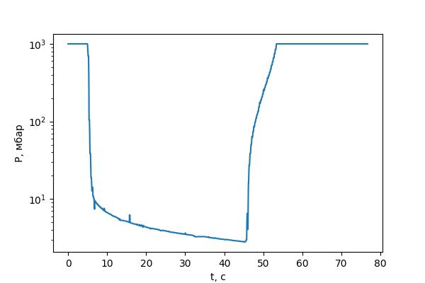|
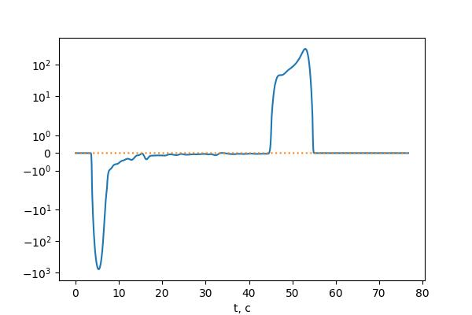|

}

{subfigures:
{width=0.33}
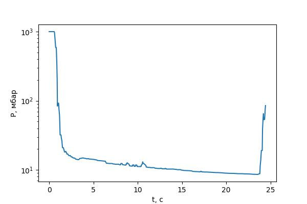|
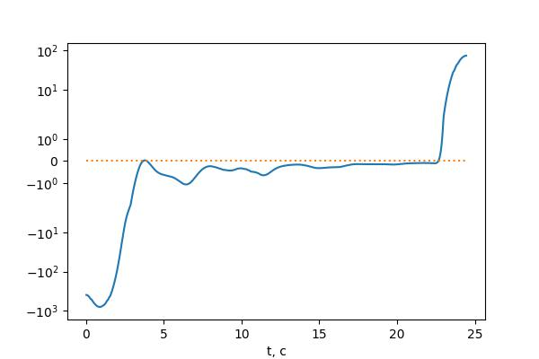|

}

{subfigures:
{width=0.33}
|
|

}

{subfigures:
{width=0.33}
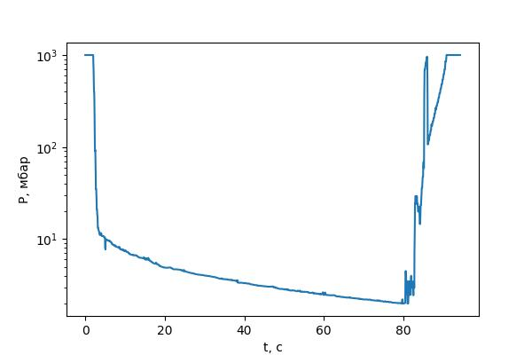|
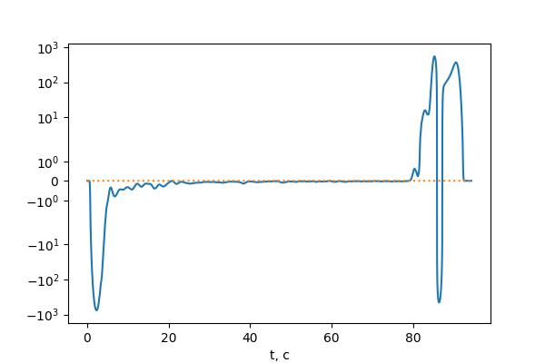|

}

{subfigures:
{width=0.45}
|
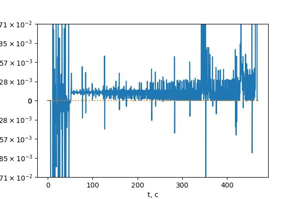
}

{subfigures:
{width=0.45}
|
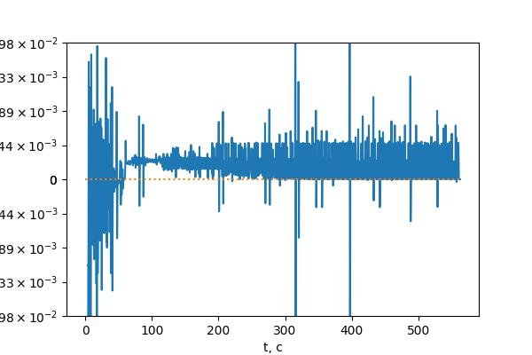
}

{subfigures:
{width=0.45}

}

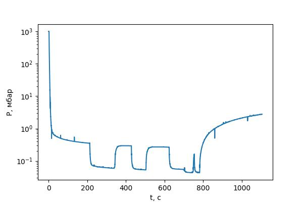{width=30%}

{subfigures:
{width=0.3}

}

{subfigures:
{width=0.3}
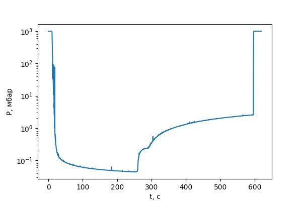

}

Мы попробовали приблизить некоторые из полученных нами зависимостей с помощью экспонент, функций вид $αe^{-bt} + p_0$. К сожалению, графики экспонентами приближаются только кусочно, скорее всего, на разных порядках давления в силу вступают различные эффекты, и однозначно определить "закон откачки" не так просто. 

Все коэффициенты на прямых приведены в стандартных единицах осей — мБарах и секундах, функции заданы без вычета сдвига — то есть t = 0 соответствует абсолютному значению времени, а не началу определения функции.

{width=70%}

{width=70%}

{width=70%}

{width=70%}

Мы планировали как следует поработать с результатами аппроксимаций, но из-за жестких временных рамок не успели это сделать. Далее мы приведем только достаточно простые рассуждения, а более глубокий анализ экспериментально полученных данных оставим как тему для отдельного исследования. 

## Теория и осмысление результатов

Самый простое рассуждение, которое хочется проверить с помощью наших результатов — убедиться, что подключение нашего объема существенно влияет на время и характер откачки. Мы подключаем длинную трубку (длина — 10.2 метра, радиус — 1.22 см), площадь сечения $S = 4.7$ см², её объём —  $4.8$ л. Для воздуха коэффициент диффузии — $D≈0.2$ см²/с.
$$
J  = -D \nabla n\;\;(=-D \frac{\nabla p}{kT})
$$
Считая для простоты распределение газа в трубке примерно линейным, можем оценить время откачки воздуха из трубки. Тогда 
$$
\frac{dn}{dt}·\frac{L}2≈-D·n/L;\;\;τ\sim L^2/2D≈2.6·10^6\mbox{ с}
$$
Конечно, такой результат нельзя считать даже хорошей оценкой, во время откачки распределение внутри трубки будет устроено более сложным образом. Но из этого результата хорошо видно, что откачать такую трубку, как у нас, до действительно низких давлений практически нереально просто из-за большого времени, которое будет из нее выходить воздух. Это хорошо демонстрируют графики выше:

{subfigures:
{width=0.5}

}

Видно, что без шланга откачка происходит до $10^{-2}$ мбар примерно за 50 секунд, с — до 10^-1^ или 1 мбар (в зависимости, куда подключен вакуумметр). И такая откачка может эффективно продолжаться >200 секунд, сохраняя незатухающий наклон.

Пойдем дальше. Исходя из данных первого измерения с пробками можно сделать два вывода. Во первых, можно заметить, что процесс откачки — содержит в себе несколько точек с большим изгибом зависимости, из чего можно сделать вывод о том, что в эти моменты пробки переходят из положения "плохо прижатых" в положение "хорошо прижатых", или наоборот (меняя количество воздуха проникающее в схему за малый промежуток времени).

В качестве второго вывода хочется заметить, что экспонента хорошо кусочно приближает зависимость давления от времени. Тогда $\frac{dp}{dt}$ — тоже экспонента, и $\frac{dp}{dt}$ = $c_1 p + c_2$. Докажем это теоретически. Для этого будем считать вакуумный насос близким к идеальному — если молекула попала в него, то она "выходит" из системы. Тогда:
$$
\frac{dP}{dt} = \frac{dP_{in}}{dt} - \frac{dP_{out}}{dt} = c_1 (P_{atm}- P) - \frac{dν}{dt}kT
$$
Так как $\frac{dν}{dt}$ линейно зависит от давления:
$$
\frac{dP}{dt} =  c_1 (P_{atm}- P) - с_2P = c - aP
$$

Но если углубиться ещё глубже, воздух попадающий в систему - проходит в неё в разных точках, с разными давлениями, в зависимости от расстояния до насоса. $N$ - количество стыков, $P_i$ давление газа внутри на этом стыке, а <$P$> — среднее давление в системе:	
$$
\frac{d\langle P\rangle}{dt} = \sum_{i=1}^{N} c_1 (P_{atm}- P_i) - с_2P
$$

Так как давление падает очень быстро — будем считать $с_1P_i \ll с_1P_{атм}$:
$$
\frac{d\langle P\rangle}{dt} = \sum_{i=1}^{N} c_1 P_{atm} - с_2P
$$
Так как откачка происходит в одном месте, то распределение давления должно быть линейным (в зависимости от расстояния до насоса). Тогда для любого поперечного сечения трубки входящий поток должен быть равен выходящему, рассмотрим самый прогнозируемый случай (3 и 4). В этой системе у нас есть **5** соединений в которых происходит набор воздуха: **2** между трубками, 1 между трубкой и шлангом, 1 на манометре, и на 1 на задвижке. Расстояние до первых 4 сильно меньше расстояния до последнего. Рассмотрим 3-ий случай и 4-ый случай. Давление на конце при 200 секундах  (почти установилось равновесие) почти в 5 раз больше. При этом расстояние больше в 50 раз, ($l = 20\ cm$, $L = 1020\ cm$), значит:
$$
P_{pump} = P_p = P_3 - (P_4 - P_3) \frac{l}{L} \\ 
0 = \sum_{i=1}^{5} c_1 (P_{atm}- P_i) - с_2 P_p
$$

$P_i \ll P_{atm}$, значит, им можно пренебречь, тогда:
$$
5c_1 P_{atm} = с_2 P_p = c_2 (P_4 - P_3) \frac{l}{L}
$$

Сравним с первым экспериментом, где мы рассматривали малую систему с двумя соединениями.
$$
2c_1 P_{atm} = с_2 P_{p1}
$$
Проверим корректность этого вывода:
$$
c_1 = \frac{c_2 P_p1}{2P_{atm}}  \\
 2 · 8 · 10^{-2} - = 2 (P_3 - (P_4 - P_3) \frac{l}{L})  = 5P_{p1} => P_{p1} = 1.6 · 10{-2}
$$

Это интересный результат, но стоит проверить его с помощью 5 схемы.
$$
\frac{7c_1 P_{atm}}{c_2} = 1.4 · 8 · 10^{-2} = P_p > P_5 = 7 · 10^{-2}
$$
Значит наша теория совершает неплохую оценку ситуации, но достаточно не точна в точных результатах.

## Выводы

Мы рассмотрели большое количество конфигурации одной, достаточно простой установки с одним измерительным прибором. Обнаружили большое количество эффектов в таком простом процессе, как откачка вакуумным насосом.

Для снятия измерений мы написали программу для распознавания показания с измерительного прибора. Программа показала себя достаточно эффективной, хотя, конечно, работать с данными напрямую с прибора было бы гораздо удобнее.

Для того, чтобы корректно начертить схему нашей установке, мы разобрались в стандартных обозначениях для элементов вакуумных систем. В работе мы использовали лишь несколько, но очень надеемся, что использовали правильно.  

К сожалению, мы не успели глубоко проанализировать данные. Отчасти это вызвано заметным количеством ошибок и выбросов из-за метода измерения, большой "дискретностью" данных. Это не позволило нам в приемлемом качестве получить такие графики, как, например, зависимость скорости откачки от давления. Мы не смогли получить серьезных количественных результатов.

