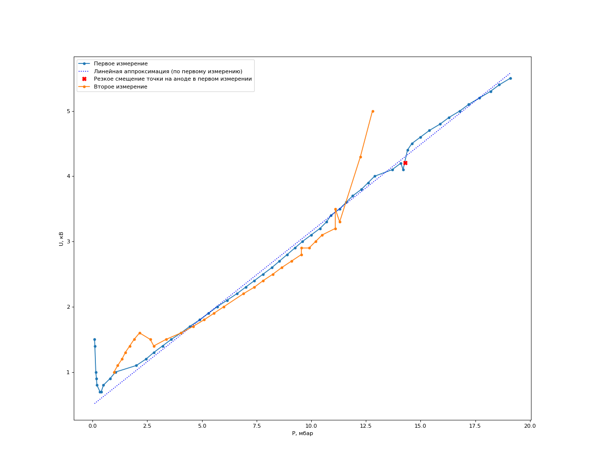
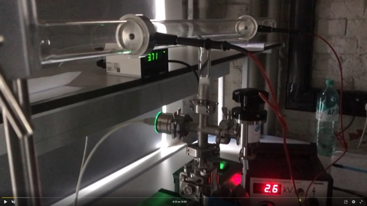
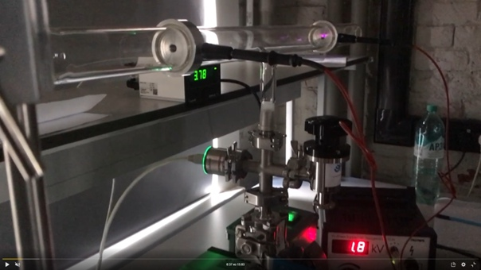

---
title: Вынужденнные колебания в электрическом контуре
date: \today
...

## Введение

С древних времен человечество наблюдало прохождение заряда через воздух во время грозы, сопровождаемое характерным свечением и звуком. Сейчас такие разряды используются на каждом шагу — например, в люминесцентных лампах. Тем не менее, полностью точно моделировать процессы, происходящие при газовом разряде, до сих пор невозможно.

В этой работе мы изучали разряд при низких давлениях (< 2% атмосферного), малых токах ($\sim$ 2 мА) и высоких напряжениях (до 10 кВ) — то есть тлеющий и дуговой разряд.

## Цель работы

Исследование процессов происходящих при известных напряжении и давлении. Если быть более точным, то исследование напряжения пробоя и минимального напряжения достаточного для поддержания газового разряда от давления в трубке.

## Теория

Разные типы разрядов хорошо демонстрирует следующий известный график[^1]:

{width=70%}

Важно, что здесь берется другой газ (неон), фиксированное давление 1 Тор ≈ 1.3 мБар и другая геометрия системы, поэтому нельзя дать количественных оценок. Тем не менее, видно, что при нашем токе 2 мА мы, скорее всего, будем находиться где-то "в яме" напряжения тлеющего разряда, и малые изменения силы тока не должны сильно влиять на напряжение (что можно было бы наблюдать, если бы токи, например, были бы порядка 1А). К сожалению, график не отображает переход от тлеющего разряда к дуговому при поднятии давления.

При тлеющем разряде на низких давлениях возникают характерные светлые и темные области, что показано на рисунке ниже[^2]:

{width=70%}

Астоново тёмное пространство около катода вызывается тем, что электроны "не успевают" набрать достаточную кинетическую энергию для возбуждения атомов. Там, где количество энергии становится достаточным, начинается катодное свечение — возбужденные атомы быстро возвращаются в исходное состояние с излучением света. Так как отрицательно заряженный катод еще рядом, и напряженность поля достаточно высокая, электроны продолжают ускоряться, и на большем расстоянии от катода кинетическоя энергия электронов становится слишком большой, и при столкновении вместо возбуждения атомы начинают ионизироваться. Это приводит к образованию большого количества свободных ионов с электронами с низкой энергией и отсутствию свечения в этой области. Затем медленные электроны начинают рекомбинировать с ионами, создавая второе (отрицательное) катодное свечение. В какой-то момент энергии становится недостаточно, и начинается следующая темная область.

Дальше поле более статично, резких перепадов нет — электроны, разгоняясь в не очень большом поле, набирают энергию, начинают возбуждать атомы с выделением света (положительное свечение), а дальше из-за большого поля у анода свечение меняется (анодное свечение).  

Иногда возникают характерные полосы (страты), вызванные тем, что могут поглощаться лишь дискретные количества энергии (соответствующие скачкам электронов по квантовым уровням, "орбитам"). Ширина полос будет зависеть от напряжения (полученная энергия на единицу длины), и слабо — от длины свободного пробега (т.е. давления, влияет только на рассеивание этой энергии). И если рассеяние будет большим — полосы будут размываться, но расстояние между ними почти не будет меняться.

Что интересно, ионы, попадающие на катод, могут выбить ионы материала катода (ионное распыление), которые и придают другой цвет свечению у катода ("выбивание" определяется коэффициентом распыления — сколько "выбитых" приходится на один "прилетевший"; для большинства металлов при энергии 500 эВ иона (значения, характерные и для нашей работы) он $\sim1$). Это также слегка "повреждает" катод, из-за чего "поведение" установки может измениться.

## Методика

{width=70%}

Используя насос для откачки воздуха из трубки мы уменьшали давление вплоть до значений в $2·10^{-2}$ бар. Единственный способ получить зависимость чего-либо от давления — ждать, пока сквозь щели в трубке (трубка не герметична) будет медленно повышаться давление. Как оказалось, нам этого вполне достаточно для того, чтобы отследить скачки напряжений (встроенный в генератор вольтметр показывает напряжение с точностью до 0.1 кВ из 10кВ максимально возможных).

Мы проводили несколько типов экспериментов. В самом простом мы закрывали клапан, прерывая откачку воздуха, записывали показания вольтметра от медленно поднимающегося давления. Как оказалось, зависимость неоднозначная, присутствует некоторый гистерезис — например, предварительный неоднократный подъем-опускание давления приводит к тому, что в начале эксперимента можно наблюдать как визуальные изменения (смещение точки на катоде), так и изменения графика зависимости. Во втором мы попробовали повторить первый, но перед этим несколько раз подняли и опустили давление. Как оказалось, зависимость напряжение-давление и форма разряда ведет себя по-другому.

Также мы отклоняли движущиеся заряды магнитным полем. Для этого мы подносили постоянный магнит к трубке и наблюдали, как меняется свечение и напряжение в трубке.

Последним измерением мы исследовали "напряжение пробоя" — какое требуется напряжение требуется подать, чтобы свечение появилось. После этого включается ограничение по току, напряжение падает и остается постоянным, как бы мы ни крутили ручку генератора. 

## Результаты

### Первый эксперимент

На графиках ниже показан внешний вид трубки от различных давлений. Здесь и далее — напряжение установлено на достаточно большое значение, его изменение почти ни на что не влияет — включается ограничение по току:

{subfigures:
{width=0.3}
|
|
|
|
|
|

}

На давлениях порядка нескольких десятых мБар свечение имеет "канонический" вид тлеющего разряда: хорошо заметно положительное свечение, видно отрицательное свечение. На давлениях $<0.3 \mbox{ mBar}$ у катода появляются кратковременные "вспышки" (обведено рамкой на первой фотографии). При повышении давления положительное свечение постепенно исчезает, и при $\sim2-3\mbox{ mBar}$ остается только катодное свечение, "сфокусированное" в одной точке — тлеющий разряд постепенно переходит в дуговой (дуги не видно, но сфокусированная точка свидетельствует именно об этом). 

На высоких давлениях "точка" начинает скакать:

{subfigures:
{width=0.3}
|
|

}

То есть при больших давлениях возникает нестабильность, и "катодная точка" начинает перемещаться между некоторыми характерными положениями (есть небольшое количество положений, между которыми точка перемещается).

Примерно на $p=15.3\mbox{ mBar}$ точка полностью уходит с "левого" края на "правый", что сопровождается небольшим скачком напряжения:

{width=60%}

Видно, что в моменты смещения точки также резко меняется напряжение (красный крест).

### Второй эксперимент

{subfigures:
{width=0.3}
|
|
|
|
|
|
|
|

}

Как и в прошлом эксперименте, точка дергается:

{subfigures:
{width=0.3}

}

При проведении повторных измерений сразу за предыдущими мы обнаружили видимое различие между графиками измерений. Если сравнить с первым экспериментом, видно, что здесь свечение выключается гораздо позже ($\sim$ 2 мБар по сравнению с $\sim$ 1 мБар в предыдущем). Также отличаются зависимости:

{width=80%}

Виден "холм" на давлениях около 1 мБар.

Также после измерения было замечено повышение температуры трубки. Учитывая, что давление достаточно мало, можно считать, что в трубке находится идеальный газ, тогда можно сказать, что $p=nkT$. Значит при одинаковом давлении в разных экспериментах будет отличающаяся концентрация воздуха в трубке. Что влияет на длину свободного пробега, и среднюю скорость частиц.

Скачки точки на низких давлениях ( $p = 2.6\ mBar$ )

{subfigures:
{width=0.3}
|
|
|

}

В другой раз мы наблюдали аналогичную "дугу" — точка очень быстро скакала туда-сюда.

Дуга на краю отверстия (смещается магнитом) + изменился цвет:

{subfigures:

|
}

### Динамика столба

{subfigures:
{width=0.4}
|
|
|

}

Чем больше давление, тем более "размытыми" и тем более вправо смещаются полоски положительного свечения — уменьшается длина свободного пробега, энергия рассеивается быстрее, быстрее наступает область положительного свечения.

Столбы в разных экспериментах:

{subfigures:
{width=0.3}
|
|
}

Струящиеся полосы

Видно, что несмотря на то, что во втором случае давление в три раза больше, расстояние между полосами примерно сохраняется, как и предсказывает теория.

### Магнитное отклонение

Изменение поведения под действием магнитного поля лучше всего заметно в зоне положительного свечения: оно смещается на край трубки, как правило, усиливаясь (и даже возникая, когда его нет).

{subfigures:
|

}

Можно увидеть те самые "полосы", вызванные дискретностью атомных уровней:

При поднесении магнитов к катоду положительное свечение смещается ближе к катоду, катодное свечение становится более "плоским":

{subfigures:
|

}

На высоких давлениях при поднесении магнитов "сфокусированная катодной точка" смещается и появляется положительное свечение.

Более того, магнитное поле может вместе с появлением положительного свечения уменьшить требуемое напряжение, что особенно заметно на давлениях порядка $2·10^{-2}$ мБар, когда свечения без поля уже нет:

{subfigures:
{width=0.33}
|
|
|
|
|

}

Даже на больших расстояниях трубка начинает "видеть" магнитное поле, начиная проходить по ограничению по току, а на маленьких — напряжение опускаться до $5$ В.  Возникает "обычное" положительное свечение, а катодное свечение фокусируется около магнитов.

Не до конца понятно, почему так происходит. Казалось бы, появление магнитного поля заставит электроны отклоняться от прямой траектории, требуя больше энергии и увеличивая напряжение. Тем не менее, видимо, из-за концентрации электронов в одном месте газ ионизируется, что приводит к большому количеству электронов, способных возбуждать атомы газа. 

### Зависимости напряжений от давления

{width=80%}

Видно, что когда мы опускали давление, напряжение поднималось гораздо медленнее, чем когда мы начали поднимать. Тем не менее, у нас сохранилось недостаточное количество точек, поэтому судить сложно.

При подъеме давление "левая часть" ($<4·10^{-2}$ мБар) хорошо описывается функцией вида $\displaystyle{\frac A{x^3}}$, а чуть дальше начинается участок ($0.5 ·10^{-2}-0.11 ·10^{-2}$, описывающийся $\displaystyle{\frac{B}{x^{3/4}}}$. 

Наконец, мы исследовали пробой — характерное напряжение, после которого напряжение падает и начинается свечение, результаты представлены ниже вместе с остальными зависимостями:

{width=80%}

Напряжение пробития очень нестабильно — мы обнаружили, что момент пробития сильно зависит от скорости, с которым мы крутим ручку генератора. Возможно, это вызвано какими-то эффектами генератора: при кручении ручки возникает дополнительное напряжение, из-за которого пробитие происходит раньше. Сильный разброс на 15 мБарах вызван, скорее всего, именно этим эффектом. 

Также при пробое нами было обнаружено резкое увеличение давления в трубке.

{width=70%}

{width=70%}

{width=70%}

Оно происходит из-за того что при наличии свечения в трубке, частицы внутри неё приобретают дополнительную кинетическую энергию, в результате чего увеличивая температуру внутри. В следствие чего повышается давление.

{width=80%}

Здесь высокий разброс, поэтому сложно говорить о какой-то зависимости. Видно, что отношение уменьшается на участке $8-12$ мБар, но это может быть вызвано систематической погрешностью. Поэтому остается только усреднить значения и оценить ошибку, подсчитав стандартное отклонение — окажется, что напряжение пробития в $2.0±0.2$ раза выше напряжения после пробития (почти совпадает с максимальным отклонением — ±0.25). 

## Выводы

Были промерены зависимости напряжения тлеющего и дугового разрядов при фиксированном токе 2 мА от давления $20$ мкБар до 20 мБар. Эксперимент показал, что эта зависимость и наблюдаемое свечение неоднозначно определено и может слегка меняться в разных измерениях. На участке $20-40$ мкБар напряжение хорошо описывается функцией вида $\displaystyle{\frac A{x^3}}$, на $50-110$ мкБар — $\displaystyle{\frac{B}{x^{3/4}}}$, на давлениях $2-20$ мБар зависимость близка к линейной. Напряжение пробоя превышает напряжение в 2.0 ± 0.2 раза. Мы неоднократно наблюдали полосы (страты) в положительном свечении и обнаружили увеличение интенсивности свечения и требуемого для тока 2 мА напряжения во внешнем магнитном поле. Наблюдения по большей части согласуются с теоретической моделью.

[^1]: C. F. Gallo, *[Coronas and Gas Discharges in Electrophotography: A Review](https://ieeexplore.ieee.org/abstract/document/4157817)*, IEEE Transactions on Industry Applications, Vol.IA-13, No. 6, p.739 (1975)
[^2]: from L. B. Loeb, Fundamental Processes in Electrical Discharges in Gases, 1939, New York: John Wiley, fig 269, p 566

