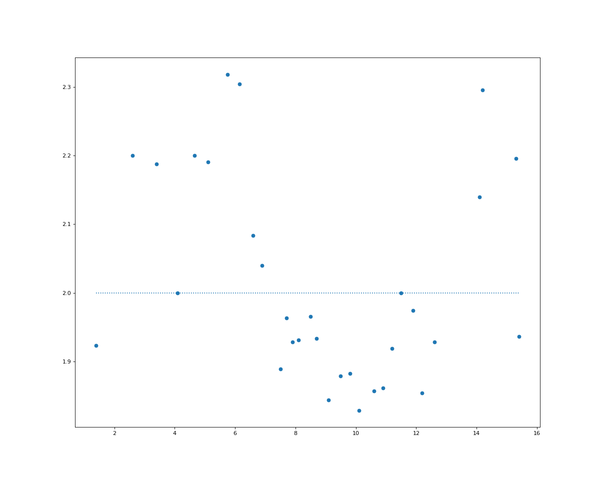
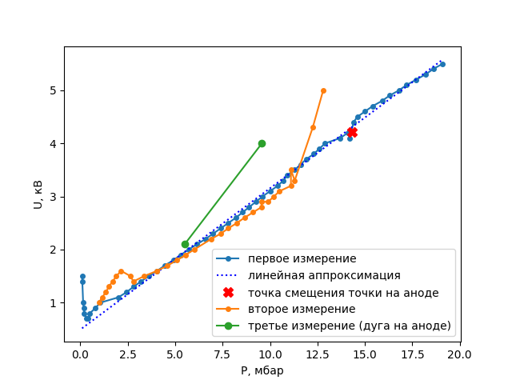

---
title: Газовый разряд
date: \today
...

## Введение

С древних времен человечество наблюдало прохождение заряда через воздух во время грозы, сопровождаемое характерным свечением и звуком. Сейчас такие разряды используются на каждом шагу — например, в люминесцентных лампах. Тем не менее, полностью точно моделировать процессы, происходящие при газовом разряде, до сих пор невозможно.

В этой работе мы изучали разряд при низких давлениях (< 2% атмосферного), малых токах (~2 мА) и высоких напряжениях (до 10 кВ) — то есть тлеющий разряд.

## Цель работы

Исследование процессов происходящих при известных напряжении и давлении. Если быть более точным, то исследование напряжения пробоя и минимального напряжения достаточного для поддержания газового разряда от давления в трубке.

## Теоретические предположения

Разные типы разрядов хорошо демонстрирует следующий известный график[^1]:

{width:70%}

Важно, что здесь берется другой газ (неон), фиксированное давление и другая геометрия системы, поэтому нельзя дать количественных оценок. Тем не менее, видно, что при нашем токе 2 мА мы, скорее всего, будем находиться где-то "в яме" напряжения тлеющего разряда, и малые изменения силы тока не должны сильно влиять на напряжение (что можно было бы наблюдать, если бы токи, например, были бы порядка 1А). 

## Методика

{width=70%}

Используя насос для откачки воздуха из трубки мы уменьшали давление вплоть до значений в $2·10^{-2}$ бар. Единственный способ получить зависимость чего-либо от давления — ждать, пока сквозь щели в трубке (трубка не герметична) будет медленно повышаться давление. Как оказалось, нам этого вполне достаточно для того, чтобы отследить скачки напряжений (встроенный в генератор вольтметр показывает напряжение с точностью до 0.1 кВ из 10кВ максимально возможных).

Мы проводили несколько типов экспериментов. В самом простом мы закрывали клапан, прерывая откачку воздуха записывали показания вольтметра от медленно поднимающегося давления. Как оказалось, зависимость неоднозначная, присутствует некоторый гистерезис — например, предварительный неоднократный подъем-опускание давления приводит к тому, что начало эксперимента меняется как визуально (смещение точки на аноде), так и на зависимости.

{subfigures:
{width=0.4}

}

точки при высоких давлениях (первый эксперимент):

{subfigures:

}

Полностью переход происходит примерно на $p=15.3\ mBar$.

Динамика столба

{subfigures:
{width=0.4}

}

Столбы в разных экспериментах:

{subfigures:

}

Струящиеся полосы

Скачки точки

{subfigures:

}

В другой раз мы наблюдали аналогичную "дугу" — точка очень быстро скакала туда-сюда.

Дуга на краю дыры (смещается магнитом) + изменился цвет:

{subfigures:

}

Магнитное отклонение:

{subfigures:

}

Приближается при поднесении магнитов!

{subfigures:

}

Высокие давление (появляется красный столб):

Нестабильность 

[^1]: C. F. Gallo, *[Coronas and Gas Discharges in Electrophotography: A Review](https://ieeexplore.ieee.org/abstract/document/4157817)*, IEEE Transactions on Industry Applications, Vol.IA-13, No. 6, p.739 (1975)
